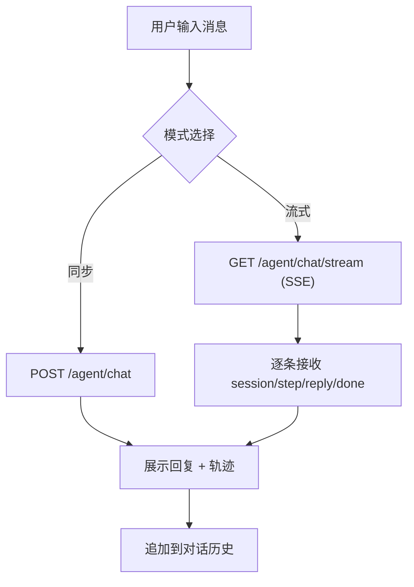

## 1. 产品概述

mwb-ai-claw Agent 测试控制台——一个与后端 Agent REST/SSE 接口交互的单页测试界面，帮助开发者图形化验证 ReAct 推理循环、工具调用与会话管理能力，无需 Postman 即可完成联调。

- 目标用户：mwb-ai-claw 项目的开发者
- 核心价值：可视化展示对话、推理轨迹（traceSteps）与流式输出，加速 Agent 联调

## 2. 核心功能

### 2.2 功能模块

1. **对话面板**：消息输入、发送、对话历史展示、推理轨迹（traceSteps）逐条展示
2. **会话管理**：创建会话、查询会话历史、切换会话
3. **配置面板**：Agent ID 输入、同步/流式模式切换、接口地址显示

### 2.3 页面详情

| 页面名称 | 模块名称 | 功能描述 |
|---------|---------|---------|
| 控制台 | 对话面板 | 输入消息 → 调用 /agent/chat 或 /agent/chat/stream → 展示回复与推理步骤 |
| 控制台 | 会话管理 | 创建/查询/切换会话，展示历史消息 |
| 控制台 | 配置面板 | 显示当前 Agent 配置，切换同步/流式模式，自定义后端地址 |

## 3. 核心流程

1. **同步对话**：输入消息 → POST /agent/chat → 展示回复 + traceSteps
2. **流式对话**：输入消息 → GET /agent/chat/stream (SSE) → 逐条展示 session/step/reply/done 事件
3. **会话管理**：创建会话 → 在该会话内对话 → 查询会话历史

## 4. 用户界面设计

### 4.1 设计风格

- **主题**：深色终端美学，契合 AI Agent / 开发者工具场景
- **配色**：墨黑/深空蓝背景（#0d1117 / #161b22）+ 青绿强调色（#39d353 / #2ea043）+ 琥珀色轨迹标记（#d29922）
- **字体**：对话区用等宽字体（JetBrains Mono / Fira Code），UI 用现代无衬线
- **布局**：三栏式（会话列表 | 对话主区 | 轨迹/配置面板），窄屏折叠侧栏
- **动效**：消息淡入上滑、SSE 事件逐条滚动、Agent 思考时的脉冲指示、轨迹步骤展开折叠
- **细节**：用户/助手消息气泡区分、tool 消息用代码块样式、轨迹用时间线呈现

### 4.2 页面设计概览

| 页面名称 | 模块名称 | UI 元素 |
|---------|---------|---------|
| 控制台 | 会话列表栏 | 会话卡片列表、新建按钮、当前会话高亮 |
| 控制台 | 对话主区 | 消息气泡（user/assistant/tool 三色区分）、输入框、发送按钮、模式开关 |
| 控制台 | 轨迹面板 | 时间线展示 Thought/Action/Observation、可折叠、状态徽标 |
| 控制台 | 配置面板 | Agent ID、后端地址、同步/流式切换、接口速查 |

### 4.3 响应式

桌面优先（三栏），窄屏（<768px）折叠左右栏为抽屉式，保持对话主区可用。
