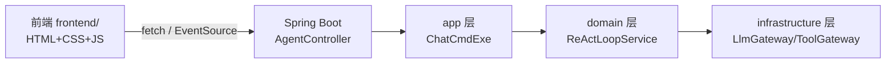

## 1. 架构设计



## 2. 技术说明

- **前端**：纯 HTML5 + CSS3 + 原生 JavaScript（零依赖、无构建工具）
  - 选型理由：测试控制台与 Java 项目集成，零依赖可直接浏览器打开或随 Spring Boot static 资源发布；SSE 用原生 EventSource 即可
- **目录**：项目根下新建 `frontend/` 目录存放前端代码
- **后端**：现有 Spring Boot `/agent/*` 接口（无需改动）
- **通信**：
  - 同步对话：`fetch` POST
  - 流式对话：`EventSource`（SSE）
  - 会话管理：`fetch` GET/POST

## 3. 路由定义

单页 `index.html`，无前端路由。页面内通过 Tab/Panel 切换功能区域。

## 4. API 定义

### 4.1 同步对话
`POST /agent/chat`
```typescript
// Request (ChatCmd)
{ sessionId?: string, agentId?: string, message: string }
// Response (SingleResponse<ChatResponseDTO>)
{ success: boolean, errCode?: string, errMessage?: string,
  data: { sessionId: string, reply: string, traceSteps: string[] } }
```

### 4.2 流式对话
`GET /agent/chat/stream?message=&sessionId=&agentId=`
```
SSE 事件流：
event: session  → data: <sessionId>
event: step     → data: <traceStep>
event: reply    → data: <reply>
event: done     → data:
event: error    → data: <errorMessage>
```

### 4.3 创建会话
`POST /agent/session`
```typescript
// Request (CreateSessionCmd)
{ agentId?: string, title?: string }
// Response (SingleResponse<SessionDTO>)
{ success, data: { sessionId, agentId, title, status, messages: [{role, content, timestamp}] } }
```

### 4.4 查询会话
`GET /agent/session/{sessionId}`
```typescript
// Response (SingleResponse<SessionDTO>)
{ success, data: { sessionId, agentId, title, status, messages: [...] } }
```

## 5. 跨域处理

前端若独立打开（file:// 或其他端口），后端需开启 CORS。在 Spring Boot 加全局 CORS 配置，允许前端来源访问 `/agent/**`。
