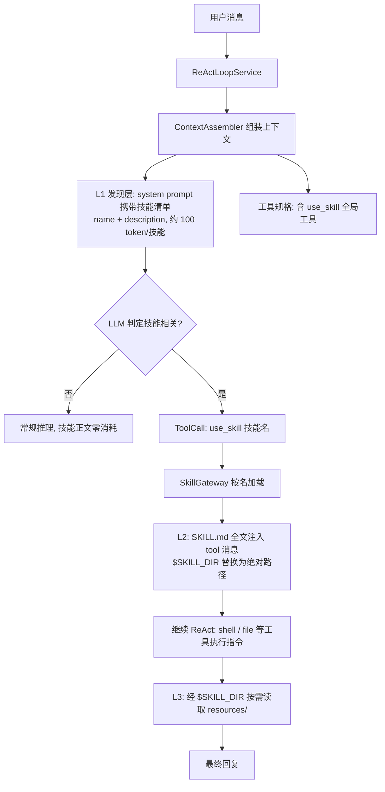
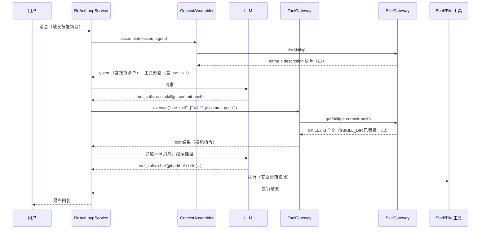

# Skill（技能）技术支持技术方案

> 迭代目标：为 mwb-ai-claw 引入业界标准的 Skill（Agent Skills）技术 —— 将可复用的工作流与领域知识打包为 `SKILL.md` 目录，采用渐进式披露（Progressive Disclosure）按需注入 Agent 上下文；新增技能零代码、零主链路改动
> 文档编号：feature-skill-support
> 关联文档：`feature-config-orchestration-separation技术方案(SUBMIT).md`（配置/编排体系基线）、`feature-layered-memory技术方案(SUBMIT).md`（上下文工程基线）

> **实施状态（2026-08-18）：已实施 ✅**
> - 已完成：domain/skill（`Skill` / `SkillGateway`）、infrastructure/skill（`SkillLoader` 目录扫描 + frontmatter 解析 + 启动校验 / `SkillRegistryImpl`）、`UseSkillTool`（global 工具，`$SKILL_DIR` 替换）、`DefaultContextAssembler` 技能清单注入（L1）、`AgentProperties` 配置项（skills-enabled / skills-dir）、内置技能 12 个（code-review / project-structure-analysis / unit-test-writing / git-workflow / ddd-modeling / tech-design-doc / web-research / database-design / doc-writing-guide / markdown-diagramming / doc-review / example-skill）
> - 已验证：启动加载技能 `[12]`；对话「请生成我的项目周报」→ LLM 自动调用 `use_skill` 加载 SKILL.md → 按技能工作流调用 `read_memory` → 按模板输出周报（完整/进行中/风险/下周计划）；不相关消息零技能正文消耗（L2/L3）；主文档 mermaid 双版本渲染 24/24 OK

## 1. 背景与目标

### 1.1 背景

mwb-ai-claw 已具备完整的 Agent 能力栈：工具 SPI（file / shell / http / 记忆 / MCP）、多 Agent 编排（routing / pipeline / conversational）、上下文工程（system prompt 组装 + 分层记忆）。但存在一个结构性空白——**「该怎么做」的指令层缺失**：

- **多步工作流无法沉淀复用**：如「代码提交并推送」（多步 git 指令组合）、「技术选型」（固定评估框架）、「周报生成」（固定模板）——目前只能每次在对话中口头描述，或硬编码进某个 Agent 的 `systemPrompt`；
- **知识注入成本高**：把一套 SOP 交给 Agent，只能改 `agents.json` 的 `systemPrompt` 或 AGENT.md，全局生效、不可插拔、不可分享，且与「工程化沉淀」的要求相悖；
- **业界已有成熟标准**：Anthropic 于 2025-10 发布 Agent Skills（`SKILL.md` + 渐进式披露），2025-12 开放为 AgentSkills.io 跨平台标准，Claude Code / Trae 等均已支持。mwb-ai-claw 作为 Agent 框架应具备同等能力——**MCP 解决「能做什么」，Skill 解决「该怎么做」**。

### 1.2 目标

1. **Skill 定义标准**：支持 `skills/<name>/SKILL.md`（YAML frontmatter：`name` / `description` + Markdown 指令正文）与可选 `resources/` 资源目录；
2. **渐进式披露（三层）**：技能清单（name + description，约 100 token/技能）常驻 system prompt（L1 发现层）；`SKILL.md` 全文仅在 LLM 判定相关时通过 `use_skill` 工具按需加载（L2）；资源文件在执行期按 `$SKILL_DIR` 路径按需读取（L3）——控制 token 成本的同时保持专家级指令深度；
3. **零侵入扩展**：新增技能 = 放一个目录 → 重启加载 → 所有 Agent 即可使用；不修改任何 Java 代码、不修改 `agents.json` / `orchestrations.json`；
4. **安全一致**：技能只是「指令注入」，不携带任何执行特权，执行仍走既有工具沙箱（shell 白名单 / file 路径限制 / http host 限制 / 超时 / 截断）；
5. **与现有体系正交**：技能为全局能力（对齐 MCP 全局工具），对 routing / pipeline / conversational 任意编排内的所有 Agent 可见，与记忆、MCP 可叠加使用。

### 1.3 非目标（本期不做）

- Agent 级技能绑定（`agents.json` 增加 `skills` 字段静态注入）——预留二期；
- Skill 市场 / 远程下载安装（本期仅本地目录扫描）；
- 技能热加载（本期启动加载、重启生效）；
- 技能质量评估埋点（触发率 / 成功率指标——预留二期）；
- 会话级技能选择记忆（由 LLM 自主发现即可）。

## 2. 现状分析

### 2.1 现状痛点

| 关注点 | 现状 | 问题 |
|--------|------|------|
| 工作流沉淀 | 无 | 多步 SOP 每次重复描述，或硬编码进 `systemPrompt`，全局生效不可插拔 |
| 知识注入 | 手改 `systemPrompt` / AGENT.md | 影响所有会话、不可分享、无版本管理 |
| 能力扩展 | 工具 SPI（执行能力）、MCP（外部连接） | 都是「能力」层，缺「该怎么做」的指令层 |
| 上下文成本 | 全量 systemPrompt 常驻 | 若把技能全部注入会浪费 token，需按需加载 |

### 2.2 可复用资产

| 资产 | 现状 | 复用方式 |
|------|------|----------|
| `ToolExecutor` SPI + `DynamicToolRegistry` | 内置工具 + MCP 动态注册（`global=true` 对所有 Agent 可见） | `use_skill` 作为内置工具注册（`global=true`），行为与 MCP 工具一致 |
| `DefaultContextAssembler.buildSystemPrompt` | systemPrompt + AGENT.md + 记忆 组装链 | 追加「可用技能」清单区块（L1 发现层） |
| `AgentConfigLoader` 的 `${VAR}` 解析 / 加载优先级 | 运行目录 > classpath 内置模板 | `SkillLoader` 复用同策略（运行目录 `skills/` > classpath `skills/`） |
| `ToolSecurity` 沙箱 | 命令白名单 / 路径限制 / 超时 / 截断 | skill 的脚本与资源执行天然受限，无需新增安全面 |
| `.trae/skills/git-commit-push/SKILL.md` | 现有技能示例（frontmatter + Markdown） | 作为 `SKILL.md` 格式参照 |

## 3. 总体方案

### 3.1 核心思路：渐进式披露（Progressive Disclosure）

参照 Anthropic Agent Skills 标准，技能按三层披露：

| 层级 | 内容 | 何时加载 | 成本 |
|------|------|----------|------|
| L1 | frontmatter：`name` + `description` | 每次请求常驻 system prompt | ~100 token/技能 |
| L2 | `SKILL.md` 正文指令 | LLM 通过 `use_skill(name)` 按需加载 | 仅命中时 |
| L3 | `resources/` 资源（脚本 / 参考文档 / 模板） | 执行中按 `$SKILL_DIR` 路径读取 | 按需 |



- **L1 发现层**：技能清单（name + description）注入 system prompt，让 LLM 知道「有哪些技能、何时该用」——description 是路由信号，质量决定触发率；
- **L2 指令层**：LLM 通过 `use_skill(name)` 工具加载 `SKILL.md` 全文，作为 tool 消息注入上下文，继续 ReAct 推理；
- **L3 资源层**：技能目录内脚本 / 参考文档经既有 file / shell 工具按 `$SKILL_DIR` 路径读取执行，受工具沙箱约束。

### 3.2 Skill 定义（业界标准格式）

```
skills/                          # 技能根目录（运行目录优先，classpath 兜底）
└── git-commit-push/             # 技能目录名 = skill name（kebab-case）
    ├── SKILL.md                 # 必需：YAML frontmatter + Markdown 指令正文
    └── resources/               # 可选：脚本 / 参考文档 / 模板 / 资产
```

`SKILL.md` 示例：

```markdown
---
name: git-commit-push
description: 将工作区改动提交并推送至远程仓库。当用户要求提交代码、推送代码、提交更改时使用。
---

# Git 提交与推送

## 工作流
1. 检查当前状态：`git status` / `git diff --stat` / `git log --oneline -5`
2. 解析提交信息：显式标记 > 自然语言提取 > 根据 diff 自动生成
3. 暂存并提交：`git add -A && git commit -m "..."`（首行 ≤ 50 字符）
4. 推送：`git push`；无 upstream 时 `git push -u origin <branch>`

## 安全规则
- 禁止 force push 到 main / master
- 禁止提交含密钥的文件（.env / credentials.json 等）
- 禁止破坏性命令（reset --hard / checkout . / clean -f），除非用户明确要求

## 参考
- 详细命令示例见 $SKILL_DIR/resources/commands.md
```

约定：

- `name`：kebab-case，必须与目录名一致（启动期校验）；
- `description`：what + when + 触发词（第三人称、动词开头），是 L1 发现层的路由信号；
- 正文：建议 ≤ 500 行，超出部分拆入 `resources/` 参考文档（L3 按需读取）；
- `$SKILL_DIR`：正文 / 资源中引用技能目录的占位符，`use_skill` 返回时替换为实际绝对路径；
- 不内置 `README.md`（Anthropic 规范：文档全部进 `SKILL.md` 或 `references/`）。

### 3.3 与现有能力的关系

| 能力 | 定位 | 与本方案关系 |
|------|------|--------------|
| 工具（`ToolExecutor` / MCP） | 能做什么（厨房） | skill 通过既有工具执行，复用安全沙箱 |
| **Skill（本方案）** | **该怎么做（菜谱）** | 指令层，不新增执行能力 |
| 编排（routing / pipeline / conversational） | 多 Agent 协作 | 正交：任意编排内 Agent 均可用技能 |
| 记忆（分层记忆） | 跨会话事实 | 正交：技能可引导 Agent 读写记忆 |

> 与工具 / MCP 的本质区别：工具注册即始终可用（always-on），技能仅在相关时按需加载（on-demand）——由调用频率与上下文成本共同决定选型。

## 4. 详细设计

### 4.1 domain 层：Skill 模型与网关（新增 `domain/skill` 包）

```java
@Data
public class Skill {
    private String name;          // kebab-case，与目录名一致
    private String description;   // what + when + 触发词（L1 路由信号）
    private String content;       // SKILL.md 正文（L2，按需加载）
    private String baseDir;       // 技能目录绝对路径（L3 资源访问根，$SKILL_DIR 来源）
}

/** 技能网关接口（依赖倒置，domain 定义） */
public interface SkillGateway {
    List<Skill> listSkills();     // 技能清单（L1：仅 name + description）
    Skill getSkill(String name);  // 按名取完整技能（L2：含正文与 baseDir）
}
```

### 4.2 infrastructure 层：加载与注册（新增 `infrastructure/skill` 包）

```java
/** 扫描技能根目录，解析 frontmatter，启动校验 */
@Component
public class SkillLoader {
    // 1. 扫描路径：运行目录 <skills-dir>（默认 ./skills）优先，classpath skills/ 内置模板兜底
    // 2. 解析 SKILL.md 的 YAML frontmatter（name / description），读取正文
    //    - 复用 Spring Boot 传递依赖 SnakeYAML，无需新增依赖
    // 3. 启动校验：
    //    - name 缺失 / description 缺失 → 启动报错（定位到技能目录）
    //    - name 与目录名不一致 → 启动报错
    //    - 技能 name 重复 → 启动报错
}

/** SkillGateway 实现：启动时加载，name → Skill 索引 */
@Component
public class SkillRegistryImpl implements SkillGateway { ... }

/** 内置工具：按需加载技能指令全文 */
@Component
public class UseSkillTool implements ToolExecutor {
    // NAME = "use_skill"
    // global = true（注册为全局工具，所有 Agent 可见，与 MCP 工具行为一致）
    // 参数：{ "skill": "git-commit-push" }
    // 返回：SKILL.md 全文（$SKILL_DIR 已替换为 baseDir 绝对路径）
    //       技能不存在 → ToolResult.error("技能不存在，可用技能: xxx, yyy")
}
```

- `UseSkillTool` 通过 `DynamicToolRegistry` 注册为 `global=true`，任何 Agent 无需在 `agents.json` 声明即可调用——与 MCP 工具完全一致；
- `listSkills()` 仅返回 name + description（不加载正文，L1 开销最小化）；`getSkill(name)` 才读正文（L2）。

### 4.3 上下文注入（L1 发现层，修改 `DefaultContextAssembler`）

`buildSystemPrompt` 在「Agent 扩展指令 / 记忆」之后追加技能清单区块（有技能才追加）：

```
## 可用技能（按需通过 use_skill 工具加载完整指令）
- code-review：系统化代码审查：正确性、安全、性能、可维护性与规范，输出结构化审查报告。当用户要求审查代码、Review、指出问题、评估代码质量时使用。
- ddd-modeling：DDD 领域建模：限界上下文划分、聚合/实体/值对象识别、领域服务与仓储边界。当用户要求领域建模、DDD、聚合设计时使用。
- web-research：联网调研方法论：通过 tavily 搜索工具多轮检索、交叉验证、结构化输出并附来源。当用户要求调研、查询最新信息、搜索资料时使用。
- ...（共 9 个内置技能，完整清单见 §6.2）
```

- 仅注入 name + description，正文按需加载（L2）；
- `DefaultContextAssembler` 构造函数新增可选 `SkillGateway` 参数（null 兼容既有调用），由 `AgentConfiguration` 装配。

### 4.4 运行时调用链（L2 / L3）



### 4.5 安全设计

| 面 | 说明 |
|----|------|
| 指令可信度 | 技能来自本地可信目录，仅为提示词注入，不携带任何执行特权 |
| 执行沙箱 | skill 的脚本 / 资源通过既有 shell / file 工具执行，命令白名单 / 路径限制 / 超时 / 输出截断全量生效 |
| 资源路径 | `$SKILL_DIR` 指向技能目录（默认位于 workspace 内）；越界访问仍被 file 工具路径限制拦截 |
| 注入面 | 技能正文可能诱导执行危险命令 → 由 shell 白名单 / 黑名单兜底，与人工对话同等对待，无特权提升 |

### 4.6 配置

```yaml
agent:
  skills-enabled: true          # 技能总开关（默认 true）
  skills-dir: ./skills          # 技能根目录（运行目录，默认；classpath skills/ 为内置模板兜底）
```

- 加载优先级：运行目录 `<skills-dir>` > classpath `skills/`（与 `agents.json` / `orchestrations.json` 一致）；
- 启动日志：`已加载技能 [9]: ...`；
- 技能缺失 / 格式错误：启动期报错（对齐 `OrchestrationConfigLoader` 的启动校验风格）。

## 5. 模块改动清单

| 层 | 文件 | 改动 |
|----|------|------|
| domain/skill | `Skill.java` | **新增**：技能值对象 |
| domain/skill | `SkillGateway.java` | **新增**：技能网关接口（listSkills / getSkill） |
| infrastructure/skill | `SkillLoader.java` | **新增**：目录扫描 + frontmatter 解析 + 启动校验 |
| infrastructure/skill | `SkillRegistryImpl.java` | **新增**：SkillGateway 实现（name → Skill 索引） |
| infrastructure/tool/builtin | `UseSkillTool.java` | **新增**：内置工具（global=true，`$SKILL_DIR` 替换） |
| domain/context | `DefaultContextAssembler.java` | 修改：system prompt 追加技能清单（L1） |
| infrastructure/config | `AgentProperties.java` | 新增 `skillsEnabled` / `skillsDir` |
| infrastructure/config | `AgentConfiguration.java` | 装配 SkillGateway 到 DefaultContextAssembler（可选参数） |
| start/resources | `skills/<name>/SKILL.md` | **新增**：内置技能 9 个（classpath 模板兜底，清单见 §6.2） |
| start/resources | `application.yml` | skills 配置项 |
| 文档 | `README.md` / `mwb-ai-claw技术方案.md` / `docs/` | 三处同步（本方案实施后） |

> 主链路（`ChatCmdExe` / 编排层 / ReAct 循环）零改动——技能通过「工具 + 上下文」两个既有扩展点接入。

## 6. 配置示例

### 6.1 application.yml

```yaml
agent:
  name: mwb-ai-claw
  system-prompt: "你是 mwb-ai-claw 智能助手..."
  skills-enabled: true          # 技能总开关
  skills-dir: ./skills          # 技能根目录（运行目录）
  # 其余配置不变
```

### 6.2 内置技能（classpath 模板）

内置 12 个技能（`start/src/main/resources/skills/`），覆盖代码工程 / 文档 / 研究 / 建模类任务，正文均自包含（classpath 技能无 `$SKILL_DIR`）：

| 技能 | 用途 |
|------|------|
| `code-review` | 系统化代码审查（正确性/安全/性能/可维护性/规范） |
| `project-structure-analysis` | 代码库结构与模块划分分析 |
| `unit-test-writing` | Java 单元测试编写规范（JUnit + Mockito） |
| `git-workflow` | 规范化 Git 提交流程（status/diff/commit/push） |
| `ddd-modeling` | DDD 领域建模（限界上下文/聚合/实体/值对象） |
| `tech-design-doc` | 技术方案文档编写（docs/ 目录规范 + mermaid 图） |
| `web-research` | 联网调研方法论（配合 tavily MCP 工具） |
| `database-design` | 数据库表结构设计规范（命名/索引/约束/DDL） |
| `doc-writing-guide` | 文档写作规范基座（Markdown 结构/中文简洁表达/文档模板） |
| `markdown-diagramming` | mermaid 图表规范（语法要点 + 旧版兼容性避坑 + 渲染验证） |
| `doc-review` | 文档审查（结构/准确性/格式 + README-技术方案-docs 三处一致性核查） |
| `example-skill` | 演示技能（周报生成，格式示范） |

格式示范（example-skill）：

```markdown
---
name: example-skill
description: 演示技能：按固定模板生成项目周报。当用户要求生成周报 / 日报时使用。
---

# 项目周报生成

## 工作流
1. 通过 read_memory 读取本周完成事项
2. 按以下模板输出：完成项 / 进行中 / 风险 / 下周计划

## 模板
### 完成项
- ...
### 进行中
- ...
### 风险
- ...
### 下周计划
- ...
```

### 6.3 新增一个技能（零代码）

```bash
mkdir -p skills/my-skill
# 编写 skills/my-skill/SKILL.md（frontmatter + 指令正文）
# 重启应用 → 日志输出已加载技能 → 对话中触发即可使用
```

## 7. 实施步骤

1. **domain/skill**：新增 `Skill` + `SkillGateway`；
2. **infrastructure/skill**：`SkillLoader`（目录扫描 + SnakeYAML 解析 frontmatter + 启动校验）+ `SkillRegistryImpl`；
3. **infrastructure/tool/builtin**：`UseSkillTool`（`global=true`，`$SKILL_DIR` 替换，技能不存在友好报错）；
4. **domain/context**：`DefaultContextAssembler` 追加技能清单（L1）+ `AgentConfiguration` 装配可选 `SkillGateway`；
5. **infrastructure/config**：`AgentProperties` 增加 `skillsEnabled` / `skillsDir`；
6. **start/resources**：内置示例技能 + `application.yml` 配置项；
7. 编译验证 + 全链路测试（技能触发 / 按需加载 / 资源读取 / 安全兜底 / 与编排记忆叠加）；
8. 三处文档同步（README / mwb-ai-claw技术方案 / docs）。

## 8. 测试计划

| 用例 | 预期 |
|------|------|
| 启动加载技能 | 日志输出已加载技能清单；name 缺失 / 与目录不一致 / 重复 → 启动报错 |
| 消息触发技能场景 | LLM 自主调用 `use_skill`，SKILL.md 注入后按指令执行 |
| 不相关消息 | 不加载任何技能正文（L2/L3 token 零消耗） |
| 技能正文引导执行危险命令 | 仍受 shell 白名单 / 黑名单约束，危险命令被拦截 |
| `skills` 目录为空 / 关闭开关 | 正常启动，system prompt 无技能清单区块 |
| 运行目录技能覆盖 classpath | 运行目录优先（同 agents.json 策略） |
| 调用不存在的技能 | `use_skill` 返回错误并列出可用技能 |
| 与编排 / 记忆叠加 | routing / pipeline / conversational 内技能均可用；技能可引导读写记忆 |
| 资源读取（L3） | 技能经 `$SKILL_DIR` 读取 resources/ 文件成功；越界路径被 file 工具拦截 |

## 9. 风险与应对

| 风险 | 应对 |
|------|------|
| description 质量差导致技能触发率低 | 遵循「what + when + 触发词」规范（内置示例示范）；二期可加 keywords 辅助触发 |
| 技能正文过长撑爆上下文 | 渐进式披露（正文按需加载）+ ≤500 行建议 + 长文拆入 resources（L3） |
| 恶意 / 粗心技能诱导危险操作 | 执行仍走工具沙箱（白名单 / 路径 / 超时 / 截断），与人工对话同等对待，无特权 |
| frontmatter 解析引入 YAML 依赖 | 复用 Spring Boot 传递依赖 SnakeYAML，无新增依赖 |
| 技能名与工具名冲突 | `use_skill` 为独立工具命名空间，技能名仅作为其参数，无冲突面 |

## 10. 后续演进（预留）

- **Agent 级技能绑定**：`agents.json` 支持 `skills` 字段静态注入（优先级：Agent 显式绑定 > 全局发现）；
- **关键词辅助触发**：frontmatter 增加可选 `keywords`，对齐编排选择器思路辅助 LLM 判定；
- **技能热加载**：文件监听，新增 / 修改技能实时生效；
- **技能市场 / 远程安装**：通过 git 或 HTTP 拉取技能目录到本地；
- **技能质量评估**：触发率 / 成功率埋点，参照 Anthropic 技能构建指南的量化指标。
