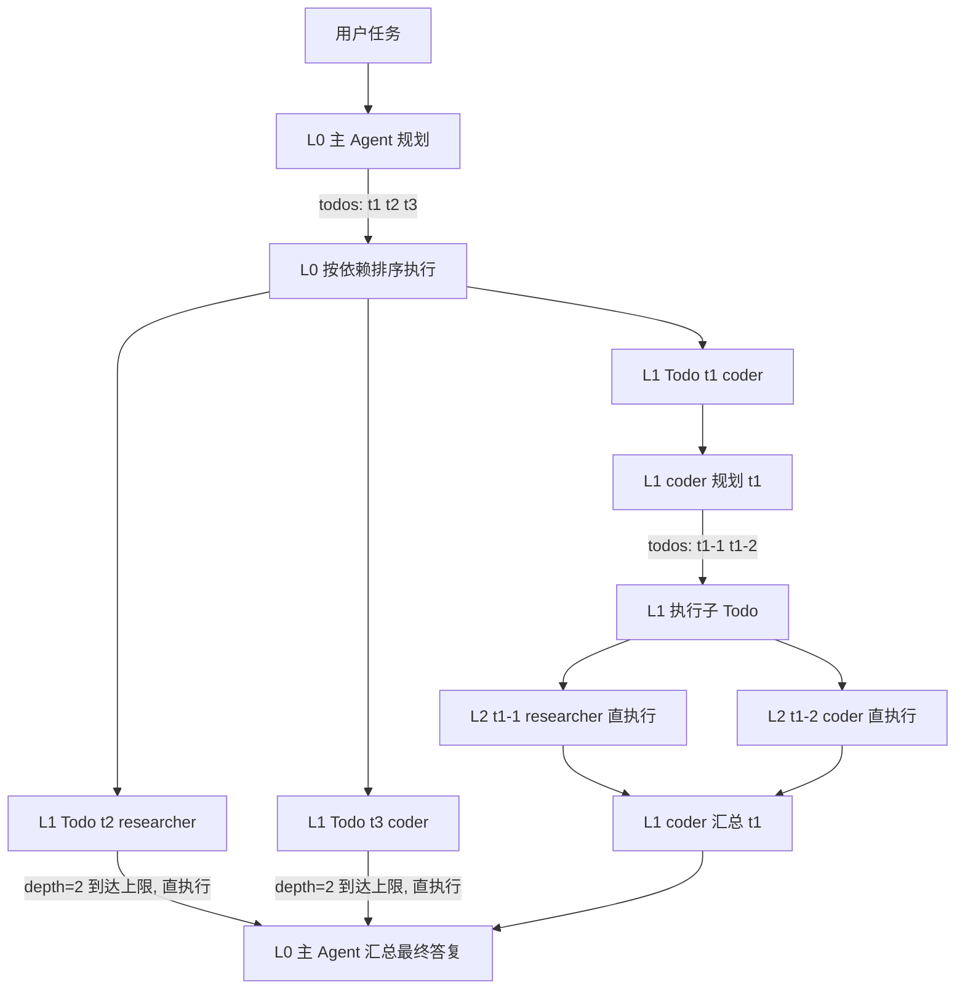

# Todo 委派编排（规划-委派-汇总 · 递归委托）技术方案

> 迭代目标：新增第四种编排模式 `delegate` —— 主 Agent 思考规划并列出 Todo，委托子 Agent 执行；子 Agent 可递归再委托子 Agent，逐层收敛汇总，最终由主 Agent 输出结论
> 文档编号：feature-todo-delegate-orchestration
> 关联文档：`feature-config-orchestration-separation技术方案(SUBMIT).md`（编排插件化基线）、`feature-agent-collaboration-pipeline-conversational技术方案(Deprecated).md`（协作模式设计基线）

> **实施状态：已实施** ✅
> - 实现已按本文档落地，核心差异见「7.2 实施结论（已完成）」
> - 同步变更已一并完成：`README.md`、`mwb-ai-claw技术方案.md`、`tools/install.sh` 帮助文案（见 §7.1）

## 1. 背景与目标

### 1.1 背景

现有四种编排（`routing` / `pipeline` / `conversational`）各有所长，但对「复杂、多步骤、跨领域」任务均有短板：

| 编排 | 擅长 | 短板 |
|------|------|------|
| `routing` | 单一领域问题 | 单 Agent 能力封顶，无分工 |
| `pipeline` | 固定阶段的流水线 | 阶段**预定义**，无法按任务动态拆解；单层接力，无法嵌套 |
| `conversational` | 观点讨论与收敛 | 讨论而非执行，产出是结论不是产物 |

真实复杂任务（如「从零搭建一个含前端、后端、部署的完整项目」）需要：**先整体规划拆解 → 按子任务分工执行 → 逐层汇总**。且子任务本身可能仍然复杂，需要再次拆解（如后端子任务再拆「设计数据模型 → 实现接口 → 写测试」）。

### 1.2 目标

1. **动态规划**：主 Agent 接收任务后，思考并规划出 Todo 列表（结构化 JSON），而非人工预定义阶段；
2. **委托执行**：每个 Todo 委托给最适合的 Agent 执行，支持依赖关系（`dependsOn`）与无依赖并行；
3. **递归委托**：子 Agent 执行 Todo 时同样可以再规划子 Todo 并委托下一级 Agent，形成任务树（受深度/数量限制）；
4. **逐层汇总**：每层规划 Agent 收集其子 Todo 结果后汇总为本层答复，主 Agent 最终输出结论；
5. **零主链路改动**：复用 `AgentOrchestrator` SPI 插件机制，新增类型 `delegate`，`ChatCmdExe` / `OrchestratorRegistry` 零改动。

### 1.3 非目标（本期不做）

- 规划结果的持久化 / 断点续跑 / 人工审批门禁（见 §10 演进）；
- 执行中动态调整 Todo（先规划后执行的静态 DAG，非动态计划）；
- 跨会话的 Todo 状态机与可视化面板；
- 编排 DSL / 图形化配置（JSON 即可）。

## 2. 现状分析

### 2.1 可复用资产

| 资产 | 现状 | 复用方式 |
|------|------|----------|
| `AgentOrchestrator` SPI + `OrchestratorRegistry` | 编排插件化，按 `type()` 自动注册 | 新增 `delegate` 插件即插即用，主链路零改动 |
| `ExecutionUnit.runAgent(prompt, agent, cb, streamCb)` | 单 Agent 一次性 ReAct（临时会话） | 所有 Todo / 规划 / 汇总执行的公共原语 |
| `ExecutionUnit.writeArtifact` | 阶段产物落盘 | `resultPass=file` 时汇总结果落盘 |
| `ConversationalOrchestrator` 线程池 | 首轮并行（daemon fixed pool） | 并行 Wave 执行复用同款模式（并发数=concurrency） |
| `PipelineOrchestrator` 空回复重试 / 失败策略 | 空回复重试一次 + abort/continue | 复用相同容错模式（重试 + abort/skip） |
| `JsonUtils` | JSON 序列化 / 反序列化 | 规划协议解析 |
| `CollaborationResult.traceSteps` | 轨迹列表 | 扩展「规划/委托/汇总」层级轨迹 |

### 2.2 差异对比

| 维度 | `pipeline` | `delegate`（本方案） |
|------|-----------|---------------------|
| 阶段来源 | 配置预定义（人工） | 运行时由主 Agent 规划（动态） |
| 层级 | 单层串行 | 递归多层（任务树） |
| 分支 | 无（纯串行） | 依赖排序 + 无依赖并行 |
| 每层角色 | 固定阶段 Agent | 每层有「规划 Agent（兼汇总）」+「执行子 Agent」 |
| 失败策略 | abort / continue | abort / skip（可重试） |

## 3. 总体方案

### 3.1 核心思路

```
用户消息
   │
   ▼
┌─────────────────────────────────────────────────────────────┐
│  TodoDelegateOrchestrator（type=delegate，编排插件）           │
│                                                             │
│  递归执行单元 executeNode(task, plannerAgentId, depth)：      │
│  1. 规划 Plan    ：planner 思考 → 输出 Todo 列表（结构化 JSON）│
│  2. 委派 Execute ：拓扑排序 → 按依赖分组 → 每个 Todo 递归/直执行 │
│  3. 汇总 Summarize：planner 收集子结果 → 输出本层最终答复       │
└─────────────────────────────────────────────────────────────┘
   │ 递归：子 Todo 若 depth < maxDepth，则以子 Agent 为规划者
   │       再次执行 executeNode（子 Agent 同理可再委托）
   ▼
ExecutionUnit.runAgent（规划 / 执行 / 汇总共用原语）
```

- **规划 Agent（planner）**：每层节点由 `plannerAgentId`（根节点）或上一层的 `todo.agentId`（子节点）指定，兼任「规划 + 汇总」双重职责；
- **执行子 Agent**：叶子层 Todo 直接执行（ReAct），非叶子层 Todo 递归为新的「规划 → 委派 → 汇总」节点；
- **深度控制**：`maxDepth` 限制任务树高度（1 = 单层委托；2 = 允许子 Agent 再委托一层，以此类推）。

### 3.2 递归流程示例（maxDepth=2）



> L0 主 Agent 拆解 3 个 Todo；t1 交给 coder 后 coder 继续拆解（递归），t2 / t3 到达深度上限直接执行；每层执行完汇总，最终主 Agent 输出整体结论。

## 4. 详细设计

### 4.1 数据模型（实施落位：infrastructure/collaboration 层，与 `PipelineStage` / `ConversationDefinition` 同级；方案原写 domain 层，实施时按现有类型化解析模型的存放约定调整）

#### 4.1.1 TodoDefinition（单个待办项）

```java
package com.mwb.ai.claw.infrastructure.collaboration;

import lombok.Data;

import java.util.ArrayList;
import java.util.List;

/**
 * 规划产物：主 Agent 输出的一项待办。
 */
@Data
public class TodoDefinition {

    /** Todo id（节点内唯一，如 t1 / t1-1） */
    private String todoId;

    /** 标题 */
    private String title;

    /** 任务描述（含完成标准，由规划 Agent 编写） */
    private String description;

    /** 执行 Agent id（引用 agents.json；未知 id 回退默认 Agent） */
    private String agentId;

    /** 依赖的 todoId 列表（可空；依赖先执行，结果注入该 Todo 的 prompt） */
    private List<String> dependsOn = new ArrayList<>();
}
```

#### 4.1.2 DelegateDefinition（编排配置）

```java
package com.mwb.ai.claw.infrastructure.collaboration;

import lombok.Data;

/**
 * delegate 编排配置：orchestrations.json 中 config.delegate 的类型化映射。
 */
@Data
public class DelegateDefinition {

    /** 根节点规划 Agent id（默认 "architect"；子节点规划者 = 上一层 todo.agentId） */
    private String plannerAgentId;

    /** 单层 Todo 数量上限（默认 8；超出截断并告警） */
    private Integer maxTodos;

    /** 递归委托深度（默认 2；1=仅主 Agent 拆解一层，子 Agent 直执行；2=允许子 Agent 再拆解一层） */
    private Integer maxDepth;

    /** 无依赖 Todo 是否并行执行（默认 true） */
    private Boolean parallel;

    /** 并行度（默认 4，与 conversational 线程池并发数同级） */
    private Integer concurrency;

    /** Todo 失败策略：abort（终止整个编排，默认）| skip（标记失败继续，汇总时注明） */
    private String onFailure;

    /** Todo 失败重试次数（默认 1；空回复同样触发重试） */
    private Integer retries;

    /** 规划 / 汇总阶段思考模式（默认 false，避免推理 token 吃满输出预算导致 content 为空） */
    private Boolean thinking;

    /** 汇总结果传递：text（直接拼入汇总 prompt，默认）| file（落盘传路径） */
    private String resultPass;

    /** 产物落盘目录（resultPass=file 时使用，默认 orchestration-artifacts） */
    private String workdir;
}
```

### 4.2 规划协议（Plan 阶段）

规划 Agent 的输出必须是**可直接解析的结构化 JSON**，规划 Prompt 模板：

```text
你是任务规划者。请将以下任务拆解为可执行的子任务（todo）列表：
任务：{task}
{depthHint}（当 depth >= maxDepth 时：本任务必须直接完成，不得再拆解）
约束：
- 最多 {maxTodos} 个 todo
- 每个 todo 需给出：todoId（如 t1/t2）、title、description（含完成标准）、agentId（从可用 Agent 中选择）、dependsOn（依赖的 todoId 列表，可空）
- 可直接完成的简单任务，输出单个 todo（agentId 为自己）
- 只输出 JSON，不要其他内容：
{ "todos": [ { "todoId": "t1", "title": "...", "description": "...", "agentId": "coder", "dependsOn": [] } ] }
```

**解析与校验策略（顺序执行）：**

1. **提取**：优先正则提取 ` ```json ... ``` ` 代码块；无代码块则截取首个 `{` 到末个 `}`；
2. **反序列化**：`JsonUtils.mapper().readValue` 为 `List<TodoDefinition>`；
3. **校验**：
   - `todoId` 非空且节点内唯一；
   - `agentId` 存在（未知 id 回退默认 Agent，trace 告警）；
   - `dependsOn` 引用必须存在于本层 todoId 集合；
   - todo 数超过 `maxTodos` → 截断保留前 `maxTodos` 个（trace 告警）。
4. **重试**：解析失败 → 追加提示「只输出 JSON，不要任何解释文字」重试一次；
5. **降级**：仍失败 → 本节点降级为「直执行」（规划 Agent 直接回答任务），保证可用性不中断。

### 4.3 执行引擎（Execute 阶段）

#### 4.3.1 依赖拓扑与并行 Wave

采用 Kahn 拓扑排序对同层 Todo 分层：

- 同一 Wave 内的 Todo 无相互依赖 → 可并行；
- 顺序保证：Wave k 的全部 Todo 完成后才执行 Wave k+1；
- **依赖环检测**：拓扑排序失败（存在环）→ 回退按声明顺序串行执行 + trace 告警。

```java
/** 拓扑分层：返回 List<Wave>，每个 Wave 内无依赖可并行 */
List<List<TodoDefinition>> topoSortWaves(List<TodoDefinition> todos) {
    // Kahn 算法：入度表 + 邻接表；每轮取出入度为 0 的节点为一个 Wave
    // 存在环（产出 Wave 数 < todo 数）→ 返回 null，由调用方回退声明顺序串行
}
```

#### 4.3.2 单个 Todo 执行（递归控制）

```java
/**
 * 递归执行单元：规划 → 委派 → 汇总。
 * depth 为当前节点深度（根=0）；子 Todo 深度 = depth + 1。
 */
private NodeResult executeNode(OrchestrationContext ctx, DelegateDefinition def,
                               String task, String plannerAgentId, int depth,
                               List<TodoDefinition> parentTodos) {
    // 1. 规划
    List<TodoDefinition> todos = plan(ctx, def, task, plannerAgentId, depth);
    if (todos == null || todos.isEmpty()) {
        return directExecute(ctx, def, task, plannerAgentId, depth);   // 降级直执行
    }
    // 1.1 单 todo 自执行优化：仅 1 个 todo 且 agentId 为规划者自身 → 直接直执行，避免无谓递归
    if (todos.size() == 1 && todos.get(0).getAgentId().equals(plannerAgentId)) {
        return directExecute(ctx, def, task, plannerAgentId, depth);
    }
    // 2. 委派：拓扑分层 → Wave 并行 / 串行
    List<List<TodoDefinition>> waves = topoSortWaves(todos);
    Map<String, NodeResult> results = new LinkedHashMap<>();           // 保持声明顺序
    for (List<TodoDefinition> wave : waves) {
        if (isParallel(def, wave)) {
            results.putAll(runWaveParallel(ctx, def, wave, depth, task, results)); // 流式回调传 null
        } else {
            for (TodoDefinition todo : wave) {
                results.put(todo.getTodoId(), runTodo(ctx, def, todo, depth, task, results));
            }
        }
    }
    // 3. 汇总
    return summarize(ctx, def, task, plannerAgentId, depth, todos, results);
}

/** 执行单个 Todo：非叶子层递归再规划；叶子层直执行 */
private NodeResult runTodo(OrchestrationContext ctx, DelegateDefinition def,
                           TodoDefinition todo, int depth, String parentTask,
                           Map<String, NodeResult> siblingResults) {
    String subTask = buildSubTaskPrompt(parentTask, todo, siblingResults); // 依赖结果注入
    if (depth + 1 < def.maxDepthOrDefault()) {
        // 递归：子 Agent 兼任下一层规划者
        return executeNode(ctx, def, subTask, todo.getAgentId(), depth + 1, null);
    }
    // 叶子层：直执行
    return directExecute(ctx, def, subTask, todo.getAgentId(), depth);
}
```

#### 4.3.3 并行执行

复用 `ConversationalOrchestrator` 的线程池模式（daemon 线程，随 JVM 退出）：

```java
// 每次 orchestrate() 新建 daemon 线程池（并发数=concurrency），编排结束 shutdown()
private ExecutorService newDelegatePool(int concurrency) {
    return Executors.newFixedThreadPool(concurrency, r -> {
        Thread t = new Thread(r, "delegate-wave");
        t.setDaemon(true);
        return t;
    });
}
```

- 并发数 = `concurrency`（默认 4）；
- 并行 Wave 的流式回调传 `null`（避免多线程交错输出终端），串行执行传 `ctx.getStreamCallback()`；
- 使用 `CompletableFuture.allOf(...).join()` 等待整波完成，结果按声明顺序回填 `LinkedHashMap`；异常经 `AtomicReference<Throwable>` 收集后统一抛出。

### 4.4 汇总阶段（Summarize）

```text
你是任务负责人。以下是你委派子 Agent 完成的任务与各子任务结果，请综合整理为最终答复：
任务：{task}

子任务结果：
{todoResults}    // 每个 todo: [t1] agent: <结果截断 N 字符>；resultPass=file 时为文件路径

请输出完整、可直接交付的最终答复。不要调用任何工具，直接输出。
```

- 汇总 Agent = 本层规划 Agent（根节点为 `plannerAgentId`）；
- 结果注入控制：单个 Todo 结果默认截断（如 2000 字符），`resultPass=file` 时先落盘再传文件路径，避免上下文超长；
- 汇总失败 → 重试一次 → 仍失败：`onFailure=abort` 抛 `BizException` 终止；`onFailure=skip` 直接拼接各子结果作为本层答复（保证用户始终拿到结果）。

### 4.5 失败处理与容错

| 场景 | 处理 |
|------|------|
| 规划输出解析失败 | 重试一次（结构化 prompt）→ 仍失败降级「直执行」 |
| Todo 执行异常 / 空回复 | 重试 `retries` 次（复用 pipeline 的「请直接输出完整回答」提示）→ 仍失败按 `onFailure`：abort 终止 / skip 标记失败继续 |
| 递归深度 / Todo 数量超限 | `maxDepth`、`maxTodos` 硬限制：到达上限强制「直执行 / 截断」 |
| 依赖环 | 拓扑排序检测 → 回退声明顺序串行 + trace 告警 |
| 未知 agentId | 回退默认 Agent（`agentGateway.getAgent(null)`）+ trace 告警 |

### 4.6 轨迹与进度（traceSteps / ProgressCallback）

层级轨迹使用 `[Plan]` / `[Todo:xxx]` / `[Summarize]` 前缀，子级用 `父todoId/子todoId` 标识层级：

```text
[Orchestration] 委托编排开始: 深度=2, 并发=4
[Plan] 架构师: 拆解为 3 个 todo: t1, t2, t3
[Todo:t1] 编码专家: <结果截断 80 字>
[Plan:t1] 编码专家: 拆解为 2 个 todo: t1-1, t1-2
[Todo:t1/t1-1] 信息检索专家: ...
[Todo:t1/t1-2] 编码专家: ...
[Summarize:t1] 编码专家: ...
[Todo:t2] 信息检索专家: ...
[Summarize] 架构师: <最终答复截断 80 字>
```

- 每个阶段（规划 / 每个 Todo 开始与完成 / 汇总）通过 `ctx.getCallback().onProgress(...)` 实时推送；
- `CollaborationResult.traceSteps` 汇总全链路轨迹，前端现有渲染零改动。

### 4.7 编排注册

新增插件 `TodoDelegateOrchestrator` 实现 `AgentOrchestrator`：

```java
@Component
public class TodoDelegateOrchestrator implements AgentOrchestrator {

    @Override
    public String type() { return "delegate"; }

    @Override
    public void validate(OrchestrationDefinition definition) {
        // 1. 解析 config.delegate → DelegateDefinition（缺失抛异常）
        // 2. plannerAgentId 存在（默认 "architect"）
        // 3. maxTodos >= 1、maxDepth >= 1、concurrency >= 1
        // 4. onFailure ∈ {abort, skip}、resultPass ∈ {text, file}
        // 5. definition.agents 中的 agentId 均存在（启动校验）
    }

    @Override
    public CollaborationResult orchestrate(OrchestrationContext ctx) {
        // 根节点执行：executeNode(ctx, def, ctx.message, def.plannerAgentId, 0, null)
        // 组装 CollaborationResult（reply / agentId=plannerAgentId / traceSteps / orchestrationId）
    }
}
```

注册中心（`OrchestratorRegistry`）启动期自动收集，主链路零改动。

## 5. 模块改动清单

| 层 | 文件 | 改动 |
|----|------|------|
| infrastructure/collaboration | `TodoDefinition.java` | **新增**：规划产物模型（实施落位 infrastructure 层，与 `PipelineStage` / `ConversationDefinition` 同级） |
| infrastructure/collaboration | `DelegateDefinition.java` | **新增**：delegate 编排配置模型 |
| infrastructure/collaboration/strategy | `TodoDelegateOrchestrator.java` | **新增**：delegate 编排插件（规划 / 拓扑排序 / 并行执行 / 递归委托 / 汇总） |
| infrastructure/collaboration | `ConversationDefinition.java` 同类位置 | 无改动（参考其类型化解析模式） |
| start/resources | `orchestrations.json` | **新增** `todo-delegate` 条目（type=delegate） |
| start/resources | `agents.json` | 可选：新增 `planner` Agent（默认复用 `architect` 即可，无需必改） |
| app/executor | `ChatCmdExe.java` | **零改动**（SPI 自动发现） |
| infrastructure/collaboration | `OrchestratorRegistry.java` | **零改动**（自动收集） |
| 文档 | `README.md` | **同步变更**：内置编排清单 / 能力说明 / 使用示例补充 `todo-delegate` |
| 文档 | `mwb-ai-claw技术方案.md` | **同步变更**：编排章节补充 `delegate` 类型说明 |
| 文档 | 本文档 | **同步变更**：实施状态置为已实施 ✅ 并补充结论 |
| 脚本 | `tools/install.sh` | **同步变更（可选）**：`--orchestration` 帮助文案示例补充 `todo-delegate`（见 §7.1） |

## 6. 配置示例

### 6.1 orchestrations.json 新增条目

```json
{
  "id": "todo-delegate",
  "type": "delegate",
  "description": "主 Agent 思考规划并拆解为 Todo 列表，委托子 Agent 执行；子 Agent 可递归再委托，逐层汇总。适用于复杂、多步骤、跨领域任务",
  "keywords": ["规划并实现", "复杂任务", "任务拆解", "分步骤", "分步完成", "多步骤", "拆解并执行", "团队协作", "分工完成", "整体规划"],
  "agents": ["architect", "coder", "researcher", "reviewer"],
  "config": {
    "delegate": {
      "plannerAgentId": "architect",
      "maxTodos": 8,
      "maxDepth": 2,
      "parallel": true,
      "concurrency": 4,
      "onFailure": "abort",
      "retries": 1,
      "thinking": false,
      "resultPass": "text"
    }
  }
}
```

> 配置说明：`maxDepth=2` 表示主 Agent 拆一层、子 Agent 可再拆一层（叶子层直执行）。想关闭递归委托（子 Agent 直执行）设 `maxDepth=1` 即可。

### 6.2 agents.json 可选新增 planner（不新增则复用 architect）

```json
{
  "agentId": "planner",
  "name": "规划协调者",
  "description": "擅长任务拆解、规划 Todo、协调子 Agent 分工与结果汇总",
  "keywords": ["规划", "拆解", "协调", "汇总", "分工"],
  "systemPrompt": "你是资深任务规划协调者，擅长将复杂任务拆解为可执行子任务并统筹汇总。",
  "tools": ["read_memory", "write_memory"],
  "maxSteps": 5,
  "model": "${PLANNER_MODEL:${DEFAULT_MODEL:deepseek-chat}}",
  "apiKey": "${PLANNER_API_KEY:${DEFAULT_API_KEY:}}"
}
```

### 6.3 使用方式

```bash
# 意图命中（消息含「规划并实现 / 复杂任务 / 任务拆解」等关键词）自动选择
java -jar start/target/start-*.jar

# 显式指定
mwb-ai-claw --agent.orchestration=todo-delegate

# 请求体显式指定（优先级最高）
# { "message": "从零搭建一个包含前后端和部署的完整项目", "orchestrationId": "todo-delegate" }
```

## 7. 实施步骤

1. **数据模型层**：新增 `TodoDefinition` / `DelegateDefinition`（实施落位 infrastructure/collaboration，含默认值方法，如 `maxDepthOrDefault()`）；
2. **infrastructure/collaboration/strategy**：实现 `TodoDelegateOrchestrator`：
   - `validate()`：启动期校验（plannerAgentId / maxTodos / maxDepth / concurrency / onFailure / resultPass / agents 存在性）；
   - 规划协议解析（JSON 提取 → 反序列化 → 校验 → 重试 → 降级直执行）；
   - Kahn 拓扑分层 + Wave 并行执行（复用 conversational 线程池模式）；
   - 递归委托（`depth + 1 < maxDepth`）+ 叶子直执行 + 逐层汇总；
   - 失败重试 / abort / skip、轨迹与进度推送；
3. **start/resources**：`orchestrations.json` 新增 `todo-delegate`；可选新增 `planner` Agent；
4. **编译验证 + 全链路测试**（见 §8）；
5. **同步变更文档与工具脚本**（实施时必须一并完成，不得遗漏）：
   - 本文档：更新「实施状态」为已实施 ✅ 并补充实施结论；
   - `README.md`：内置编排清单 / 能力说明 / 使用示例补充 `todo-delegate`；
   - `mwb-ai-claw技术方案.md`：编排章节补充 `delegate` 类型说明；
   - `tools/install.sh`：`--orchestration` 帮助文案示例补充 `todo-delegate`（见 §7.1 核查结论，功能上无需改动）；
   - `tools/install.ps1` / `setup.*` / `package.*`：已核查，无编排相关引用，无需调整。

### 7.1 tools 目录脚本核查结论（已核查）

| 脚本 | 编排相关引用 | 是否需要调整 |
|------|------------|------------|
| `tools/install.sh` | 支持 `--orchestration <id>`（透传 `--agent.orchestration`），帮助文案示例为「routing \| code-review-pipeline \| team-discussion 等」 | 功能无需改动；帮助文案示例已补充 `todo-delegate`（已完成） |
| `tools/install.ps1` | 无编排引用（仅审批模式处理） | 无需调整 |
| `tools/setup.sh` / `setup.ps1` | 无编排引用 | 无需调整 |
| `tools/package.sh` / `package.ps1` | 无编排引用（打包逻辑） | 无需调整 |

### 7.2 实施结论（已完成）

**落地文件**

| 层 | 文件 | 说明 |
|----|------|------|
| infrastructure/collaboration | `TodoDefinition.java` | 规划产物模型（todoId / title / description / agentId / dependsOn） |
| infrastructure/collaboration | `DelegateDefinition.java` | delegate 编排配置模型（plannerAgentId / maxTodos / maxDepth / parallel / concurrency / onFailure / retries / thinking / resultPass / workdir + `xxxOrDefault()`） |
| infrastructure/collaboration/strategy | `TodoDelegateOrchestrator.java` | delegate 编排插件（规划→委派→汇总，Kahn 拓扑分层 + Wave 并行 + 递归委托 + 容错降级） |
| start/resources | `orchestrations.json` | 新增 `todo-delegate` 条目（type=delegate，含 10 个意图关键词） |
| infrastructure/src/test | `TodoDelegateOrchestratorTest.java` | fake AgentGateway / ExecutionUnit 单元测试 4 例 |

**与方案的差异（实施时调整，均已落实）**

1. **模型层位置**：方案 §4.1 原写「domain 层新增」，实施按现有 `PipelineStage` / `ConversationDefinition` 的存放约定放入 **infrastructure/collaboration**（同包，注册中心不感知结构，无功能影响）；
2. **单 todo 自执行优化**（方案 §4.2 规划 Prompt「可直接完成的简单任务，输出单个 todo（agentId 为自己）」的落点）：规划产物若只有 1 个 todo 且 agentId 为规划者自身，直接「直执行」完成，不再绕一圈规划→委派→汇总，接近直执行成本（见 §9 风险表末行）；
3. **依赖注入**：方案 §8 测试计划「依赖结果注入其 prompt」落地为将已完成 todo 结果（截断）拼入子 todo 的 prompt 上下文；
4. **线程池生命周期**：每次 `orchestrate()` 新建 daemon 线程池（并发数=concurrency）并在编排结束 `shutdown()`，避免静态池全局膨胀（与 conversational 复用同模式但实例级管理）。

**验收结果**：`mvn test` 全绿（9 例通过，含本特性 4 例：依赖排序与并行 / 递归再委托层级标签 `[Todo:t1/t1-1]` / 非 JSON 降级直执行 / 依赖环回退串行），启动校验与现有 routing / pipeline / conversational 回归不受影响。

## 8. 测试计划

| 用例 | 预期 |
|------|------|
| 单层委托（maxDepth=1） | 主 Agent 拆解 N 个 todo → 各子 Agent 直执行 → 汇总输出 | 
| 递归委托（maxDepth=2） | 子 Agent 可再拆解子 todo，叶子直执行，逐层汇总 |
| 依赖排序 | 有 `dependsOn` 的 todo 在依赖完成后执行，依赖结果注入其 prompt |
| 无依赖并行 | 同 Wave 并行执行，结果按声明顺序回填 |
| 依赖环 | 检测到环 → 回退声明顺序串行 + trace 告警，不中断 |
| 规划 JSON 解析失败 | 重试一次 → 仍失败降级为规划 Agent 直执行，用户仍能拿到答复 |
| 规划 todo 超限 | 截断保留前 maxTodos 个 + trace 告警 |
| todo 执行失败 | 重试 retries 次 → abort 终止 / skip 标记失败继续（按配置） |
| 未知 agentId | 回退默认 Agent + trace 告警 |
| 深度超限 | 到达 maxDepth 的节点强制直执行，不产生更深层规划 |
| 空回复 | 复用「请直接输出完整回答」重试逻辑 |
| 并行 wave 流式 | 并行阶段流式回调传 null，串行阶段正常流式 |
| 与现有编排兼容 | routing / pipeline / conversational 行为回归不变；新增编排不影响主链路 |
| 意图选择 | 消息命中 todo-delegate 关键词 → 选择 delegate 编排；未命中回退默认 routing |

## 9. 风险与应对

| 风险 | 应对 |
|------|------|
| LLM 结构化输出不稳定（JSON 解析失败） | 重试 + 降级「直执行」，可用性不中断 |
| 递归深度 / Todo 数量失控 | `maxDepth` / `maxTodos` 硬限制 + 强制截断 |
| 并行调用成本 / 模型限流 | `concurrency` 可配置（默认 4），串行兜底 |
| 汇总注入子结果导致上下文超长 | 单结果截断 + `resultPass=file` 落盘传路径 |
| 依赖环导致死循环 | Kahn 拓扑检测 → 回退串行 |
| 规划 Agent 能力不足拆解不合理 | plannerAgentId 可配置（默认 architect），可切换 planner Agent |
| 每层规划额外消耗一轮 LLM 调用 | `maxDepth=1` 可关闭递归；简单任务规划 Agent 会输出单 todo 自执行，近似直执行成本 |

## 10. 后续演进（已实施 ✅，2026-08-19）

> 本节 6 项演进原为「预留」清单，均已按 §11 分阶段计划（P0 数据底座 / P1 交互与上下文 / P2 智能与组合）实施完成；技术方案、落地说明与验收结果见 §11.2 / §11.3 / §11.4。

- **规划产物落盘**：plan.json 写入 `orchestration-artifacts`，支持轨迹追溯与可视化面板 → **已实施 ✅**（见 §11.2 P0-1 / P0-2）
- **Todo 状态机 + 人工审批门禁**：`paused → approved → running → done`，关键节点人工确认后再委托 → **已实施 ✅**（见 §11.3 P1-1 ~ P1-4）
- **动态规划（Plan-Do-Reflect）**：执行中根据中间结果调整后续 Todo → **已实施 ✅**（见 §11.4 P2-1 / P2-2）
- **上下文压缩**：子结果相关性 top-k 注入汇总（控制上下文成本）→ **已实施 ✅**（见 §11.3 P1-5）
- **委托结果沉淀记忆**：子任务结论写入分层记忆 FACT，供后续任务复用 → **已实施 ✅**（见 §11.2 P0-3）
- **编排嵌套组合**：允许 delegate 的某个 Todo 显式引用 pipeline / conversational / delegate 自身编排执行（嵌套调用链防环）→ **已实施 ✅**（见 §11.4 P2-3 / P2-4）

## 11. 后续演进实施计划（已全部落地 ✅）

> 将 §10 的 6 项演进按「依赖关系 + 风险 + 收益」归并为 3 个阶段（P0 → P2）分步推进。每阶段独立可交付、可验收；前序阶段产物是后续阶段的数据底座，避免返工。

### 11.1 阶段总览

| 阶段 | 演进项 | 依赖 | 核心价值 |
|------|--------|------|----------|
| P0 数据底座 | ① 规划产物落盘 ② 委托结果沉淀记忆 | 无（基于已实施 delegate 基线） | 全链路可追溯；子结论可复用 |
| P1 交互与上下文 | ③ Todo 状态机 + 人工审批门禁 ④ 上下文压缩 | 依赖 P0-①（plan.json 持久化） | 可控性 + 上下文成本 |
| P2 智能与组合 | ⑤ 动态规划（Plan-Do-Reflect）⑥ 编排嵌套组合 | 依赖 P1-③（状态机）+ P0 | 动态调整 + 跨编排复用 |

依赖说明：⑤ 调整 Todo 需状态机支撑暂停/替换；③ 的门禁需要 ① 持久化的 plan 状态；④ 的检索源复用 ① 的落盘结果与 `resultPass=file` 链路。

### 11.2 P0 数据底座（已实施 ✅，2026-08-19）

**目标**：delegate 编排全过程可追溯（plan.json + 各层结果落盘），子任务结论进入分层记忆可复用；不改动执行语义。

| # | 任务 | 涉及文件 | 要点 |
|---|------|----------|------|
| P0-1 | 规划产物落盘 plan.json | `TodoDelegateOrchestrator`、`DelegateDefinition`（复用现有 `workdir`） | 每层规划成功后写 `plan-{layerPath}.json`（含 todos 快照）；汇总后写 `result-{layerPath}.txt`；trace 追加「plan 已落盘: 路径」 |
| P0-2 | 产物目录隔离与幂等 | 同上 + `ExecutionUnitImpl.writeArtifact` | 同次编排按 `{sessionId}/{时间戳}` 子目录隔离；重复执行覆盖同名文件；目录不存在自动创建 |
| P0-3 | 委托结果沉淀记忆 | `TodoDelegateOrchestrator`（汇总后经记忆网关写 FACT） | 每个叶子 todo 完成后写入 FACT：`{todoId}/{title}/{结论截断}/{父任务}`；按 todoId 幂等去重 |
| P0-4 | 轨迹补全 | `CollaborationResult.traceSteps` | 落盘与记忆写入均追加 trace 行，前端现有渲染零改动 |

**验收标准**
- 执行一次 delegate 编排后，`workdir` 下存在 `plan-*.json` 与 `result-*.txt`，内容与 trace 一致；
- 分层记忆检索「某子任务结论」可召回对应 FACT，重复执行不产生重复 FACT；
- 现有 4 个 delegate 单测 + 全量 `mvn test` 回归通过。

**落地说明（已完成）**

| 改动点 | 说明 |
|--------|------|
| `ExecutionUnit.writeFile(dir, fileName, content)` | domain 接口 + `ExecutionUnitImpl` 新增：按精确文件名落盘（目录自动创建、同名覆盖），供 plan/result 落盘使用 |
| 产物目录隔离 | `orchestrate()` 计算 `{workdir}/{sessionId}/{时间戳}` 根目录传入 `DelegateExecutor`；重复编排进入不同时间戳子目录（幂等不冲突）；`resultPass=file` 的子结果落盘同步改用隔离目录 |
| plan.json 落盘 | `plan()` 成功后写 `plan-{layerPath}.json`（todos 快照；层级路径平铺为 `t1-t1-1`），trace 追加「规划产物已落盘: 路径」 |
| result.txt 落盘 | `summarize()` 取得答复后写 `result-{layerPath}.txt`，trace 追加「汇总结果已落盘: 路径」 |
| FACT 沉淀 | 叶子 todo 完成后 `LayeredMemoryGateway.saveFact("delegate-todo:{todoPath}", "{todoId}/{title}/结论:{截断 500}/{任务:{截断 200}}", 1.0)`；topic 含层级路径幂等去重；记忆未启用 / 未注入时静默跳过，失败仅告警不影响编排；trace 追加「结论已沉淀记忆」 |
| 单元测试 | `TodoDelegateOrchestratorTest` 新增 `testP0_persistArtifactsAndFacts`（断言 plan.json/result.txt 落盘、落盘与沉淀轨迹、t1/t2 的 FACT topic 与内容），fake 扩展 `writeFile` 记录 + `FakeLayeredMemoryGateway` 记录 saveFact |

**验收结果**：infrastructure 模块全量测试 exit 0（TodoDelegateOrchestratorTest 5 例 + RuleBasedAgentRouterTest 5 例全绿）；既有 4 例 delegate 单测回归通过（落盘/记忆为可选增强，未配置或失败时行为不变）。

### 11.3 P1 交互与上下文（已实施 ✅，2026-08-19）

**目标**：引入 Todo 生命周期状态机与人工审批门禁（关键节点可暂停人工确认），并对汇总注入做相关性 top-k 压缩，控制上下文成本。

| # | 任务 | 涉及文件 | 要点 |
|---|------|----------|------|
| P1-1 | Todo 状态机模型 | 新增 `TodoStatus`（enum：paused / approved / running / done / failed）；`TodoDefinition` 增加 `status` 字段 | 状态流转：paused→approved→running→done；失败→failed（按 `onFailure` 策略继续或终止） |
| P1-2 | 审批门禁定义 | `DelegateDefinition` 增加 `approvalGate`（`none`（默认）/ `root`（仅根规划）/ `all`（每层））与 `approvalTimeoutMs` | 命中门禁的层：规划完成后置 paused 并抛出「等待审批」信号，不进入委派 |
| P1-3 | 审批 API | app 层新增 `pendingTasks` / `approve` / `reject` 接口（REST + WebSocket + Shell 命令） | 按 `{sessionId}/{layerPath}` 定位暂停节点；approve → 状态机推进继续执行；reject → 回退直执行或终止 |
| P1-4 | 执行引擎挂起/恢复 | `TodoDelegateOrchestrator.executeNode` | 检测到 paused 节点时中断当前线程等待（异步任务 + 轮询 / `CompletableFuture` 挂起），审批完成后从断点继续 |
| P1-5 | 上下文压缩（top-k 检索） | 复用分层记忆 `VectorMemoryRetriever` / `EmbeddingGateway` | 汇总阶段不全量注入：子结果先写临时页，检索与父任务最相关 top-k（默认 3，可配置）注入汇总 prompt；`resultPass=file` 链路保留 |

**验收标准**
- 配置 `approvalGate=root` 后，根规划完成即暂停，审批通过前无任何子 Agent 被调用；
- approve / reject 后编排正确继续或终止，状态机日志完整；
- 汇总 prompt 注入的子结果数 ≤ top-k，且质量不劣于全量注入（人工对比 3 例）；
- 单测新增：状态流转、门禁挂起/恢复、top-k 截断。

**风险与降级**：挂起/恢复依赖线程模型——同步 `orchestrate` 需改为「异步任务 + 状态查询」两段式（审批后由任务驱动继续），`ChatCmdExe` 需适配返回「等待审批」中间态；若影响面过大，P1-2/3/4 降级为「记录审批日志 + 提供人工重跑入口」，不与编排执行内联。

**落地说明（已完成）**

| 改动点 | 说明 |
|--------|------|
| `TodoStatus` 状态机 | infrastructure/collaboration 新增 enum（paused / approved / running / done / failed）；`TodoDefinition` 增加 `status` 字段；`runTodo` 执行前置 running、完成后置 done / failed（skip 失败标记）；门禁层 plan 快照在等待期间保持 paused，批准后置 approved |
| 审批门禁配置 | `DelegateDefinition` 增加 `approvalGate`（none 默认 / root / all）与 `approvalTimeoutMs`（默认 0=无限等待）、`topK`（默认 3）及 `xxxOrDefault()`；`validate()` 增加 approvalGate ∈ {none,root,all} 与 topK ≥ 1 校验 |
| 挂起/恢复模型 | **保持同步 `orchestrate` 主链路零改动**（未改两段式）：新增 `ApprovalRegistry` + `PendingApproval`（`CompletableFuture` 挂起），`executeNode` 规划完成后命中门禁即注册节点、todos 置 paused、trace 推送「等待人工审批: {sessionId}/{layerKey}」并 `await(timeout)` 阻塞；approve → 置 approved 继续委派；reject / 超时 → 该层降级直执行（trace 注明「审批已拒绝 / 等待审批超时，该层降级直执行」）；决策后节点自动从注册表移除（幂等）。`ChatCmdExe` / `AgentController` 同步链路零改动 |
| 审批 API | client 新增 `ApprovalCmd` / `PendingApprovalDTO`；app 新增 `ApprovalService`（pendingTasks / approve / reject）；adapter 新增 `ApprovalController`（`GET /agent/pending-tasks`、`POST /agent/approve`、`POST /agent/reject`）+ `AgentWebSocketHandler` 扩展消息类型（approve / reject / pending_tasks，`WsRequest` 增加 `layerKey`） |
| top-k 上下文压缩 | 汇总阶段 text 模式且子结果数 > topK 时，按子结果与父任务文本的字符 bigram 覆盖率降序取 top-k 注入，trace 输出「子结果已按相关性压缩至 top-N」；topK ≥ 子结果数时全量注入（行为与 P0 前一致）；`resultPass=file` 链路保留（注入文件路径） |
| orchestrations.json | `todo-delegate` 配置新增 `approvalGate: none`、`approvalTimeoutMs: 0`、`topK: 3`（均为默认值，未配置时行为与既有 delegate 完全一致） |
| 单元测试 | `TodoDelegateOrchestratorTest` 新增 5 例：root 门禁审批前无子 Agent 调用且 plan 处于 paused、批准后恢复执行并清空注册表 / 拒绝降级直执行 / 超时降级直执行 / all 门禁逐层暂停（root → t1）逐层批准到叶子 / top-k 只注入最相关子结果且 topK ≥ 数量时全量注入 |

**实施结论与差异**：挂起/恢复未按「两段式异步 + 状态查询」改造主链路，而是采用「编排线程内 `CompletableFuture` 阻塞等待 + 审批 API 决策唤醒」——同步 `orchestrate` 语义与 `ChatCmdExe` 零改动，审批等待期间 SSE / 同步请求保持连接（由 `approvalTimeoutMs` 兜底防悬挂）；top-k 相关性未依赖向量检索（记忆未启用时亦可用），采用父任务与子结果字符 bigram 覆盖率本地打分，`resultPass=file` 链路保留。Shell 模式审批交互补充：普通对话改由后台 daemon 线程执行（REPL 主循环不阻塞），命中门禁等待期间可用 `/pending` / `/approve` / `/reject` 决策唤醒；`/approve` / `/reject` 的 sessionId 可选（编排首次创建会话时 shell 的 sessionId 可能未同步，以 `/pending` 输出为准）；`planMode` 分支保持同步（与审批门禁同用场景建议 `approvalGate=none` 或使用 Web 模式）。

**验收结果**：`mvn test` 全量 exit 0（15 例全绿：TodoDelegateOrchestratorTest 10 例【既有 5 + P1 新增 5】+ RuleBasedAgentRouterTest 5 例）；approvalGate=none（默认）时既有 delegate 测试全部回归通过（门禁为可选增强，未配置不暂停、top-k 不压缩）。Shell 审批命令为终端交互（无单测），`mvn -pl mwb-ai-claw-adapter -am compile` 编译通过。

### 11.4 P2 智能与组合（已实施 ✅，2026-08-19）

**目标**：规划不再静态——执行中根据中间结果调整剩余 Todo；并支持 Todo 级嵌套复用其他编排。

| # | 任务 | 涉及文件 | 要点 |
|---|------|----------|------|
| P2-1 | 动态规划（Plan-Do-Reflect） | `TodoDelegateOrchestrator`、plan.json 读写 | 首个 Wave 执行完成后，规划 Agent 结合已得结果对剩余 Todo 做一次 re-plan（新增/删除/调整后续 Wave）；受 `maxTodos` / `maxDepth` 与 `replanRounds`（默认 1）限制 |
| P2-2 | Re-plan 协议 | 复用 §4.2 规划协议 + `adjust` 动作 | 规划输出支持 `{"todos": [...], "adjust": [{"todoId","action":"keep\|drop\|modify","description"}]}`，仅作用于未执行 Wave |
| P2-3 | 编排嵌套组合 | 新增 `ExecutionUnit.runOrchestration(message, orchestrationId)`（或经 `OrchestratorRegistry` 按 id 调起） | Todo 配置支持 `orchestrationId` 字段（可引用 pipeline / conversational / delegate 自身；防环：禁止引用当前任务树祖先层） |
| P2-4 | 嵌套上下文与结果回传 | `TodoDelegateOrchestrator` | 嵌套编排返回的 `CollaborationResult.reply` 作为该 Todo 结果参与上层汇总；trace 层级标签沿用 `[Todo:t1/...]` |

**验收标准**
- 场景：规划 5 个 todo，首个 Wave 执行后 re-plan 将第 4 个 todo 拆为 2 个，最终执行 6 个节点且结果正确汇总；
- 嵌套编排：delegate 的某 todo 指定 pipeline 编排执行，产物回传正确；循环引用（A→B→A）启动校验报错；
- 全量回归 + 新增单测：re-plan 调整、嵌套调用、循环引用检测。

**落地说明（已完成）**

| 改动点 | 说明 |
|--------|------|
| 配置扩展 | `DelegateDefinition` 新增 `replanRounds`（默认 0=不启用，§11.5 兼容约束；`validate` 校验 ≥ 0）；`TodoDefinition` 新增 `orchestrationId`（可空）；`orchestrations.json` 的 todo-delegate 增加 `replanRounds: 0` |
| P2-1 动态规划 | `executeNode` 委派改为 Wave 循环：每个 Wave 执行完成后，若仍有剩余 Wave 且 `replanUsed < replanRounds`，规划者结合已得结果与剩余 Todo 做一次 re-plan；调整成功则以新剩余 Wave 继续，失败保持原剩余；re-plan 后 todo 的 `dependsOn` 可引用已完成 todo（视为已满足，不重新执行），拓扑排序对集合外依赖跳过，支持把单个 todo 拆为多个 |
| P2-2 Re-plan 协议 | 新增 `replan()` + `parseReplan()`：规划输出支持完整 `{"todos":[...]}` 替换剩余，或 `{"adjust":[{"todoId","action":"keep|drop|modify","description"}]}` 增量调整；过滤未知依赖引用、受 `maxTodos` 截断；调整后的剩余 todo 写 `plan-{layerPath}.json` 并输出 `[Replan]` 轨迹（含「N → M」数量变化） |
| P2-3 编排嵌套组合 | `ExecutionUnit` 新增 `runOrchestration(message, orchestrationId)`（domain 接口 + `ExecutionUnitImpl` 装配嵌套上下文：复用 Agent 注册表 / 执行单元，按 id 解析定义并调起插件）；`runTodo` 中 todo 配置 `orchestrationId` 时优先走嵌套编排分支（pipeline / conversational / delegate 自身），否则按既有递归 / 直执行 |
| P2-3 防环 | `orchestrate()` 入口用线程级嵌套调用链（`ThreadLocal<Deque>`）检测：进入时 push 编排 id、退出时 pop（配对清理，并行 Wave 线程各自独立）；嵌套进入时若 id 已在链中（A→B→A）立即抛 `BizException`「编排循环引用」终止——因 todo 由 LLM 运行时生成，防环在运行时按调用链检测而非启动期静态校验 |
| P2-4 嵌套上下文与结果回传 | 嵌套编排返回的 `CollaborationResult.reply` 作为该 Todo 结果参与本层汇总（`resultPass=file/text` 均生效）；trace 沿用 `[Todo:{todoPath}] 嵌套编排 {id} 完成: ...` 层级标签；嵌套 todo 结论同样沉淀分层记忆 FACT |
| 单元测试 | `TodoDelegateOrchestratorTest` 新增 5 例：首波后 re-plan 把第 4 个 todo 拆为 2 个（5→6 节点，含依赖顺序断言）/ adjust 协议 keep-drop-modify 生效 / replanRounds=0（默认）不触发 / todo 指定 pipeline 嵌套编排且结果注入汇总 prompt / todo 嵌套 delegate 自身（A→A）触发循环引用终止 |

**实施结论与差异**：`replanRounds` 默认值按 §11.5 兼容约束取 **0（不启用）**（§11.4 表格草稿的「默认 1」以兼容性约束为准，未配置时行为与既有 delegate 完全一致）；嵌套调起采用文档首选方案 `ExecutionUnit.runOrchestration`（而非编排器内注入注册表）；防环因 todo 运行时生成，落地为「运行时嵌套调用链检测」（`ThreadLocal<Deque>` 记录当前线程编排 id 栈），无法在启动期静态校验，配置层 `validate()` 仅校验 `replanRounds` 与既有字段。

**验收结果**：`mvn test` 全量 exit 0（20 例全绿：TodoDelegateOrchestratorTest 15 例【既有 5 + P0 1 + P1 5 + P2 新增 4】+ RuleBasedAgentRouterTest 5 例）；`orchestrations.json` JSON 校验通过；replanRounds=0（默认）与未配置 `orchestrationId` 时既有 delegate 测试全部回归通过（re-plan 与嵌套均为可选增强）。

### 11.5 里程碑与回归约束

- **阶段合入门槛**：`mvn test` 全绿 + `orchestrations.json` 启动校验通过 + README / 技术方案文档同步（沿用本特性「实施必须同步文档」约定）；
- **P0 为一切前置**：P1-③ 与 P2-⑤ 若遇实现阻力，均可以「独立 API 版」降级交付，不阻塞其他阶段；
- **兼容性**：新增配置字段全部带默认值（`approvalGate=none`、`replanRounds=0`、`topK=3`），未配置时行为与当前 delegate 完全一致，既有编排不受影响。
