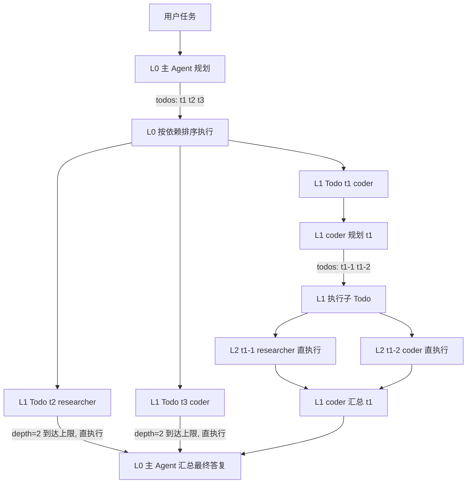

# Todo 委派编排（规划-委派-汇总 · 递归委托）技术方案

> 迭代目标：新增第四种编排模式 `delegate` —— 主 Agent 思考规划并列出 Todo，委托子 Agent 执行；子 Agent 可递归再委托子 Agent，逐层收敛汇总，最终由主 Agent 输出结论
> 文档编号：feature-todo-delegate-orchestration
> 关联文档：`feature-config-orchestration-separation技术方案(SUBMIT).md`（编排插件化基线）、`feature-agent-collaboration-pipeline-conversational技术方案(Deprecated).md`（协作模式设计基线）

> **实施状态：待评审（未实施）** ⏳
> - 本文档仅描述技术方案与代码设计，尚未进入实现
> - 实现时按「7. 实施步骤」顺序推进，并以「8. 测试计划」作为验收标准
> - **实现完成后必须同步变更**：本文档实施状态、`README.md`、`mwb-ai-claw技术方案.md` 及 `tools/` 脚本（见 §7.1 核查结论）

## 1. 背景与目标

### 1.1 背景

现有四种编排（`routing` / `pipeline` / `conversational`）各有所长，但对「复杂、多步骤、跨领域」任务均有短板：

| 编排 | 擅长 | 短板 |
|------|------|------|
| `routing` | 单一领域问题 | 单 Agent 能力封顶，无分工 |
| `pipeline` | 固定阶段的流水线 | 阶段**预定义**，无法按任务动态拆解；单层接力，无法嵌套 |
| `conversational` | 观点讨论与收敛 | 讨论而非执行，产出是结论不是产物 |

真实复杂任务（如「从零搭建一个含前端、后端、部署的完整项目」）需要：**先整体规划拆解 → 按子任务分工执行 → 逐层汇总**。且子任务本身可能仍然复杂，需要再次拆解（如后端子任务再拆「设计数据模型 → 实现接口 → 写测试」）。

### 1.2 目标

1. **动态规划**：主 Agent 接收任务后，思考并规划出 Todo 列表（结构化 JSON），而非人工预定义阶段；
2. **委托执行**：每个 Todo 委托给最适合的 Agent 执行，支持依赖关系（`dependsOn`）与无依赖并行；
3. **递归委托**：子 Agent 执行 Todo 时同样可以再规划子 Todo 并委托下一级 Agent，形成任务树（受深度/数量限制）；
4. **逐层汇总**：每层规划 Agent 收集其子 Todo 结果后汇总为本层答复，主 Agent 最终输出结论；
5. **零主链路改动**：复用 `AgentOrchestrator` SPI 插件机制，新增类型 `delegate`，`ChatCmdExe` / `OrchestratorRegistry` 零改动。

### 1.3 非目标（本期不做）

- 规划结果的持久化 / 断点续跑 / 人工审批门禁（见 §10 演进）；
- 执行中动态调整 Todo（先规划后执行的静态 DAG，非动态计划）；
- 跨会话的 Todo 状态机与可视化面板；
- 编排 DSL / 图形化配置（JSON 即可）。

## 2. 现状分析

### 2.1 可复用资产

| 资产 | 现状 | 复用方式 |
|------|------|----------|
| `AgentOrchestrator` SPI + `OrchestratorRegistry` | 编排插件化，按 `type()` 自动注册 | 新增 `delegate` 插件即插即用，主链路零改动 |
| `ExecutionUnit.runAgent(prompt, agent, cb, streamCb)` | 单 Agent 一次性 ReAct（临时会话） | 所有 Todo / 规划 / 汇总执行的公共原语 |
| `ExecutionUnit.writeArtifact` | 阶段产物落盘 | `resultPass=file` 时汇总结果落盘 |
| `ConversationalOrchestrator` 线程池 | 首轮并行（daemon fixed pool） | 并行 Wave 执行复用同款模式（并发数=concurrency） |
| `PipelineOrchestrator` 空回复重试 / 失败策略 | 空回复重试一次 + abort/continue | 复用相同容错模式（重试 + abort/skip） |
| `JsonUtils` | JSON 序列化 / 反序列化 | 规划协议解析 |
| `CollaborationResult.traceSteps` | 轨迹列表 | 扩展「规划/委托/汇总」层级轨迹 |

### 2.2 差异对比

| 维度 | `pipeline` | `delegate`（本方案） |
|------|-----------|---------------------|
| 阶段来源 | 配置预定义（人工） | 运行时由主 Agent 规划（动态） |
| 层级 | 单层串行 | 递归多层（任务树） |
| 分支 | 无（纯串行） | 依赖排序 + 无依赖并行 |
| 每层角色 | 固定阶段 Agent | 每层有「规划 Agent（兼汇总）」+「执行子 Agent」 |
| 失败策略 | abort / continue | abort / skip（可重试） |

## 3. 总体方案

### 3.1 核心思路

```
用户消息
   │
   ▼
┌─────────────────────────────────────────────────────────────┐
│  TodoDelegateOrchestrator（type=delegate，编排插件）           │
│                                                             │
│  递归执行单元 executeNode(task, plannerAgentId, depth)：      │
│  1. 规划 Plan    ：planner 思考 → 输出 Todo 列表（结构化 JSON）│
│  2. 委派 Execute ：拓扑排序 → 按依赖分组 → 每个 Todo 递归/直执行 │
│  3. 汇总 Summarize：planner 收集子结果 → 输出本层最终答复       │
└─────────────────────────────────────────────────────────────┘
   │ 递归：子 Todo 若 depth < maxDepth，则以子 Agent 为规划者
   │       再次执行 executeNode（子 Agent 同理可再委托）
   ▼
ExecutionUnit.runAgent（规划 / 执行 / 汇总共用原语）
```

- **规划 Agent（planner）**：每层节点由 `plannerAgentId`（根节点）或上一层的 `todo.agentId`（子节点）指定，兼任「规划 + 汇总」双重职责；
- **执行子 Agent**：叶子层 Todo 直接执行（ReAct），非叶子层 Todo 递归为新的「规划 → 委派 → 汇总」节点；
- **深度控制**：`maxDepth` 限制任务树高度（1 = 单层委托；2 = 允许子 Agent 再委托一层，以此类推）。

### 3.2 递归流程示例（maxDepth=2）



> L0 主 Agent 拆解 3 个 Todo；t1 交给 coder 后 coder 继续拆解（递归），t2 / t3 到达深度上限直接执行；每层执行完汇总，最终主 Agent 输出整体结论。

## 4. 详细设计

### 4.1 数据模型（domain 层新增）

#### 4.1.1 TodoDefinition（单个待办项）

```java
package com.mwb.ai.claw.domain.collaboration;

import lombok.Data;

import java.util.ArrayList;
import java.util.List;

/**
 * 规划产物：主 Agent 输出的一项待办。
 */
@Data
public class TodoDefinition {

    /** Todo id（节点内唯一，如 t1 / t1-1） */
    private String todoId;

    /** 标题 */
    private String title;

    /** 任务描述（含完成标准，由规划 Agent 编写） */
    private String description;

    /** 执行 Agent id（引用 agents.json；未知 id 回退默认 Agent） */
    private String agentId;

    /** 依赖的 todoId 列表（可空；依赖先执行，结果注入该 Todo 的 prompt） */
    private List<String> dependsOn = new ArrayList<>();
}
```

#### 4.1.2 DelegateDefinition（编排配置）

```java
package com.mwb.ai.claw.domain.collaboration;

import lombok.Data;

/**
 * delegate 编排配置：orchestrations.json 中 config.delegate 的类型化映射。
 */
@Data
public class DelegateDefinition {

    /** 根节点规划 Agent id（默认 "architect"；子节点规划者 = 上一层 todo.agentId） */
    private String plannerAgentId;

    /** 单层 Todo 数量上限（默认 8；超出截断并告警） */
    private Integer maxTodos;

    /** 递归委托深度（默认 2；1=仅主 Agent 拆解一层，子 Agent 直执行；2=允许子 Agent 再拆解一层） */
    private Integer maxDepth;

    /** 无依赖 Todo 是否并行执行（默认 true） */
    private Boolean parallel;

    /** 并行度（默认 4，与 conversational 线程池并发数同级） */
    private Integer concurrency;

    /** Todo 失败策略：abort（终止整个编排，默认）| skip（标记失败继续，汇总时注明） */
    private String onFailure;

    /** Todo 失败重试次数（默认 1；空回复同样触发重试） */
    private Integer retries;

    /** 规划 / 汇总阶段思考模式（默认 false，避免推理 token 吃满输出预算导致 content 为空） */
    private Boolean thinking;

    /** 汇总结果传递：text（直接拼入汇总 prompt，默认）| file（落盘传路径） */
    private String resultPass;
}
```

### 4.2 规划协议（Plan 阶段）

规划 Agent 的输出必须是**可直接解析的结构化 JSON**，规划 Prompt 模板：

```text
你是任务规划者。请将以下任务拆解为可执行的子任务（todo）列表：
任务：{task}
{depthHint}（当 depth >= maxDepth 时：本任务必须直接完成，不得再拆解）
约束：
- 最多 {maxTodos} 个 todo
- 每个 todo 需给出：todoId（如 t1/t2）、title、description（含完成标准）、agentId（从可用 Agent 中选择）、dependsOn（依赖的 todoId 列表，可空）
- 可直接完成的简单任务，输出单个 todo（agentId 为自己）
- 只输出 JSON，不要其他内容：
{ "todos": [ { "todoId": "t1", "title": "...", "description": "...", "agentId": "coder", "dependsOn": [] } ] }
```

**解析与校验策略（顺序执行）：**

1. **提取**：优先正则提取 ` ```json ... ``` ` 代码块；无代码块则截取首个 `{` 到末个 `}`；
2. **反序列化**：`JsonUtils.mapper().readValue` 为 `List<TodoDefinition>`；
3. **校验**：
   - `todoId` 非空且节点内唯一；
   - `agentId` 存在（未知 id 回退默认 Agent，trace 告警）；
   - `dependsOn` 引用必须存在于本层 todoId 集合；
   - todo 数超过 `maxTodos` → 截断保留前 `maxTodos` 个（trace 告警）。
4. **重试**：解析失败 → 追加提示「只输出 JSON，不要任何解释文字」重试一次；
5. **降级**：仍失败 → 本节点降级为「直执行」（规划 Agent 直接回答任务），保证可用性不中断。

### 4.3 执行引擎（Execute 阶段）

#### 4.3.1 依赖拓扑与并行 Wave

采用 Kahn 拓扑排序对同层 Todo 分层：

- 同一 Wave 内的 Todo 无相互依赖 → 可并行；
- 顺序保证：Wave k 的全部 Todo 完成后才执行 Wave k+1；
- **依赖环检测**：拓扑排序失败（存在环）→ 回退按声明顺序串行执行 + trace 告警。

```java
/** 拓扑分层：返回 List<Wave>，每个 Wave 内无依赖可并行 */
List<List<TodoDefinition>> topoSortWaves(List<TodoDefinition> todos) {
    // Kahn 算法：入度表 + 邻接表；每轮取出入度为 0 的节点为一个 Wave
    // 存在环（产出 Wave 数 < todo 数）→ 返回 null，由调用方回退声明顺序串行
}
```

#### 4.3.2 单个 Todo 执行（递归控制）

```java
/**
 * 递归执行单元：规划 → 委派 → 汇总。
 * depth 为当前节点深度（根=0）；子 Todo 深度 = depth + 1。
 */
private NodeResult executeNode(OrchestrationContext ctx, DelegateDefinition def,
                               String task, String plannerAgentId, int depth,
                               List<TodoDefinition> parentTodos) {
    // 1. 规划
    List<TodoDefinition> todos = plan(ctx, def, task, plannerAgentId, depth);
    if (todos == null || todos.isEmpty()) {
        return directExecute(ctx, def, task, plannerAgentId, depth);   // 降级直执行
    }
    // 2. 委派：拓扑分层 → Wave 并行 / 串行
    List<List<TodoDefinition>> waves = topoSortWaves(todos);
    Map<String, NodeResult> results = new LinkedHashMap<>();           // 保持声明顺序
    for (List<TodoDefinition> wave : waves) {
        if (isParallel(def, wave)) {
            results.putAll(runWaveParallel(ctx, def, wave, depth, task, results)); // 流式回调传 null
        } else {
            for (TodoDefinition todo : wave) {
                results.put(todo.getTodoId(), runTodo(ctx, def, todo, depth, task, results));
            }
        }
    }
    // 3. 汇总
    return summarize(ctx, def, task, plannerAgentId, depth, todos, results);
}

/** 执行单个 Todo：非叶子层递归再规划；叶子层直执行 */
private NodeResult runTodo(OrchestrationContext ctx, DelegateDefinition def,
                           TodoDefinition todo, int depth, String parentTask,
                           Map<String, NodeResult> siblingResults) {
    String subTask = buildSubTaskPrompt(parentTask, todo, siblingResults); // 依赖结果注入
    if (depth + 1 < def.maxDepthOrDefault()) {
        // 递归：子 Agent 兼任下一层规划者
        return executeNode(ctx, def, subTask, todo.getAgentId(), depth + 1, null);
    }
    // 叶子层：直执行
    return directExecute(ctx, def, subTask, todo.getAgentId(), depth);
}
```

#### 4.3.3 并行执行

复用 `ConversationalOrchestrator` 的线程池模式（daemon 线程，随 JVM 退出）：

```java
private static final ExecutorService DELEGATE_POOL = Executors.newFixedThreadPool(
        DEFAULT_CONCURRENCY, r -> {
            Thread t = new Thread(r, "delegate-wave");
            t.setDaemon(true);
            return t;
        });
```

- 并发数 = `concurrency`（默认 4）；
- 并行 Wave 的流式回调传 `null`（避免多线程交错输出终端），串行执行传 `ctx.getStreamCallback()`；
- 使用 `CompletableFuture.allOf(...).join()` 等待整波完成，结果按声明顺序回填 `LinkedHashMap`。

### 4.4 汇总阶段（Summarize）

```text
你是任务负责人。以下是你委派子 Agent 完成的任务与各子任务结果，请综合整理为最终答复：
任务：{task}

子任务结果：
{todoResults}    // 每个 todo: [t1] agent: <结果截断 N 字符>；resultPass=file 时为文件路径

请输出完整、可直接交付的最终答复。不要调用任何工具，直接输出。
```

- 汇总 Agent = 本层规划 Agent（根节点为 `plannerAgentId`）；
- 结果注入控制：单个 Todo 结果默认截断（如 2000 字符），`resultPass=file` 时先落盘再传文件路径，避免上下文超长；
- 汇总失败 → 重试一次 → 仍失败：`onFailure=abort` 抛 `BizException` 终止；`onFailure=skip` 直接拼接各子结果作为本层答复（保证用户始终拿到结果）。

### 4.5 失败处理与容错

| 场景 | 处理 |
|------|------|
| 规划输出解析失败 | 重试一次（结构化 prompt）→ 仍失败降级「直执行」 |
| Todo 执行异常 / 空回复 | 重试 `retries` 次（复用 pipeline 的「请直接输出完整回答」提示）→ 仍失败按 `onFailure`：abort 终止 / skip 标记失败继续 |
| 递归深度 / Todo 数量超限 | `maxDepth`、`maxTodos` 硬限制：到达上限强制「直执行 / 截断」 |
| 依赖环 | 拓扑排序检测 → 回退声明顺序串行 + trace 告警 |
| 未知 agentId | 回退默认 Agent（`agentGateway.getAgent(null)`）+ trace 告警 |

### 4.6 轨迹与进度（traceSteps / ProgressCallback）

层级轨迹使用 `[Plan]` / `[Todo:xxx]` / `[Summarize]` 前缀，子级用 `父todoId/子todoId` 标识层级：

```text
[Orchestration] 委托编排开始: 深度=2, 并发=4
[Plan] 架构师: 拆解为 3 个 todo: t1, t2, t3
[Todo:t1] 编码专家: <结果截断 80 字>
[Plan:t1] 编码专家: 拆解为 2 个 todo: t1-1, t1-2
[Todo:t1-1] 信息检索专家: ...
[Todo:t1-2] 编码专家: ...
[Summarize:t1] 编码专家: ...
[Todo:t2] 信息检索专家: ...
[Summarize] 架构师: <最终答复截断 80 字>
```

- 每个阶段（规划 / 每个 Todo 开始与完成 / 汇总）通过 `ctx.getCallback().onProgress(...)` 实时推送；
- `CollaborationResult.traceSteps` 汇总全链路轨迹，前端现有渲染零改动。

### 4.7 编排注册

新增插件 `TodoDelegateOrchestrator` 实现 `AgentOrchestrator`：

```java
@Component
public class TodoDelegateOrchestrator implements AgentOrchestrator {

    @Override
    public String type() { return "delegate"; }

    @Override
    public void validate(OrchestrationDefinition definition) {
        // 1. 解析 config.delegate → DelegateDefinition（缺失抛异常）
        // 2. plannerAgentId 存在（默认 "architect"）
        // 3. maxTodos >= 1、maxDepth >= 1、concurrency >= 1
        // 4. onFailure ∈ {abort, skip}、resultPass ∈ {text, file}
        // 5. definition.agents 中的 agentId 均存在（启动校验）
    }

    @Override
    public CollaborationResult orchestrate(OrchestrationContext ctx) {
        // 根节点执行：executeNode(ctx, def, ctx.message, def.plannerAgentId, 0, null)
        // 组装 CollaborationResult（reply / agentId=plannerAgentId / traceSteps / orchestrationId）
    }
}
```

注册中心（`OrchestratorRegistry`）启动期自动收集，主链路零改动。

## 5. 模块改动清单

| 层 | 文件 | 改动 |
|----|------|------|
| domain/collaboration | `TodoDefinition.java` | **新增**：规划产物模型 |
| domain/collaboration | `DelegateDefinition.java` | **新增**：delegate 编排配置模型 |
| infrastructure/collaboration/strategy | `TodoDelegateOrchestrator.java` | **新增**：delegate 编排插件（规划 / 拓扑排序 / 并行执行 / 递归委托 / 汇总） |
| infrastructure/collaboration | `ConversationDefinition.java` 同类位置 | 无改动（参考其类型化解析模式） |
| start/resources | `orchestrations.json` | **新增** `todo-delegate` 条目（type=delegate） |
| start/resources | `agents.json` | 可选：新增 `planner` Agent（默认复用 `architect` 即可，无需必改） |
| app/executor | `ChatCmdExe.java` | **零改动**（SPI 自动发现） |
| infrastructure/collaboration | `OrchestratorRegistry.java` | **零改动**（自动收集） |
| 文档 | `README.md` | **同步变更**：内置编排清单 / 能力说明 / 使用示例补充 `todo-delegate` |
| 文档 | `mwb-ai-claw技术方案.md` | **同步变更**：编排章节补充 `delegate` 类型说明 |
| 文档 | 本文档 | **同步变更**：实施状态置为已实施 ✅ 并补充结论 |
| 脚本 | `tools/install.sh` | **同步变更（可选）**：`--orchestration` 帮助文案示例补充 `todo-delegate`（见 §7.1） |

## 6. 配置示例

### 6.1 orchestrations.json 新增条目

```json
{
  "id": "todo-delegate",
  "type": "delegate",
  "description": "主 Agent 思考规划并拆解为 Todo 列表，委托子 Agent 执行；子 Agent 可递归再委托，逐层汇总。适用于复杂、多步骤、跨领域任务",
  "keywords": ["规划并实现", "复杂任务", "任务拆解", "分步骤", "分步完成", "多步骤", "拆解并执行", "团队协作", "分工完成", "整体规划"],
  "agents": ["architect", "coder", "researcher", "reviewer"],
  "config": {
    "delegate": {
      "plannerAgentId": "architect",
      "maxTodos": 8,
      "maxDepth": 2,
      "parallel": true,
      "concurrency": 4,
      "onFailure": "abort",
      "retries": 1,
      "thinking": false,
      "resultPass": "text"
    }
  }
}
```

> 配置说明：`maxDepth=2` 表示主 Agent 拆一层、子 Agent 可再拆一层（叶子层直执行）。想关闭递归委托（子 Agent 直执行）设 `maxDepth=1` 即可。

### 6.2 agents.json 可选新增 planner（不新增则复用 architect）

```json
{
  "agentId": "planner",
  "name": "规划协调者",
  "description": "擅长任务拆解、规划 Todo、协调子 Agent 分工与结果汇总",
  "keywords": ["规划", "拆解", "协调", "汇总", "分工"],
  "systemPrompt": "你是资深任务规划协调者，擅长将复杂任务拆解为可执行子任务并统筹汇总。",
  "tools": ["read_memory", "write_memory"],
  "maxSteps": 5,
  "model": "${PLANNER_MODEL:${DEFAULT_MODEL:deepseek-chat}}",
  "apiKey": "${PLANNER_API_KEY:${DEFAULT_API_KEY:}}"
}
```

### 6.3 使用方式

```bash
# 意图命中（消息含「规划并实现 / 复杂任务 / 任务拆解」等关键词）自动选择
java -jar start/target/start-*.jar

# 显式指定
mwb-ai-claw --agent.orchestration=todo-delegate

# 请求体显式指定（优先级最高）
# { "message": "从零搭建一个包含前后端和部署的完整项目", "orchestrationId": "todo-delegate" }
```

## 7. 实施步骤

1. **domain 层**：新增 `TodoDefinition` / `DelegateDefinition`（含默认值方法，如 `maxDepthOrDefault()`）；
2. **infrastructure/collaboration/strategy**：实现 `TodoDelegateOrchestrator`：
   - `validate()`：启动期校验（plannerAgentId / maxTodos / maxDepth / concurrency / onFailure / resultPass / agents 存在性）；
   - 规划协议解析（JSON 提取 → 反序列化 → 校验 → 重试 → 降级直执行）；
   - Kahn 拓扑分层 + Wave 并行执行（复用 conversational 线程池模式）；
   - 递归委托（`depth + 1 < maxDepth`）+ 叶子直执行 + 逐层汇总；
   - 失败重试 / abort / skip、轨迹与进度推送；
3. **start/resources**：`orchestrations.json` 新增 `todo-delegate`；可选新增 `planner` Agent；
4. **编译验证 + 全链路测试**（见 §8）；
5. **同步变更文档与工具脚本**（实施时必须一并完成，不得遗漏）：
   - 本文档：更新「实施状态」为已实施 ✅ 并补充实施结论；
   - `README.md`：内置编排清单 / 能力说明 / 使用示例补充 `todo-delegate`；
   - `mwb-ai-claw技术方案.md`：编排章节补充 `delegate` 类型说明；
   - `tools/install.sh`：`--orchestration` 帮助文案示例补充 `todo-delegate`（见 §7.1 核查结论，功能上无需改动）；
   - `tools/install.ps1` / `setup.*` / `package.*`：已核查，无编排相关引用，无需调整。

### 7.1 tools 目录脚本核查结论（已核查）

| 脚本 | 编排相关引用 | 是否需要调整 |
|------|------------|------------|
| `tools/install.sh` | 支持 `--orchestration <id>`（透传 `--agent.orchestration`），帮助文案示例为「routing \| code-review-pipeline \| team-discussion 等」 | 功能无需改动；**建议**在帮助文案示例中补充 `todo-delegate`（纯文档性） |
| `tools/install.ps1` | 无编排引用（仅审批模式处理） | 无需调整 |
| `tools/setup.sh` / `setup.ps1` | 无编排引用 | 无需调整 |
| `tools/package.sh` / `package.ps1` | 无编排引用（打包逻辑） | 无需调整 |

## 8. 测试计划

| 用例 | 预期 |
|------|------|
| 单层委托（maxDepth=1） | 主 Agent 拆解 N 个 todo → 各子 Agent 直执行 → 汇总输出 | 
| 递归委托（maxDepth=2） | 子 Agent 可再拆解子 todo，叶子直执行，逐层汇总 |
| 依赖排序 | 有 `dependsOn` 的 todo 在依赖完成后执行，依赖结果注入其 prompt |
| 无依赖并行 | 同 Wave 并行执行，结果按声明顺序回填 |
| 依赖环 | 检测到环 → 回退声明顺序串行 + trace 告警，不中断 |
| 规划 JSON 解析失败 | 重试一次 → 仍失败降级为规划 Agent 直执行，用户仍能拿到答复 |
| 规划 todo 超限 | 截断保留前 maxTodos 个 + trace 告警 |
| todo 执行失败 | 重试 retries 次 → abort 终止 / skip 标记失败继续（按配置） |
| 未知 agentId | 回退默认 Agent + trace 告警 |
| 深度超限 | 到达 maxDepth 的节点强制直执行，不产生更深层规划 |
| 空回复 | 复用「请直接输出完整回答」重试逻辑 |
| 并行 wave 流式 | 并行阶段流式回调传 null，串行阶段正常流式 |
| 与现有编排兼容 | routing / pipeline / conversational 行为回归不变；新增编排不影响主链路 |
| 意图选择 | 消息命中 todo-delegate 关键词 → 选择 delegate 编排；未命中回退默认 routing |

## 9. 风险与应对

| 风险 | 应对 |
|------|------|
| LLM 结构化输出不稳定（JSON 解析失败） | 重试 + 降级「直执行」，可用性不中断 |
| 递归深度 / Todo 数量失控 | `maxDepth` / `maxTodos` 硬限制 + 强制截断 |
| 并行调用成本 / 模型限流 | `concurrency` 可配置（默认 4），串行兜底 |
| 汇总注入子结果导致上下文超长 | 单结果截断 + `resultPass=file` 落盘传路径 |
| 依赖环导致死循环 | Kahn 拓扑检测 → 回退串行 |
| 规划 Agent 能力不足拆解不合理 | plannerAgentId 可配置（默认 architect），可切换 planner Agent |
| 每层规划额外消耗一轮 LLM 调用 | `maxDepth=1` 可关闭递归；简单任务规划 Agent 会输出单 todo 自执行，近似直执行成本 |

## 10. 后续演进（预留）

- **规划产物落盘**：plan.json 写入 `orchestration-artifacts`，支持轨迹追溯与可视化面板；
- **Todo 状态机 + 人工审批门禁**：`paused → approved → running → done`，关键节点人工确认后再委托；
- **动态规划（Plan-Do-Reflect）**：执行中根据中间结果调整后续 Todo（当前为静态 DAG）；
- **上下文压缩**：子结果向量化检索 top-k 注入汇总（结合分层记忆）；
- **委托结果沉淀记忆**：子任务结论写入分层记忆 FACT，供后续任务复用；
- **编排嵌套组合**：允许 delegate 的某个 Todo 显式引用 pipeline / conversational 编排执行。
