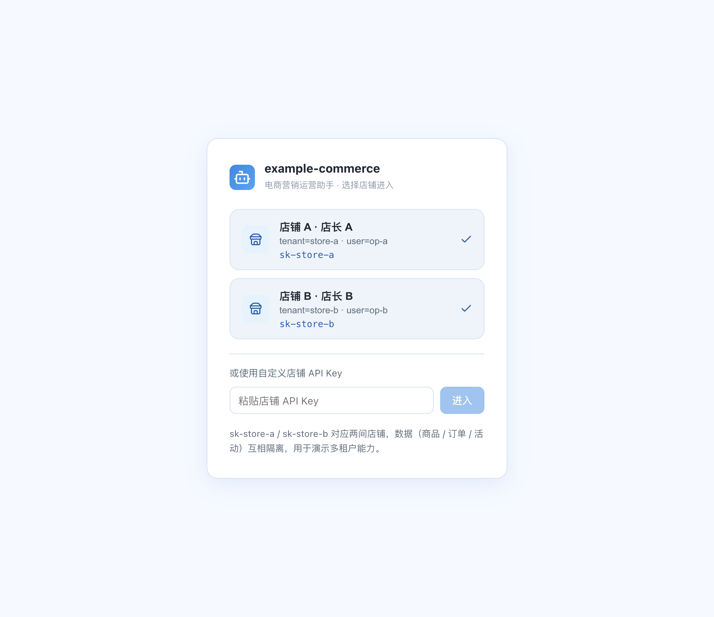
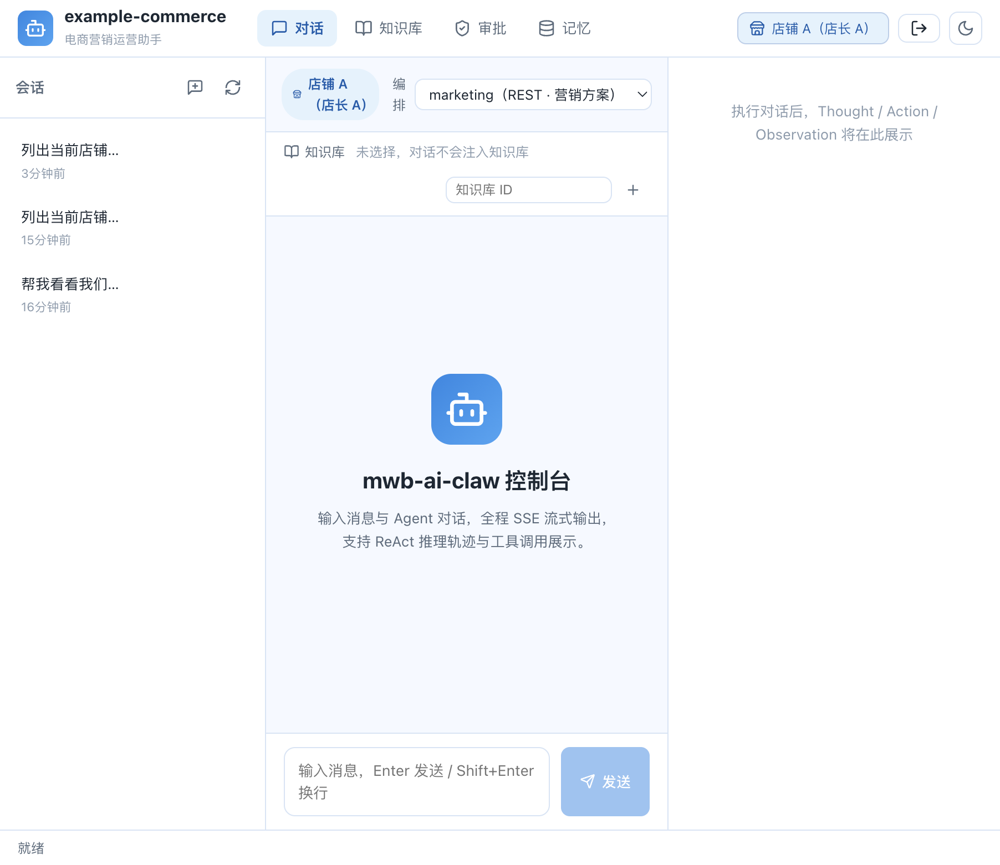
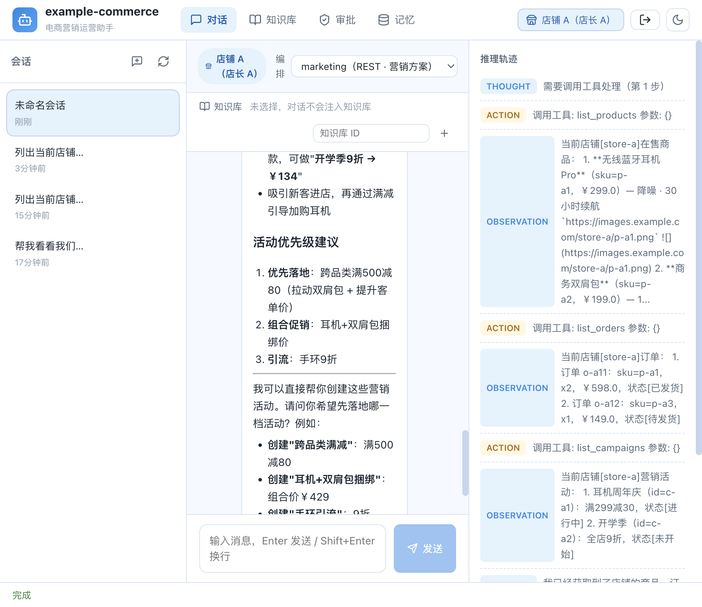
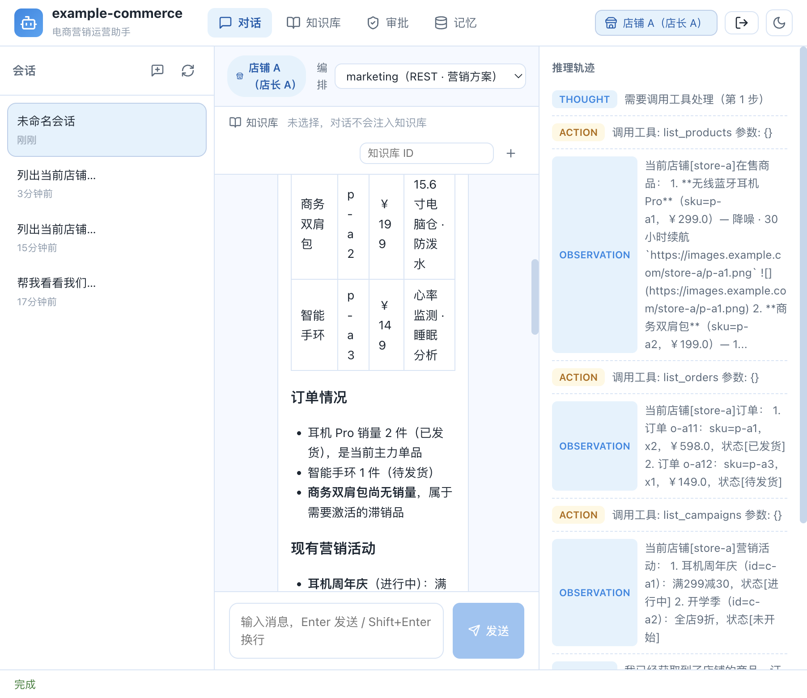

# example-commerce — 电商/营销运营助手

> mwb-ai-claw 的「真实业务示例」，集中演示框架的多扩展点可插拔能力。
> 一个「电商营销运营助手」：运营人员可以用自然语言让 Agent 查询商品、订单与活动数据，并结合业务知识库生成促销方案（可选人工审批）。
>
> 🌐 English version: [README.en.md](README.en.md)

## 1. 覆盖的扩展点（对照表）

| 扩展点 | SPI / 方式 | 本示例实现 | 扩展类型 |
| --- | --- | --- | --- |
| 自定义业务工具 | `ToolExecutor` + `@Component`（`ToolGatewayImpl` 自动收集） | `tool/ListProductsTool`、`ListOrdersTool`、`ListCampaignsTool`、`CreateCampaignTool` | 新增工具，零代码接入 |
| 数据隔离（T2） | `AgentScope` + `AgentScopeContext` | `AbstractCommerceTool.withCurrentStore()` 按 `tenantId` 读 `store/CommerceDataStore` | 多店铺隔离 |
| 真实租户体系（T2） | `TenantGateway`（鉴权链路优先反查） | `tenant/CommerceTenantGateway`（内存商户注册表：`sk-store-a`/`sk-store-b` → 店铺/操作员） | 替换/对接自并购租户存储 |
| RAG 切分（增强） | `RagChunker`（包装默认 `TextRagChunker`） | `rag/CommerceRagChunker` | 包装默认实现 |
| RAG 重排（增强） | `RagReranker`（可选注入） | `rag/CommerceRagReranker` | 增强 |
| RAG 装配 | `@ConditionalOnMissingBean` | `rag/CommerceRagConfiguration` | 替换/增强 |
| 自定义编排 | `AgentOrchestrator` SPI（`type()` 声明，注册为 Bean 自动收集） | `orchestration/MarketingOrchestrator`（type=marketing） | 新增编排 type 插件 |
| 多模态内容 | `ContentPart` / 工具输出图片 URL | `ListProductsTool` 返回商品图 markdown 图片 | 内容层 |
| 人工审批在环 | `ApprovalRegistry`/`PendingApproval`（编排内） | `MarketingOrchestrator` 生成方案后可选审批；`orchestrations.json` 中 `todo-delegate` 开启 `approvalGate` | 编排内审批 / 既有 delegate 门禁 |

## 2. 快速开始

### 2.1 本地运行

```bash
# 1. 复制 .env 并填入密钥（DEFAULT_API_KEY、可选 RAG_EMBEDDING_*）
cp src/main/resources/.env.example .env

# 2. 启动（默认 web 模式，端口 8080）
# 分两步：先安装依赖模块到本地仓库，再单独运行 example-commerce（独立工程，不随仓库 reactor 构建）。
mvn -pl example-commerce -am install -DskipTests   # 1) 编译并安装依赖模块
mvn -pl example-commerce spring-boot:run           # 2) 单独启动 example-commerce
# 或打包后 java -jar example-commerce/target/example-commerce-*.jar
```

### 2.2 Docker 一键构建（推荐）

`docker-compose.yml` 与 `Dockerfile` 统一位于 `example-commerce` 目录，可一键构建并启动后端 + 前端：

```bash
# 1. 复制 .env 并填入密钥（DEFAULT_API_KEY、可选 RAG_EMBEDDING_*）
cp src/main/resources/.env.example .env

# 2. 构建并启动（在 example-commerce 目录下执行）
# 框架依赖 mwb-ai-claw-spring-boot-starter:1.0.4（Central 正式版自动下载，无需本地仓库）
docker compose up -d --build

# 3. 验证
docker compose ps        # example-commerce / example-commerce-frontend 均 healthy

# 4. 访问
# 前端控制台：http://localhost:5174（API 经 Nginx 反代到后端）
# 后端 REST：   http://localhost:8081（宿主端口，容器内 8080；与 example-web 的 8080 并存不冲突）
```

> 说明：本示例零中间件依赖（H2 内存库 + file 存储 + RAG local），无需 MySQL / Redis。
> Dockerfile 构建时会复制 `.env`（容器版）与 `agents.json`、`orchestrations.json` 到镜像 `/app`，
> 实例启动后按「运行目录优先」加载（ConfigFileLocator / DotenvEnvironmentPostProcessor）。

## 3. 体验（REST / SSE）

> 端口说明：以下示例使用本地运行端口 `8080`；Docker 部署时宿主端口为 `8081`（容器内仍 8080），替换即可。

鉴权已开启，使用店铺 Key 区分租户（多店铺隔离）：

```bash
# 店铺 A 店长（store-a/op-a）
curl -X POST http://localhost:8080/agent/chat \
  -H "X-API-Key: sk-store-a" -H "Content-Type: application/json" \
  -d '{"message":"帮我看看我们店都有哪些商品，然后生成一份促销方案"}'

# 店铺 B 店长（store-b/op-b，数据互相隔离）
curl -X POST http://localhost:8080/agent/chat \
  -H "X-API-Key: sk-store-b" -H "Content-Type: application/json" \
  -d '{"message":"列出商品"}
```

效果：Agent 依次调用 `list_products`（含商品图片）→ `list_orders`/`list_campaigns`，结合 RAG 业务知识生成促销方案；不同店铺调用的是各自隔离的数据。

### 自定义编排（type=marketing）

```bash
curl -X POST http://localhost:8080/agent/chat \
  -H "X-API-Key: sk-store-a" -H "Content-Type: application/json" \
  -d '{"message":"结合当前商品与活动，生成一份促销方案","orchestrationId":"marketing","sessionId":"sess-a-1"}'
```

### 审批门禁（人工在环）

方案生成后如需人工确认：修改 `orchestrations.json` 中 `marketing` 的 `config.approvalEnabled: true`（并设 `approvalTimeoutMs`），然后用 REST 审批接口处理：

```bash
curl -G http://localhost:8080/agent/pending-tasks -H "X-API-Key: sk-store-a" --data-urlencode "sessionId=sess-a-1"
curl -X POST http://localhost:8080/agent/approve -H "X-API-Key: sk-store-a" \
  -H "Content-Type: application/json" -d '{"sessionId":"sess-a-1","layerKey":"root"}'
```

> `todo-delegate` 编排已配置 `approvalGate=all`，可用于「规划营销投放 + 每层审批」的通路演示。

### RAG 业务知识库

```bash
# 上传营销手册，供 Agent 检索业务知识
curl -X POST http://localhost:8080/rag/knowledge-bases/marketing/docs/upload \
  -H "X-API-Key: sk-store-a" -F "file=@./营销手册.md"
```

## 4. 说明

- 数据源 `store/CommerceDataStore` 为内存模拟，真实项目替换为业务 API/DB。
- `tenant/CommerceTenantGateway` 为内存租户注册表演示，真实项目应改为对接租户表/SSO/IAM，并管理 API Key 生命周期（签发/轮换/吊销）。
- `create_campaign` 为高权限写操作，示例直接执行；生产中应配合委托编排 `approvalGate`/工具级权限，或在工具内接入审批服务，使人工作出投放决策。

## 5. Web 前端控制台（可观察入口）

前端位于 [example-commerce-frontend](../example-commerce-frontend)，提供对话可观察界面：

- 店铺选择页（`/login`）：选择 `sk-store-a` / `sk-store-b`（或自定义 Key）进入，体现多店铺隔离；
- 对话页：顶部展示当前店铺 + 编排选择（`routing`=SSE 流式 / `marketing` / `todo-delegate`=REST），
  右侧实时展示 Thought / Action / 工具调用 / Observation 推理时间线；
- 附带会话管理、知识库（RAG 上传营销手册）、人工审批页面。

运行前端：

```bash
cd example-commerce-frontend
npm ci
npm run dev        # http://localhost:5174（Vite 开发代理 → 8080，免 CORS）
npm run typecheck  # tsc 类型检查
npm run build      # 生产构建 → dist/
```

后端需先在 8080 启动（见上）；生产时由后端静态托管 `dist/`，走同源 CORS（需在
`example.cors.allowed-origins` 中放开前端来源，如 `http://localhost:5174`）。

### 5.1 页面操作案例（截图）

以下为在 `http://localhost:5174` 上的实际操作流程截图（对应后端已按上文启动）：

**① 店铺选择页（`/#/login`）**：选择「店铺 A · 店长 A」（`sk-store-a`，tenant=store-a）进入，体现多店铺租户隔离。



**② 对话主界面（`/#/chat`）**：顶部显示当前店铺「店铺 A」，可切换编排模式（`routing`=SSE 流式 / `marketing`=REST 营销方案 / `todo-delegate`=REST 委派），右侧为推理轨迹面板。



**③ marketing 编排完整对话**：选择 `marketing` 编排并提问「帮我看看我们店有哪些商品，然后结合活动生成一份促销方案」，Agent 自动调用 `list_products` → `list_orders` → `list_campaigns` 三个业务工具，基于店铺隔离数据生成店铺现状分析（在售商品 / 订单 / 现有活动）与可落地的促销方案（跨品类满减、双肩包捆绑破零、手环引流）。



**④ 推理轨迹面板**：右侧实时展示 Thought / Action（含工具参数）/ Observation（工具返回的店铺数据）完整 ReAct 推理时间线，便于观察工具调用与多租户数据隔离。

