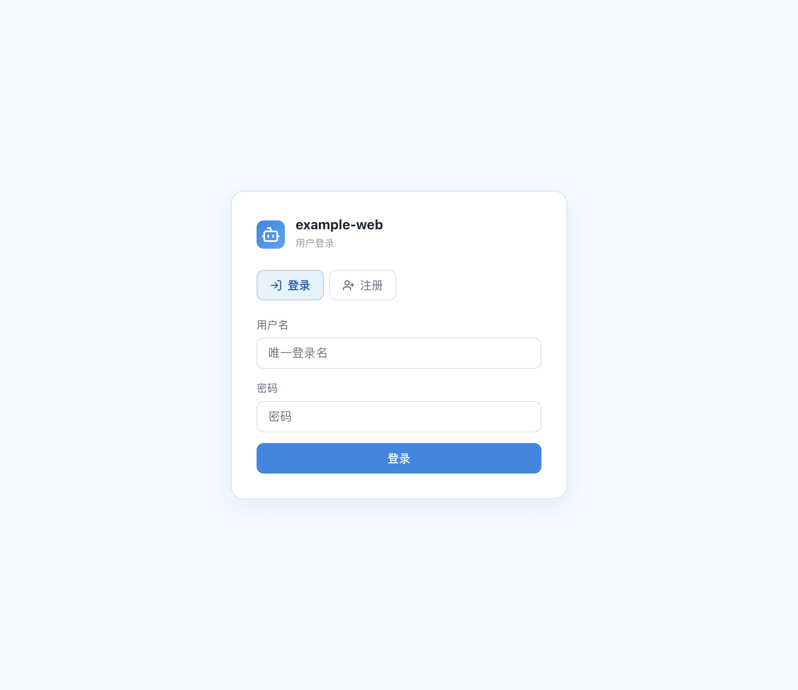
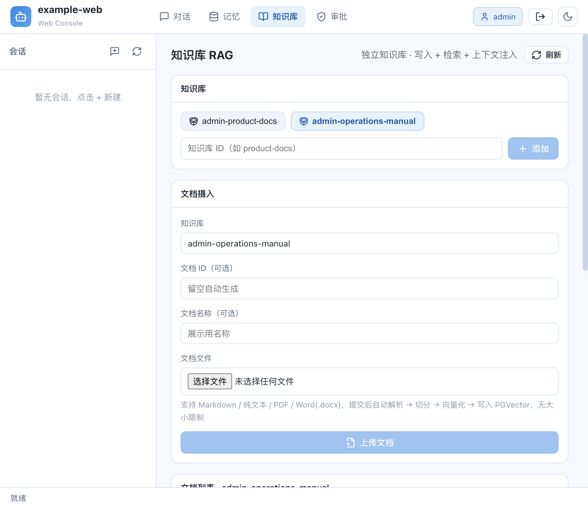
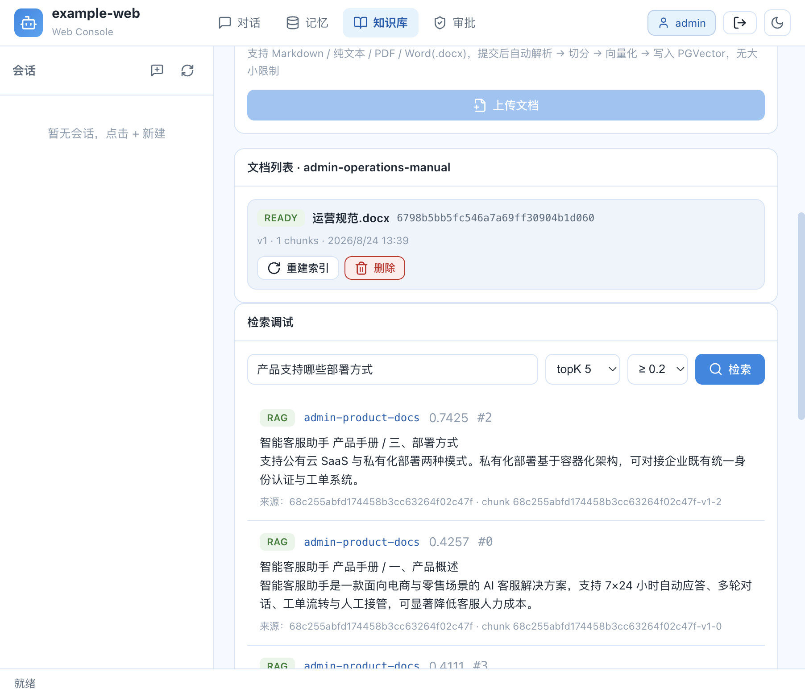
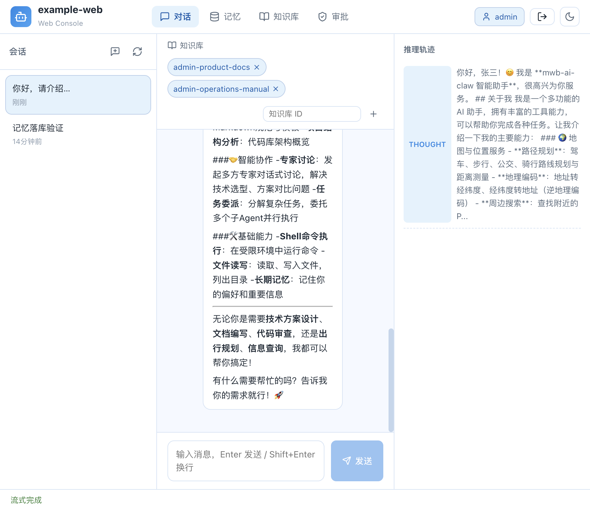
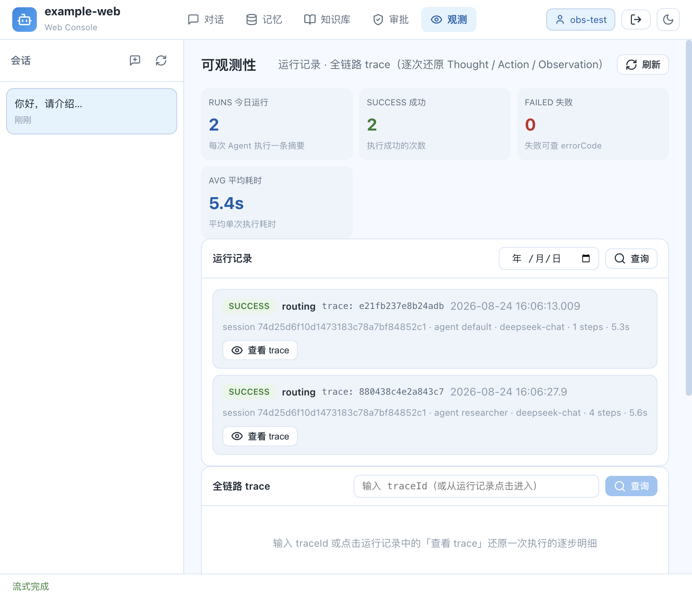
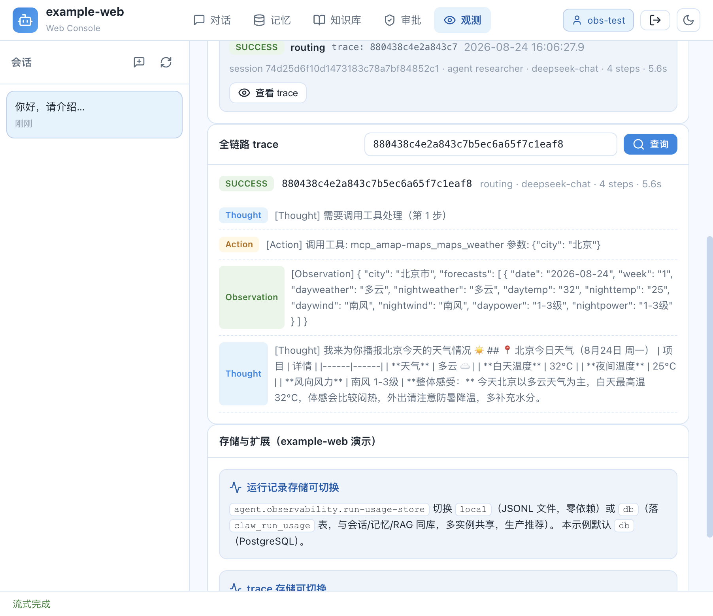
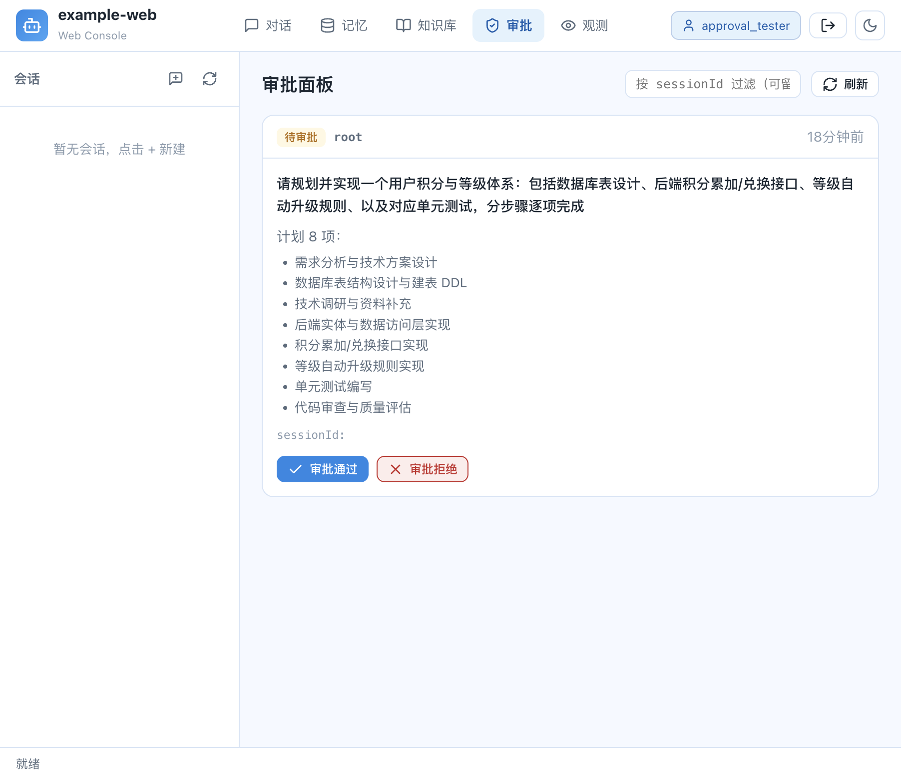
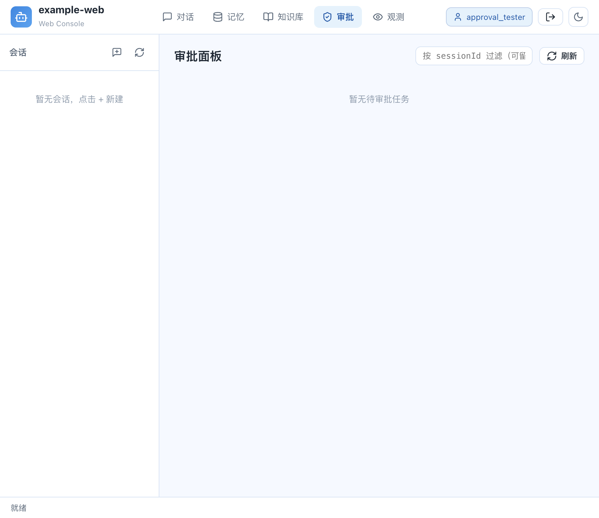
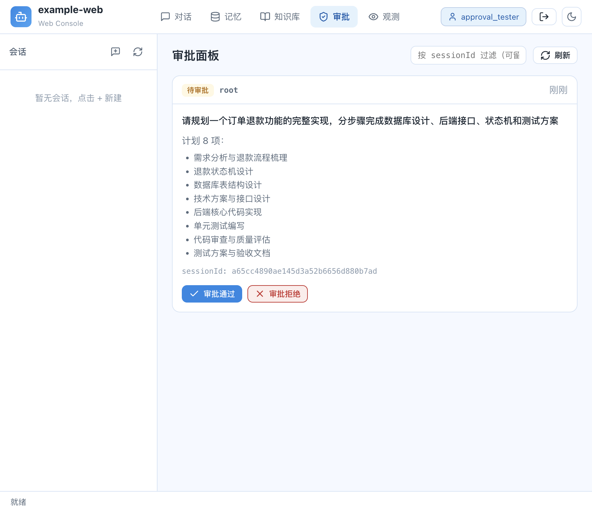

# example-web — Web 控制台示例（对话 / 记忆 / 知识库 RAG）

> mwb-ai-claw 的「Web 控制台」示例：一个基于 Spring Boot Starter 的前后端分离工程，演示
> REST / SSE 对话、分层记忆可视化、独立 RAG 知识库管理，并重点展示**生产化能力**——包括
> 分布式会话锁、向量库知识库（pgvector / 多格式解析 / 访问控制 / 容量配额）与记忆持久化落库。
>
> 🌐 English version: [README.en.md](README.en.md)

## 1. 能力与对应机制（对照表）

| 能力 | 框架机制 | 本示例配置 / 代码 |
| --- | --- | --- |
| 分布式会话锁（多实例共享） | `SessionLockManager` SPI：`LocalSessionLockManager`（JVM 内 ReentrantLock）/ `RedisSessionLockManager`（`SET NX PX` + Lua 原子释放） | `agent.collaboration.lock.type=redis`；[docker-compose.yml](docker-compose.yml) 起 Redis |
| Redis 作为可选用例 | infra 中 redis 依赖为 `optional`，由 `@ConditionalOnClass` 门控 | [pom.xml](pom.xml) 显式引入 `spring-boot-starter-data-redis` |
| 向量库适配（可切换） | `RagIndexStore` SPI：`LocalRagIndexStore`（本地文件）/ `PgVectorRagIndexStore`（PostgreSQL+pgvector） | `agent.rag.provider=pgvector`；[docker-compose.yml](docker-compose.yml) 起 pgvector（initdb 自动 `CREATE EXTENSION vector`） |
| 多格式文档解析 | `RagDocumentParser` SPI（组合器按 classpath 探测） | [pom.xml](pom.xml) 引入 PDFBox / POI-XWPF；上传支持 `.md/.txt/.pdf/.docx` |
| 知识库 API 级鉴权 | `RagAccessPolicy` SPI（`agent.rag.access.enabled=true` 时生效） | `rag/ExampleRagAccessPolicy`：READ 全局共享、写/删按 `{tenant}-` 前缀 + `admin` 超级用户 |
| 容量与配额 | `agent.rag.capacity.*` | [application.yml](src/main/resources/application.yml) 示例值 |
| 扩展点（替换 / 增强） | `RagChunker` / `RagReranker`（`@ConditionalOnMissingBean`） | `rag/ExampleRagChunker`（装饰默认切分，元数据打标）、`rag/ExampleRagReranker`（重排截取） |
| 启动即摄入示例文档 | `ApplicationRunner` | `rag/ExampleRagSeedInitializer`：MD / PDF / Word 三格式幂等摄入 |
| 记忆持久化落库 | `agent.storage.type`：`file`（本地文件）/ `db`（JDBC 存储）切换；`db` 装配 `JdbcMemoryPageStore` / `JdbcSessionGateway` / `JdbcLongTermMemoryGateway` | `STORAGE_TYPE=db`，会话 / 事实 / 记忆页 / 长期记忆四表建在 pgvector 库 |

## 2. 依赖中间件（Docker）

本示例的向量知识库（pgvector）与分布式会话锁（Redis）依赖 PostgreSQL 与 Redis，用 Docker 一键拉起：

```bash
cd example-web
docker compose up -d
docker compose ps   # 两个容器均 healthy 即可
```

- **pgvector**（`localhost:5432`，库/账号/密码默认 `claw/claw/clawdb`）
  - 首次初始化通过 [docker/initdb/01-pgvector.sql](docker/initdb/01-pgvector.sql) 自动执行
    `CREATE EXTENSION IF NOT EXISTS vector`，并创建接入方用户表 `claw_user` 与**记忆存储四表**
    `claw_session` / `claw_fact` / `claw_memory_page` / `claw_long_term`（PostgreSQL 版，与
    `example.web` 用户体系及 `agent.storage.type=db` 对应）。
  - 若已存在数据卷而扩展开启过旧镜像导致 `type "vector" does not exist`，手动执行一次：
    `docker exec example-web-pgvector psql -U claw -d clawdb -c "CREATE EXTENSION IF NOT EXISTS vector;"`
- **redis**（`localhost:6379`）用于 `agent.collaboration.lock.type=redis`。

> 无 Docker 的最小演示：可将 `RAG_PROVIDER=local`（本地文件向量索引）且 `LOCK_TYPE=local`（JVM 内锁），
> 此时无需任何中间件；但要体验 pgvector 向量召回 / 分布式会话锁仍需 PostgreSQL + Redis。

## 3. 快速开始

```bash
# 1. 复制 .env 并填入真实密钥（至少 DEFAULT_API_KEY；启用 RAG 写入/检索还需 RAG_EMBEDDING_*）
cp example-web/src/main/resources/.env.example example-web/.env

# 2. 启动（分两步：先编译安装依赖模块到本地仓库，再单独运行 example-web）
# 不要用 `mvn -pl example-web -am spring-boot:run` 一步到位——
#   `-am` 会把父 POM 等依赖模块纳入反应堆且 `spring-boot:run` 应用到每个模块，父模块无 main class 会报错。
mvn -pl example-web -am install -DskipTests   # 1) 编译并安装依赖模块
mvn -pl example-web spring-boot:run           # 2) 启动 example-web（端口 8080）
```

> 若本机 `~/.mwb-ai-claw/logs` 目录不可写导致启动失败（logback `Operation not permitted`），
> 可覆盖日志目录：`CLAW_LOG_PATH=<可写目录> mvn -pl example-web spring-boot:run`

### 关键环境变量（见 example-web/.env）

| 变量 | 默认 | 说明 |
| --- | --- | --- |
| `DB_URL` | `jdbc:postgresql://localhost:5432/clawdb` | 数据源：RAG 向量库 + 记忆落库（`STORAGE_TYPE=db`）共用 |
| `STORAGE_TYPE` | `db` | 记忆存储后端：`db`（会话/事实/记忆页/长期记忆落 PostgreSQL）\| `file`（本地文件，零依赖） |
| `LOCK_TYPE` | `redis` | 分布式会话锁渠道；无 Redis 可 `local` |
| `REDIS_URI` | `redis://localhost:6379` | Redis 地址 |
| `RAG_PROVIDER` | `pgvector` | 向量索引实现；`local` 零依赖 |
| `RAG_EMBEDDING_MODEL/BASE_URL/API_KEY` | 空 | 独立 RAG 的 Embedding（OpenAI 兼容 `/embeddings`） |
| `BOOTSTRAP_API_KEY` | `sk-admin-bootstrap` | 引导管理员 Key（tenant=admin，超级用户，可管理 `admin-*` 种子库） |

启动后日志若出现：

```
[example-web] 种子文档摄入成功: admin-product-docs / 产品手册.md
[example-web] 种子文档摄入成功: admin-product-docs / 快速上手指南.pdf
[example-web] 种子文档摄入成功: admin-operations-manual / 运营规范.docx
```

即表明多格式解析 + pgvector 写入 + 种子库初始化成功。

## 4. 前端控制台

前端位于 [example-web-frontend](../example-web-frontend)：

```bash
cd example-web-frontend
npm ci
npm run dev        # http://localhost:5173（Vite 开发代理 → 8080，免 CORS）
npm run typecheck  # tsc 类型检查
npm run build      # 生产构建 → dist/
```

页面包含：登录 / 注册、对话（可选中知识库注入参考）、记忆可视化、**知识库 RAG 管理**、人工审批。

> 知识库页默认用引导管理员 Key（`X-API-Key: sk-admin-bootstrap`）访问，以 `admin` 超级用户身份管理
> `admin-product-docs` / `admin-operations-manual` 种子知识库（普通注册用户租户为其用户名，可管理 `{用户名}-*`）。

## 5. 页面操作案例（截图）

以下为在 `http://localhost:5173` 上的实际操作流程截图（后端 + docker 已按上文启动）：

**① 登录页（`#/login`）**：用户名 / 密码登录或注册，签发 API Key 作为鉴权凭证（`X-API-Key`）。



**② 知识库 RAG 管理页（`#/rag`）**：以 admin 身份进入，左侧知识库 chip 列出种子库 `admin-product-docs`、
`admin-operations-manual`；文档列表展示三种格式文档 —— `产品手册.md`、`快速上手指南.pdf`（PDFBox 解析）、
`运营规范.docx`（POI-Word 解析），状态均为 READY，含版本 / 分块数 / 更新时间；支持上传、重建索引、删除。



**③ 检索调试（`#/rag`）**：输入「产品支持哪些部署方式」并检索，返回 PGVector 向量召回命中，带上
自定义切分器元数据 `extension=example-web-custom-chunker`，以及 score / 来源文档 / chunk。



**④ 对话注入知识库（`#/chat`）**：对话输入框上方的知识库选择条选中 `admin-product-docs`，对话时后端会将
命中内容作为「知识库参考」注入 system prompt，体现 RAG 独立于记忆的上下文注入链路。



**⑤ 对话案例（`#/chat`）**：输入「你好，请介绍一下你自己，并说明你能做什么。」，助手基于配置的模型与
编排返回结构化回复（流式输出、自动沉淀记忆）。这是最直观的「对话框」交互：发送问题 → 收到回复。


**⑥ 可观测性（`#/observability`）**：每次 Agent 执行结束都会沉淀一条运行用量摘要（落 `claw_run_usage` 表，
由 `agent.observability.run-usage-store=db` 控制），页面顶部聚合今日运行数 / 成功数 / 失败数 / 平均耗时，
下方列出每条运行记录的 traceId、会话、Agent、编排、模型、步骤数与耗时。



点击运行记录中的「查看 trace」或直接输入 traceId，可调用 `GET /trace/{traceId}` 还原该次执行的逐步明细
（Thought / Action / Observation），数据落 `claw_trace` 表（由 `agent.observability.trace.store=db` 控制），
多实例共享、按租户/用户隔离。



**⑦ 人工审批（`#/approval`）**：当编排配置了审批门禁（`orchestrations.json` 中 `approvalGate: "root"`，即
`todo-delegate` 首层升级/规划完成后需人工确认）时，后台会生成待审批节点（`PendingApproval`）。审批页面通过
`GET /agent/pending-tasks` 拉取待审批列表，展示原始任务与待执行的 todo 标题清单，支持「审批通过 / 审批拒绝」：

- **待审批**：页面列出待审批的 root 节点，包含原始任务「请规划并实现一个用户积分与等级体系…」及 8 个 todo 标题。



- **审批通过**：点击「审批通过」后将该节点标记为 APPROVED 并唤醒执行；卡片消失，页面转为「暂无待审批任务」，
  后端 `/agent/pending-tasks` 返回空列表。



- **审批拒绝**：点击「审批拒绝」并确认后，节点被标记为 REJECTED，该层降级直执行（后端日志：
  `审批门禁: 节点已决策 REJECTED`、`审批已拒绝，该层降级直执行`），列表同样转为空状态。




## 6. REST 验证（可选）

```bash
# 检索种子知识库（READ 全局共享）
curl -X POST http://localhost:8080/rag/search -H "X-API-Key: sk-admin-bootstrap" \
  -H "Content-Type: application/json" \
  -d '{"knowledgeBaseIds":["admin-product-docs"],"text":"产品支持哪些部署方式","topK":3,"minScore":0.0}'

# 查看文档列表
curl http://localhost:8080/rag/knowledge-bases/admin-product-docs/documents -H "X-API-Key: sk-admin-bootstrap"

# 查询今日运行记录（运行用量落 claw_run_usage 表）
curl http://localhost:8080/runs -H "X-API-Key: sk-admin-bootstrap"

# 按 traceId 还原一次执行的全链路逐步明细（落 claw_trace 表）
curl http://localhost:8080/trace/<traceId> -H "X-API-Key: sk-admin-bootstrap"
```

## 7. 说明

- 知识库为**全局共享**资源，检索（READ）对所有租户放行；写 / 删由 `ExampleRagAccessPolicy` 按租户前缀授权，
  体现数据隔离下的 API 层访问控制。
- RAG 与记忆系统**完全隔离**（独立领域模型 / 存储 / Embedding 配置 / 检索链路），`agent.rag.enabled=false` 时
  RAG Bean 与 `/rag` 接口均不装配，行为与未接入 RAG 前一致。
- 记忆存储默认 `STORAGE_TYPE=db`：会话 / 长期记忆 / 记忆页 / 事实全部落库到同一 PostgreSQL（pgvector）数据源，
  `agent.storage.type=file` 时退回本地文件（零依赖）；两者可平滑切换。
- 表结构：`claw_user` 与记忆四表（`claw_session` / `claw_fact` / `claw_memory_page` / `claw_long_term`）的 MySQL 原版见
  [schema.sql](src/main/resources/schema.sql)，PostgreSQL 版由 [docker/initdb/01-pgvector.sql](docker/initdb/01-pgvector.sql)
  首次初始化时一并创建。