# mwb-ai-claw 技术方案

> 本文档为 mwb-ai-claw 项目的完整技术方案，涵盖项目背景、目标、概要设计、整体架构设计（整洁架构 + DDD + 六边形架构融合）、数据模型设计（UML 类图）以及各核心领域的详细流程设计（状态图、数据交互图、文字说明）。所有图形均采用 PlantUML 描述，可在支持 PlantUML 的编辑器（VS Code / IDEA / Typora 等）中直接渲染。

---

## 1. 项目背景

随着大语言模型（LLM）的成熟，AI Agent（智能体）从「聊天问答」进化为「能真正动手干活」的自主助手已成为趋势。然而，市面上多数 Agent 框架存在以下痛点：

- **过度依赖云端**：用户数据、会话历史、长期记忆全部上传到远端服务器，隐私无法保障。
- **工具扩展困难**：每接入一个新工具都要侵入式修改核心代码，缺乏标准协议。
- **上下文窗口受限**：长对话很快超出 LLM 上下文窗口，导致「失忆」。
- **单 Agent 独木难支**：复杂任务需要多个专家 Agent 协作，但编排能力弱或耦合死。
- **技术栈偏 Python**：Java 生态缺乏一个结构清晰、可扩展、本地优先的 Agent 框架。

mwb-ai-claw 正是在此背景下诞生的 **Java 版智能体 Agent 框架**，灵感来自 OpenClaw，旨在提供一个本地优先、多 Agent 协作、开箱即用的个人 AI 助手框架，并以 DDD + 整洁架构 + 六边形架构为骨架，确保高度可扩展性。

---

## 2. 项目目标

| 维度 | 目标 | 关键能力 |
| ---- | ---- | -------- |
| **本地优先** | 数据本地化，隐私可控 | 会话/记忆落盘 `.agent/` 目录，密钥经 `.env` 注入 |
| **多渠道接入** | 同一 Agent 多入口 | REST API、SSE 流式、WebSocket、Shell REPL、前端控制台 |
| **ReAct 推理** | 思考→行动→观察迭代 | `ReActLoopService` 驱动 LLM 自主决策工具调用 |
| **工具生态** | 标准化工具接入 | 内置工具（file/shell/http/memory）+ MCP 协议（stdio/HTTP）+ SPI 扩展 |
| **分层记忆** | 突破上下文窗口 | 五层记忆（指令→Hot→Summary→Fact→Archive）+ Token 预算 + 检索召回 |
| **多 Agent 编排** | 专家协作 | 编排 SPI（routing/conversational/delegate）+ 配置与编排分离 + 意图驱动选择 |
| **多模型适配** | 兼容主流 LLM | OpenAI 兼容 API（DeepSeek/通义千问等）+ 流式 SSE 解析 + 独立模型配置 |
| **架构质量** | 高可扩展、可测试 | 整洁架构 + DDD 分层 + 六边形端口适配器 + 依赖倒置 |

---

## 3. 概要设计

### 3.1 技术选型

| 维度 | 选型 | 说明 |
| ---- | ---- | ---- |
| 语言 / 框架 | Java 8 + Spring Boot 2.7.2 | COLA 5.0 架构骨架 |
| 构建 | Maven 多模块 | parent + 6 子模块 |
| LLM 调用 | OkHttp + OpenAI 兼容 API | 统一 Chat Completions，流式 SSE |
| 流式输出 | SseEmitter + TextWebSocketHandler | Token 级实时推送 |
| 工具协议 | MCP（Model Context Protocol） | stdio / streamable_http |
| Shell 终端 | JLine 3.20 | ANSI 着色、命令历史 |
| 持久化 | 本地文件（`.agent/` 目录） | 会话 JSON + 记忆文件 |
| 前端 | 原生 HTML/CSS/JS | 零依赖测试控制台 |

### 3.2 模块全景

```
mwb-ai-claw-parent (pom)
├── mwb-ai-claw-client          # 客户端 SDK：AgentServiceI 接口、ChatCmd、DTO
├── mwb-ai-claw-adapter         # 适配层：REST/SSE Controller、WebSocket、Shell REPL
├── mwb-ai-claw-app             # 应用层：AgentServiceImpl + 命令执行器
├── mwb-ai-claw-domain          # 领域层：聚合根、领域服务、Gateway 端口接口
├── mwb-ai-claw-infrastructure  # 基础设施层：Gateway 适配器实现、工具、MCP、记忆
└── start                       # 启动模块：Application、配置文件模板
```

### 3.3 领域子域划分

| 子域 | 职责 | 核心类型 |
| ---- | ---- | -------- |
| **core 核心域** | Agent/Session/Message 聚合、ReAct 引擎、路由 | `Session`、`Agent`、`Message`、`ReActLoopService`、`ModelConfig`、`ReActResult` |
| **collaboration 编排域** | 多 Agent 协作编排（SPI 插件化 + 协作工具） | `OrchestrationDefinition`、`AgentOrchestrator`、`ExecutionUnit`、`CollaborationResult`、`TodoDefinition`、`DelegateDefinition`、`AbstractCollaborationTool` |
| **context 上下文工程域** | 上下文统一组装与消息清洗 | `ContextAssembler` |
| **llm LLM 域** | 大模型调用抽象（端口） | `LlmGateway`、`EmbeddingGateway`、`LlmRequest/Response`、`LlmStreamCallback` |
| **tool 工具域** | 工具执行抽象与安全 | `ToolGateway`、`ToolExecutor`、`ToolSpec`、`ToolResult` |
| **skill 技能域** | 技能（SKILL.md）发现与按需加载（渐进式披露） | `Skill`、`SkillGateway`、`UseSkillTool` |
| **memory 记忆域** | 分层记忆与检索 | `LayeredMemoryGateway`、`MemoryPage`、`PageEvictionPolicy`、`MemoryRetriever` |

---

## 4. 整体架构设计

本项目的架构融合了 **整洁架构（Clean Architecture）**、**领域驱动设计（DDD）** 和 **六边形架构（Hexagonal Architecture）** 三者的核心理念：

- **整洁架构**的「依赖规则」：外层依赖内层，内层不感知外层——domain 是最内层核心，不依赖任何技术框架。
- **DDD** 的「领域分层 + 聚合根」：将业务拆分为多个限界上下文（子域），核心域持有聚合根（Session），编排域、记忆域等各自自治。
- **六边形架构**的「端口与适配器」：domain 层定义 Gateway 接口（端口），infrastructure 层提供实现（适配器），adapter 层作为输入适配器（REST/WS/Shell），三者通过端口解耦。

### 4.1 架构同心圆（整洁架构 + 六边形端口适配器）

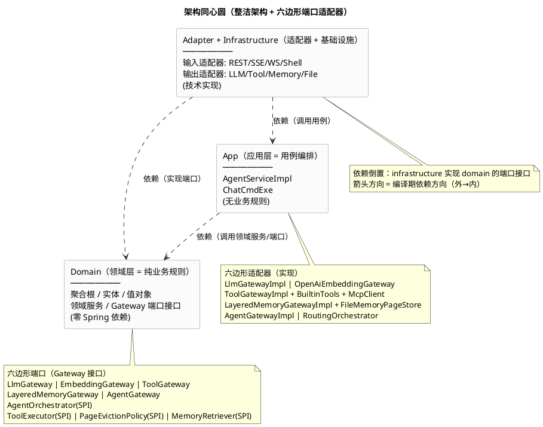
```plantuml
@startuml
title 架构同心圆（整洁架构 + 六边形端口适配器）
skinparam componentStyle rectangle
skinparam component {
  BackgroundColor #FBFBFB
  BorderColor #888888
  ArrowColor #333333
}

component "Domain（领域层 = 纯业务规则）\n──────────\n聚合根 / 实体 / 值对象\n领域服务 / Gateway 端口接口\n(零 Spring 依赖)" as DOMAIN
component "App（应用层 = 用例编排）\n──────────\nAgentServiceImpl\nChatCmdExe\n(无业务规则)" as APP
component "Adapter + Infrastructure（适配器 + 基础设施）\n──────────\n输入适配器: REST/SSE/WS/Shell\n输出适配器: LLM/Tool/Memory/File\n(技术实现)" as OUTER

note bottom of DOMAIN
  六边形端口（Gateway 接口）
  LlmGateway | EmbeddingGateway | ToolGateway
  LayeredMemoryGateway | AgentGateway
  AgentOrchestrator(SPI)
  ToolExecutor(SPI) | PageEvictionPolicy(SPI) | MemoryRetriever(SPI)
end note

note bottom of APP
  六边形适配器（实现）
  LlmGatewayImpl | OpenAiEmbeddingGateway
  ToolGatewayImpl + BuiltinTools + McpClient
  LayeredMemoryGatewayImpl + FileMemoryPageStore
  AgentGatewayImpl | RoutingOrchestrator
end note

note bottom of OUTER
  依赖倒置：infrastructure 实现 domain 的端口接口
  箭头方向 = 编译期依赖方向（外→内）
end note

OUTER ..> APP : 依赖（调用用例）
APP ..> DOMAIN : 依赖（调用领域服务/端口）
OUTER ..> DOMAIN : 依赖（实现端口）
@enduml
```

### 4.2 分层架构与模块依赖

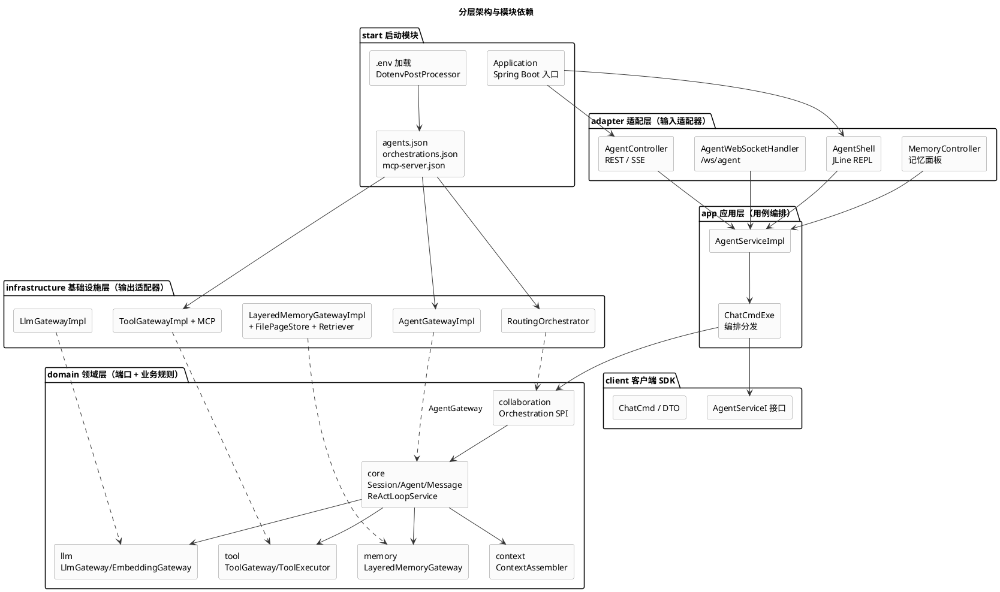
```plantuml
@startuml
title 分层架构与模块依赖
skinparam componentStyle rectangle
skinparam component {
  BackgroundColor #FBFBFB
  BorderColor #888888
  ArrowColor #333333
}

package "start 启动模块" {
    component "Application\nSpring Boot 入口" as START
    component ".env 加载\nDotenvPostProcessor" as ENV
    component "agents.json\norchestrations.json\nmcp-server.json" as CONFIG
}
package "adapter 适配层（输入适配器）" {
    component "AgentController\nREST / SSE" as CTRL
    component "AgentWebSocketHandler\n/ws/agent" as WS
    component "AgentShell\nJLine REPL" as SHELL
    component "MemoryController\n记忆面板" as MEMCTRL
}
package "app 应用层（用例编排）" {
    component "AgentServiceImpl" as SVC
    component "ChatCmdExe\n编排分发" as EXE
}
package "client 客户端 SDK" {
    component "AgentServiceI 接口" as API
    component "ChatCmd / DTO" as DTO
}
package "domain 领域层（端口 + 业务规则）" {
    component "core\nSession/Agent/Message\nReActLoopService" as CORE
    component "collaboration\nOrchestration SPI" as COLLAB
    component "context\nContextAssembler" as CTX
    component "llm\nLlmGateway/EmbeddingGateway" as LLM_PORT
    component "tool\nToolGateway/ToolExecutor" as TOOL_PORT
    component "memory\nLayeredMemoryGateway" as MEM_PORT
}
package "infrastructure 基础设施层（输出适配器）" {
    component "LlmGatewayImpl" as ILLM
    component "ToolGatewayImpl + MCP" as ITOOL
    component "LayeredMemoryGatewayImpl\n+ FilePageStore + Retriever" as IMEM
    component "AgentGatewayImpl" as ICORE
    component "RoutingOrchestrator" as ICOLLAB
}

' 输入适配器 → 应用层
CTRL --> SVC
WS --> SVC
SHELL --> SVC
MEMCTRL --> SVC

' 应用层 → 领域端口
SVC --> EXE
EXE --> COLLAB
EXE --> API

' 领域内部
COLLAB --> CORE
CORE --> CTX
CORE --> LLM_PORT
CORE --> TOOL_PORT
CORE --> MEM_PORT

' 输出适配器实现端口（依赖倒置：infrastructure → domain）
ILLM ..> LLM_PORT
ITOOL ..> TOOL_PORT
IMEM ..> MEM_PORT
ICORE ..> CORE : AgentGateway
ICOLLAB ..> COLLAB

' 启动配置
START --> CTRL
START --> SHELL
ENV --> CONFIG
CONFIG --> ICORE
CONFIG --> ICOLLAB
CONFIG --> ITOOL
@enduml
```

### 4.3 六边形端口-适配器映射

六边形架构的核心是：**领域层定义端口（接口），基础设施层提供适配器（实现），适配器层作为外部世界与领域交互的入口**。

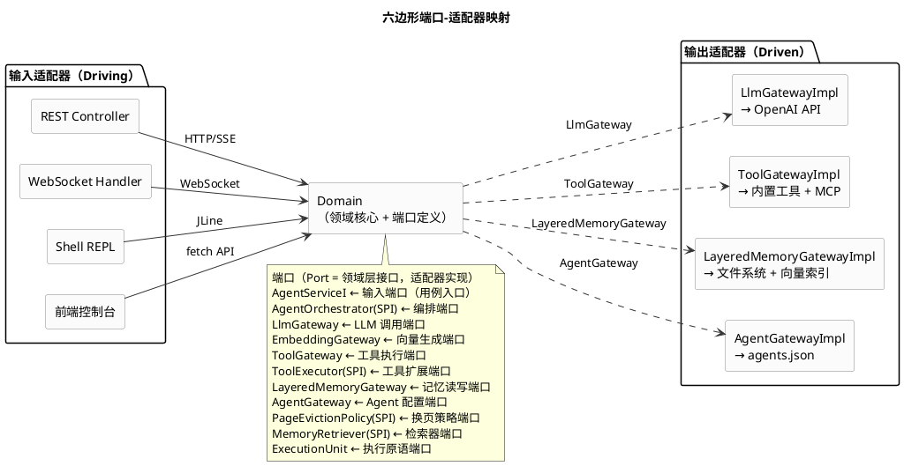
```plantuml
@startuml
title 六边形端口-适配器映射
left to right direction
skinparam componentStyle rectangle
skinparam component {
  BackgroundColor #FBFBFB
  BorderColor #888888
  ArrowColor #333333
}

component "Domain\n（领域核心 + 端口定义）" as DOMAIN

package "输入适配器（Driving）" {
    component "REST Controller" as REST
    component "WebSocket Handler" as WSH
    component "Shell REPL" as REPL
    component "前端控制台" as FE
}

package "输出适配器（Driven）" {
    component "LlmGatewayImpl\n→ OpenAI API" as LLM_IMPL
    component "ToolGatewayImpl\n→ 内置工具 + MCP" as TOOL_IMPL
    component "LayeredMemoryGatewayImpl\n→ 文件系统 + 向量索引" as MEM_IMPL
    component "AgentGatewayImpl\n→ agents.json" as AGENT_IMPL
}

note bottom of DOMAIN
  端口（Port = 领域层接口，适配器实现）
  AgentServiceI ← 输入端口（用例入口）
  AgentOrchestrator(SPI) ← 编排端口
  LlmGateway ← LLM 调用端口
  EmbeddingGateway ← 向量生成端口
  ToolGateway ← 工具执行端口
  ToolExecutor(SPI) ← 工具扩展端口
  LayeredMemoryGateway ← 记忆读写端口
  AgentGateway ← Agent 配置端口
  PageEvictionPolicy(SPI) ← 换页策略端口
  MemoryRetriever(SPI) ← 检索器端口
  ExecutionUnit ← 执行原语端口
end note

' 输入适配器 → 领域
REST --> DOMAIN : HTTP/SSE
WSH --> DOMAIN : WebSocket
REPL --> DOMAIN : JLine
FE --> DOMAIN : fetch API

' 领域 → 输出适配器（通过端口，依赖倒置）
DOMAIN ..> LLM_IMPL : LlmGateway
DOMAIN ..> TOOL_IMPL : ToolGateway
DOMAIN ..> MEM_IMPL : LayeredMemoryGateway
DOMAIN ..> AGENT_IMPL : AgentGateway
@enduml
```

### 4.4 架构设计原则

| 原则 | 体现 |
| ---- | ---- |
| **依赖规则（整洁架构）** | 依赖方向严格外→内：adapter/infrastructure → app → client + domain；domain 零 Spring 依赖，可独立测试 |
| **依赖倒置（DIP）** | domain 定义 Gateway 接口（端口），infrastructure 实现（适配器），编译期 domain 不依赖 infrastructure |
| **聚合根（DDD）** | `Session` 是核心域聚合根，所有消息操作经 Session 的 `addUserMessage`/`addAssistantMessage`/`addToolMessage` 方法 |
| **限界上下文（DDD）** | 6 个子域各自自治：core（会话+推理）、collaboration（编排）、memory（记忆）、llm（模型）、tool（工具）、context（上下文） |
| **端口适配器（六边形）** | 输入适配器（REST/WS/Shell）→ 用例端口（AgentServiceI）→ 领域 → 输出适配器（LLM/Tool/Memory Gateway 实现） |
| **SPI 可插拔** | `AgentOrchestrator`、`ToolExecutor`、`PageEvictionPolicy`、`MemoryRetriever` 均为 SPI 接口，Spring 自动收集注册 |
| **配置分离** | Agent 注册表（agents.json）与编排注册表（orchestrations.json）解耦，编排插件 SPI 与选择逻辑分离 |

---

## 5. 数据模型设计

### 5.1 领域模型全景图


```plantuml
@startuml
    ' ===== 核心域 =====
    namespace core核心域 {
        ' Session <<AggregateRoot>>
        class Session {
            -String sessionId
            -String agentId
            -String title
            -SessionStatus status
            -long createTime
            -long updateTime
            -List~Message~ messages
            +addUserMessage(content)
            +addAssistantMessage(content, toolCalls)
            +addToolMessage(toolCallId, content)
            +close()
        }
        ' Agent <<Entity>>
        class Agent {
            -String agentId
            -String name
            -String systemPrompt
            -String agentInstructions
            -String description
            -List~String~ keywords
            -ModelConfig modelConfig
            -List~String~ toolNames
            -int maxSteps = 8
        }
        ' Message <<Entity>>
        class Message {
            -String role
            -String content
            -List~ToolCall~ toolCalls
            -String toolCallId
            -long timestamp
            +of(role, content)
            +assistant(content, toolCalls)
            +tool(toolCallId, content)
        }
        ' ModelConfig <<ValueObject>>
        class ModelConfig {
            -String model
            -String baseUrl
            -String apiKey
            -double temperature = 0.7
            -int maxTokens = 2048
            -Boolean thinking
        }
        ' ReActResult <<ValueObject>>
        class ReActResult {
            -String reply
            -List~String~ traceSteps
            -boolean maxStepsReached
        }
        ' SessionStatus <<enumeration>>
        enum SessionStatus {
            ACTIVE
            CLOSED
        }
        ' MessageRole <<enumeration>>
        enum MessageRole {
            SYSTEM
            USER
            ASSISTANT
            TOOL
        }
        ' ReActLoopService <<DomainService>>
        class ReActLoopService {
            +run(session, agent, callback) ReActResult
            +streamRun(session, agent, callback, streamCallback) ReActResult
        }
        ' AgentGateway <<Port>>
        class AgentGateway {
            +getAgent(agentId) Agent
            +listAgents() List~Agent~
        }
        ' ProgressCallback <<Port>>
        class ProgressCallback {
            +onProgress(step)
        }
    }
    ' ===== 编排协作域 =====
    namespace collaboration编排域 {
        ' OrchestrationDefinition <<ValueObject>>
        class OrchestrationDefinition {
            -String id
            -String type
            -String description
            -List~String~ keywords
            -Map~String, Object~ config
            -List~String~ agents
        }
        ' OrchestrationContext <<ValueObject>>
        class OrchestrationContext {
            -String message
            -String sessionId
            -String explicitAgentId
            -String explicitOrchestrationId
            -OrchestrationDefinition definition
            -AgentGateway agentGateway
            -ExecutionUnit executionUnit
            -ProgressCallback callback
            -LlmStreamCallback streamCallback
        }
        ' CollaborationResult <<ValueObject>>
        class CollaborationResult {
            -String reply
            -String agentId
            -String sessionId
            -String orchestrationId
            -List~String~ traceSteps
        }
        ' AgentOrchestrator <<interface>>
        class AgentOrchestrator {
            +type() String
            +validate(definition)
            +orchestrate(context) CollaborationResult
        }
        ' ExecutionUnit <<Port>>
        class ExecutionUnit {
            +getOrCreateSession(sessionId, agent) Session
            +saveSession(session)
            +runSession(session, agent, callback, streamCallback) ReActResult
            +runAgent(prompt, agent, callback) String
            +writeArtifact(workdir, stageId, content) Path
        }
    }
    ' ===== LLM 域 =====
    namespace llmLLM域 {
        ' LlmGateway <<interface>>
        class LlmGateway {
            +chat(request, modelConfig) LlmResponse
            +streamChat(request, modelConfig, callback) LlmResponse
        }
        ' EmbeddingGateway <<interface>>
        class EmbeddingGateway {
            +embed(text) float[]
        }
        ' LlmRequest <<ValueObject>>
        class LlmRequest {
            -String model
            -List~LlmMessage~ messages
            -List~ToolSpec~ tools
            -double temperature
            -int maxTokens
            -Boolean thinking
        }
        ' LlmResponse <<ValueObject>>
        class LlmResponse {
            -String content
            -List~ToolCall~ toolCalls
            -String finishReason
        }
        ' LlmMessage <<ValueObject>>
        class LlmMessage {
            -String role
            -String content
            -List~ToolCall~ toolCalls
            -String toolCallId
        }
        ' ToolCall <<ValueObject>>
        class ToolCall {
            -String id
            -String name
            -String arguments
        }
        ' LlmStreamCallback <<interface>>
        class LlmStreamCallback {
            +onToken(token)
            +onToolName(toolName)
            +onToolArguments(argDelta)
            +onComplete(response)
            +onError(error)
        }
    }
    ' ===== 工具域 =====
    namespace tool工具域 {
        ' ToolGateway <<interface>>
        class ToolGateway {
            +execute(toolName, argumentsJson) ToolResult
            +listTools() List~ToolSpec~
            +getToolSpec(toolName) ToolSpec
        }
        ' ToolExecutor <<interface>>
        class ToolExecutor {
            +getName() String
            +getSpec() ToolSpec
            +execute(argumentsJson) ToolResult
        }
        ' ToolSpec <<ValueObject>>
        class ToolSpec {
            -String name
            -String description
            -String parametersJson
            -boolean global = false
        }
        ' ToolResult <<ValueObject>>
        class ToolResult {
            -boolean success
            -String output
            -String error
            +success(output)
            +error(error)
        }
    }
    ' ===== 记忆域 =====
    namespace memory记忆域 {
        ' LayeredMemoryGateway <<interface>>
        class LayeredMemoryGateway {
            +isEnabled() boolean
            +readContext(session, agent) MemoryView
            +afterTurn(session, agent)
            +afterSession(session, agent)
            +saveFact(topic, content, importance)
            +readFactsText() String
            +search(query, topK) List~MemoryPage~
        }
        ' MemoryPage <<ValueObject>>
        class MemoryPage {
            -String pageId
            -PageType type
            -String content
            -String key
            -double importance
            -int tokenCount
            -String sessionId
            -int blockStart
            -int blockEnd
            -long createTime
            -int version
            +summary(...)
            +fact(...)
            +archive(...)
        }
        ' MemoryView <<ValueObject>>
        class MemoryView {
            -List~Message~ workingMessages
            -List~MemoryPage~ summaryPages
            -List~MemoryPage~ factPages
            -List~MemoryPage~ retrievedPages
        }
        ' LayeredMemoryConfig <<Config>>
        class LayeredMemoryConfig {
            -boolean enabled
            -int contextWindowTokens
            -double contextBudgetRatio
            -double promptBudgetRatio
            -double toolBudgetRatio
            -int hotWindowSize
            -int summaryBlockSize
            -double importanceThreshold
            -int topK
            -String evictionPolicy
            -String retriever
            -boolean vectorEnabled
            -boolean archiveEnabled
            -boolean sharedRetrieve
            -String synthesizerModel
            -int synthesisCacheSize
        }
        ' PageEvictionPolicy <<interface>>
        class PageEvictionPolicy {
            +shouldEvict(context) boolean
        }
        ' MemoryRetriever <<interface>>
        class MemoryRetriever {
            +search(query, topK) List~MemoryPage~
        }
        ' PageType <<enumeration>>
        enum PageType {
            HOT
            SUMMARY
            FACT
            RETRIEVED
            ARCHIVE
        }
    }
    ' ===== 关系 =====
    Session *-- "1..*" Message
    Session --> SessionStatus
    Agent *-- "1" ModelConfig
    Message --> "0..*" ToolCall
    ReActLoopService ..> Session
    ReActLoopService ..> Agent
    ReActLoopService ..> ReActResult
    AgentGateway ..> Agent
    OrchestrationContext --> OrchestrationDefinition
    OrchestrationContext --> ExecutionUnit
    AgentOrchestrator ..> OrchestrationContext
    AgentOrchestrator --> CollaborationResult
    LlmRequest *-- "1..*" LlmMessage
    LlmRequest --> "0..*" ToolSpec
    LlmResponse --> "0..*" ToolCall
    LlmMessage --> "0..*" ToolCall
    LlmGateway ..> LlmRequest
    LlmGateway ..> LlmResponse
    ToolGateway ..> ToolResult
    ToolGateway ..> ToolSpec
    ToolExecutor ..> ToolResult
    ToolExecutor ..> ToolSpec
    LayeredMemoryGateway *-- MemoryView
    MemoryView --> "0..*" MemoryPage
    MemoryPage --> PageType
    LayeredMemoryGateway ..> MemoryPage
    PageEvictionPolicy ..> MemoryPage
    MemoryRetriever ..> MemoryPage
    LayeredMemoryGateway ..> LayeredMemoryConfig
    LlmRequest ..> ToolSpec
    LlmResponse ..> ToolCall
    Message ..> ToolCall
@enduml
```

### 5.2 核心域数据模型

核心域是整个系统的业务核心，包含 Session 聚合根、Agent 实体、Message 实体及 ReAct 推理引擎。

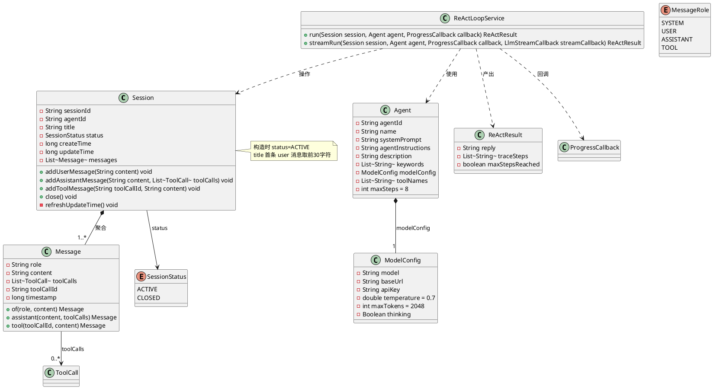
```plantuml
@startuml
    ' Session <<AggregateRoot>>
    class Session {
        -String sessionId
        -String agentId
        -String title
        -SessionStatus status
        -long createTime
        -long updateTime
        -List~Message~ messages
        +addUserMessage(String content) void
        +addAssistantMessage(String content, List~ToolCall~ toolCalls) void
        +addToolMessage(String toolCallId, String content) void
        +close() void
        -refreshUpdateTime() void
    }
    note right of Session
      构造时 status=ACTIVE
      title 首条 user 消息取前30字符
    end note
    ' Message <<Entity>>
    class Message {
        -String role
        -String content
        -List~ToolCall~ toolCalls
        -String toolCallId
        -long timestamp
        +of(role, content) Message
        +assistant(content, toolCalls) Message
        +tool(toolCallId, content) Message
    }
    ' Agent <<Entity>>
    class Agent {
        -String agentId
        -String name
        -String systemPrompt
        -String agentInstructions
        -String description
        -List~String~ keywords
        -ModelConfig modelConfig
        -List~String~ toolNames
        -int maxSteps = 8
    }
    ' ModelConfig <<ValueObject>>
    class ModelConfig {
        -String model
        -String baseUrl
        -String apiKey
        -double temperature = 0.7
        -int maxTokens = 2048
        -Boolean thinking
    }
    ' ReActResult <<ValueObject>>
    class ReActResult {
        -String reply
        -List~String~ traceSteps
        -boolean maxStepsReached
    }
    ' ReActLoopService <<DomainService>>
    class ReActLoopService {
        +run(Session session, Agent agent, ProgressCallback callback) ReActResult
        +streamRun(Session session, Agent agent, ProgressCallback callback, LlmStreamCallback streamCallback) ReActResult
    }
    ' SessionStatus <<enumeration>>
    enum SessionStatus {
        ACTIVE
        CLOSED
    }
    ' MessageRole <<enumeration>>
    enum MessageRole {
        SYSTEM
        USER
        ASSISTANT
        TOOL
    }
    Session *-- "1..*" Message : 聚合
    Session --> SessionStatus : status
    Message --> "0..*" ToolCall : toolCalls
    Agent *-- "1" ModelConfig : modelConfig
    ReActLoopService ..> Session : 操作
    ReActLoopService ..> Agent : 使用
    ReActLoopService ..> ReActResult : 产出
    ReActLoopService ..> ProgressCallback : 回调
@enduml
```

### 5.3 编排协作域数据模型

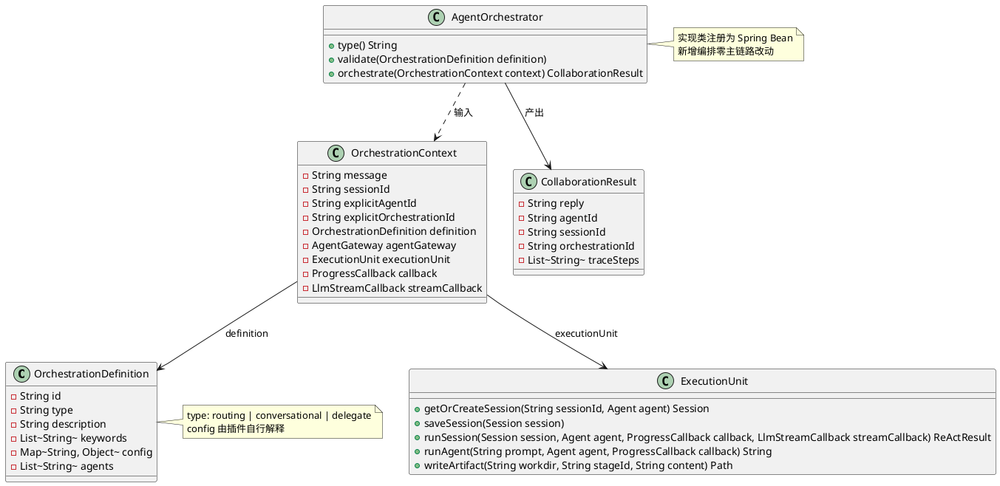
```plantuml
@startuml
    ' OrchestrationDefinition <<ValueObject>>
    class OrchestrationDefinition {
        -String id
        -String type
        -String description
        -List~String~ keywords
        -Map~String, Object~ config
        -List~String~ agents
    }
    note right of OrchestrationDefinition
      type: routing | conversational | delegate
      config 由插件自行解释
    end note
    ' OrchestrationContext <<ValueObject>>
    class OrchestrationContext {
        -String message
        -String sessionId
        -String explicitAgentId
        -String explicitOrchestrationId
        -OrchestrationDefinition definition
        -AgentGateway agentGateway
        -ExecutionUnit executionUnit
        -ProgressCallback callback
        -LlmStreamCallback streamCallback
    }
    ' CollaborationResult <<ValueObject>>
    class CollaborationResult {
        -String reply
        -String agentId
        -String sessionId
        -String orchestrationId
        -List~String~ traceSteps
    }
    ' AgentOrchestrator <<interface>>
    class AgentOrchestrator {
        +type() String
        +validate(OrchestrationDefinition definition)
        +orchestrate(OrchestrationContext context) CollaborationResult
    }
    note right of AgentOrchestrator
      实现类注册为 Spring Bean
      新增编排零主链路改动
    end note
    ' ExecutionUnit <<Port>>
    class ExecutionUnit {
        +getOrCreateSession(String sessionId, Agent agent) Session
        +saveSession(Session session)
        +runSession(Session session, Agent agent, ProgressCallback callback, LlmStreamCallback streamCallback) ReActResult
        +runAgent(String prompt, Agent agent, ProgressCallback callback) String
        +writeArtifact(String workdir, String stageId, String content) Path
    }
    OrchestrationContext --> OrchestrationDefinition : definition
    OrchestrationContext --> ExecutionUnit : executionUnit
    AgentOrchestrator ..> OrchestrationContext : 输入
    AgentOrchestrator --> CollaborationResult : 产出
@enduml
```

### 5.4 记忆域数据模型

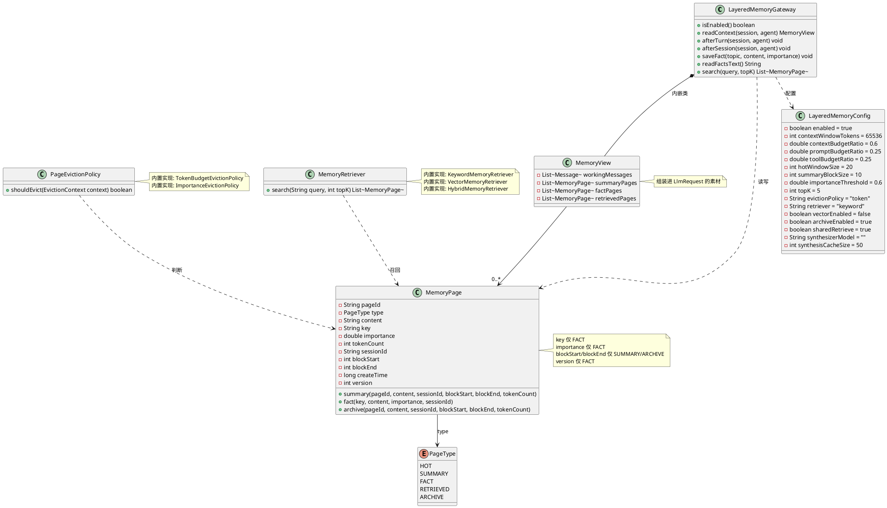
```plantuml
@startuml
    ' LayeredMemoryGateway <<interface>>
    class LayeredMemoryGateway {
        +isEnabled() boolean
        +readContext(session, agent) MemoryView
        +afterTurn(session, agent) void
        +afterSession(session, agent) void
        +saveFact(topic, content, importance) void
        +readFactsText() String
        +search(query, topK) List~MemoryPage~
    }
    ' MemoryView <<ValueObject>>
    class MemoryView {
        -List~Message~ workingMessages
        -List~MemoryPage~ summaryPages
        -List~MemoryPage~ factPages
        -List~MemoryPage~ retrievedPages
    }
    note right of MemoryView
      组装进 LlmRequest 的素材
    end note
    ' MemoryPage <<ValueObject>>
    class MemoryPage {
        -String pageId
        -PageType type
        -String content
        -String key
        -double importance
        -int tokenCount
        -String sessionId
        -int blockStart
        -int blockEnd
        -long createTime
        -int version
        +summary(pageId, content, sessionId, blockStart, blockEnd, tokenCount)
        +fact(key, content, importance, sessionId)
        +archive(pageId, content, sessionId, blockStart, blockEnd, tokenCount)
    }
    note right of MemoryPage
      key 仅 FACT
      importance 仅 FACT
      blockStart/blockEnd 仅 SUMMARY/ARCHIVE
      version 仅 FACT
    end note
    ' LayeredMemoryConfig <<Config>>
    class LayeredMemoryConfig {
        -boolean enabled = true
        -int contextWindowTokens = 65536
        -double contextBudgetRatio = 0.6
        -double promptBudgetRatio = 0.25
        -double toolBudgetRatio = 0.25
        -int hotWindowSize = 20
        -int summaryBlockSize = 10
        -double importanceThreshold = 0.6
        -int topK = 5
        -String evictionPolicy = "token"
        -String retriever = "keyword"
        -boolean vectorEnabled = false
        -boolean archiveEnabled = true
        -boolean sharedRetrieve = true
        -String synthesizerModel = ""
        -int synthesisCacheSize = 50
    }
    ' PageEvictionPolicy <<interface>>
    class PageEvictionPolicy {
        +shouldEvict(EvictionContext context) boolean
    }
    note right of PageEvictionPolicy
      内置实现: TokenBudgetEvictionPolicy
      内置实现: ImportanceEvictionPolicy
    end note
    ' MemoryRetriever <<interface>>
    class MemoryRetriever {
        +search(String query, int topK) List~MemoryPage~
    }
    note right of MemoryRetriever
      内置实现: KeywordMemoryRetriever
      内置实现: VectorMemoryRetriever
      内置实现: HybridMemoryRetriever
    end note
    ' PageType <<enumeration>>
    enum PageType {
        HOT
        SUMMARY
        FACT
        RETRIEVED
        ARCHIVE
    }
    LayeredMemoryGateway *-- MemoryView : 内嵌类
    MemoryView --> "0..*" MemoryPage
    MemoryPage --> PageType : type
    LayeredMemoryGateway ..> MemoryPage : 读写
    PageEvictionPolicy ..> MemoryPage : 判断
    MemoryRetriever ..> MemoryPage : 召回
    LayeredMemoryGateway ..> LayeredMemoryConfig : 配置
@enduml
```

### 5.5 LLM 域数据模型

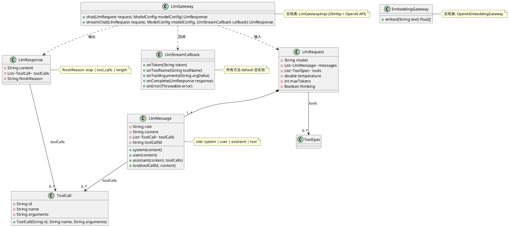
```plantuml
@startuml
    ' LlmGateway <<interface>>
    class LlmGateway {
        +chat(LlmRequest request, ModelConfig modelConfig) LlmResponse
        +streamChat(LlmRequest request, ModelConfig modelConfig, LlmStreamCallback callback) LlmResponse
    }
    note right of LlmGateway
      实现类: LlmGatewayImpl (OkHttp + OpenAI API)
    end note
    ' EmbeddingGateway <<interface>>
    class EmbeddingGateway {
        +embed(String text) float[]
    }
    note right of EmbeddingGateway
      实现类: OpenAiEmbeddingGateway
    end note
    ' LlmRequest <<ValueObject>>
    class LlmRequest {
        -String model
        -List~LlmMessage~ messages
        -List~ToolSpec~ tools
        -double temperature
        -int maxTokens
        -Boolean thinking
    }
    ' LlmResponse <<ValueObject>>
    class LlmResponse {
        -String content
        -List~ToolCall~ toolCalls
        -String finishReason
    }
    note right of LlmResponse
      finishReason: stop | tool_calls | length
    end note
    ' LlmMessage <<ValueObject>>
    class LlmMessage {
        -String role
        -String content
        -List~ToolCall~ toolCalls
        -String toolCallId
        +system(content)
        +user(content)
        +assistant(content, toolCalls)
        +tool(toolCallId, content)
    }
    note right of LlmMessage
      role: system | user | assistant | tool
    end note
    ' ToolCall <<ValueObject>>
    class ToolCall {
        -String id
        -String name
        -String arguments
        +ToolCall(String id, String name, String arguments)
    }
    ' LlmStreamCallback <<interface>>
    class LlmStreamCallback {
        +onToken(String token)
        +onToolName(String toolName)
        +onToolArguments(String argDelta)
        +onComplete(LlmResponse response)
        +onError(Throwable error)
    }
    note right of LlmStreamCallback
      所有方法 default 空实现
    end note
    LlmGateway ..> LlmRequest : 输入
    LlmGateway ..> LlmResponse : 输出
    LlmRequest *-- "1..*" LlmMessage
    LlmRequest --> "0..*" ToolSpec : tools
    LlmResponse --> "0..*" ToolCall : toolCalls
    LlmMessage --> "0..*" ToolCall : toolCalls
    LlmGateway ..> LlmStreamCallback : 回调
@enduml
```

### 5.6 工具域数据模型

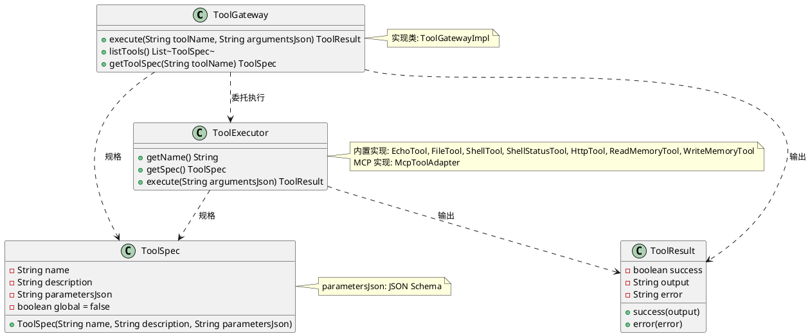
```plantuml
@startuml
    ' ToolGateway <<interface>>
    class ToolGateway {
        +execute(String toolName, String argumentsJson) ToolResult
        +listTools() List~ToolSpec~
        +getToolSpec(String toolName) ToolSpec
    }
    note right of ToolGateway
      实现类: ToolGatewayImpl
    end note
    ' ToolExecutor <<interface>>
    class ToolExecutor {
        +getName() String
        +getSpec() ToolSpec
        +execute(String argumentsJson) ToolResult
    }
    note right of ToolExecutor
      内置实现: EchoTool, FileTool, ShellTool, ShellStatusTool, HttpTool, ReadMemoryTool, WriteMemoryTool
      MCP 实现: McpToolAdapter
    end note
    ' ToolSpec <<ValueObject>>
    class ToolSpec {
        -String name
        -String description
        -String parametersJson
        -boolean global = false
        +ToolSpec(String name, String description, String parametersJson)
    }
    note right of ToolSpec
      parametersJson: JSON Schema
    end note
    ' ToolResult <<ValueObject>>
    class ToolResult {
        -boolean success
        -String output
        -String error
        +success(output)
        +error(error)
    }
    ToolGateway ..> ToolResult : 输出
    ToolGateway ..> ToolSpec : 规格
    ToolExecutor ..> ToolResult : 输出
    ToolExecutor ..> ToolSpec : 规格
    ToolGateway ..> ToolExecutor : 委托执行
@enduml
```

### 5.7 枚举定义汇总

| 枚举 | 所属域 | 值 | 用途 |
| ---- | ------ | --- | ---- |
| `SessionStatus` | core | `ACTIVE`, `CLOSED` | 会话生命周期状态 |
| `MessageRole` | core | `SYSTEM`, `USER`, `ASSISTANT`, `TOOL` | 消息角色（已废弃：`Message.role` 改用 String，枚举无引用） |
| `PageType` | memory | `HOT`, `SUMMARY`, `FACT`, `RETREVED`, `ARCHIVE` | 记忆页类型 |

---

## 6. 重要领域的详细流程设计

### 6.1 核心域：ReAct 推理引擎

#### 6.1.1 ReAct 循环状态图

ReAct 推理引擎是整个系统的核心，驱动「思考→行动→观察」迭代循环。每轮循环中，LLM 要么直接产出最终回复（终止），要么声明工具调用（进入工具执行后继续循环）。

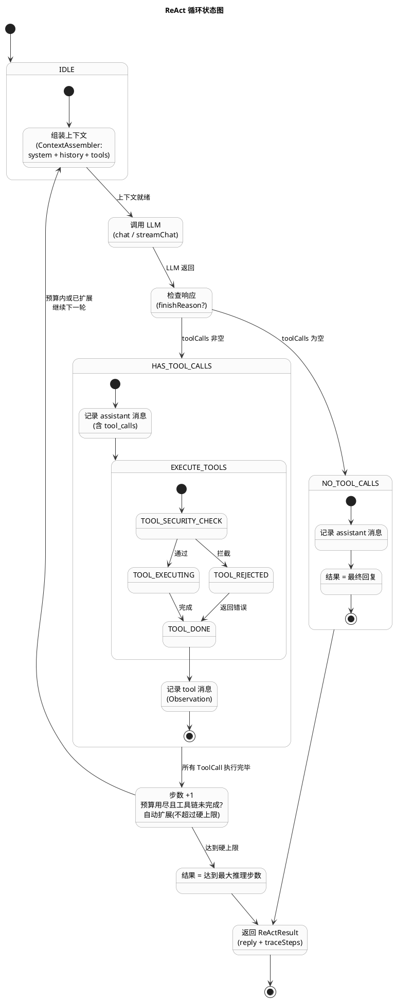
```plantuml
@startuml
title ReAct 循环状态图
skinparam state {
  BackgroundColor #FBFBFB
  BorderColor #888888
  ArrowColor #333333
}

[*] --> IDLE
state IDLE {
  [*] --> CONTEXT_ASSEMBLE
}

state "组装上下文\n(ContextAssembler:\nsystem + history + tools)" as CONTEXT_ASSEMBLE
CONTEXT_ASSEMBLE --> LLM_CALLING : 上下文就绪

state "调用 LLM\n(chat / streamChat)" as LLM_CALLING
LLM_CALLING --> CHECK_RESPONSE : LLM 返回

state "检查响应\n(finishReason?)" as CHECK_RESPONSE

state HAS_TOOL_CALLS {
  [*] --> RECORD_ASSISTANT
  state "记录 assistant 消息\n(含 tool_calls)" as RECORD_ASSISTANT
  RECORD_ASSISTANT --> EXECUTE_TOOLS
  state EXECUTE_TOOLS {
    [*] --> TOOL_SECURITY_CHECK
    TOOL_SECURITY_CHECK --> TOOL_EXECUTING : 通过
    TOOL_SECURITY_CHECK --> TOOL_REJECTED : 拦截
    TOOL_EXECUTING --> TOOL_DONE : 完成
    TOOL_REJECTED --> TOOL_DONE : 返回错误
  }
  TOOL_DONE --> RECORD_OBSERVATION
  state "记录 tool 消息\n(Observation)" as RECORD_OBSERVATION
  RECORD_OBSERVATION --> [*]
}

state NO_TOOL_CALLS {
  [*] --> RECORD_REPLY
  state "记录 assistant 消息" as RECORD_REPLY
  RECORD_REPLY --> SET_REPLY
  state "结果 = 最终回复" as SET_REPLY
  SET_REPLY --> [*]
}

CHECK_RESPONSE --> HAS_TOOL_CALLS : toolCalls 非空
CHECK_RESPONSE --> NO_TOOL_CALLS : toolCalls 为空

HAS_TOOL_CALLS --> STEP_CHECK : 所有 ToolCall 执行完毕

state "步数 +1\n预算用尽且工具链未完成?\n自动扩展(不超过硬上限)" as STEP_CHECK
STEP_CHECK --> CONTEXT_ASSEMBLE : 预算内或已扩展\n继续下一轮
STEP_CHECK --> MAX_STEPS : 达到硬上限

state "结果 = 达到最大推理步数" as MAX_STEPS
MAX_STEPS --> DONE

NO_TOOL_CALLS --> DONE

state "返回 ReActResult\n(reply + traceSteps)" as DONE
DONE --> [*]
@enduml
```

#### 6.1.2 ReAct 循环数据交互图

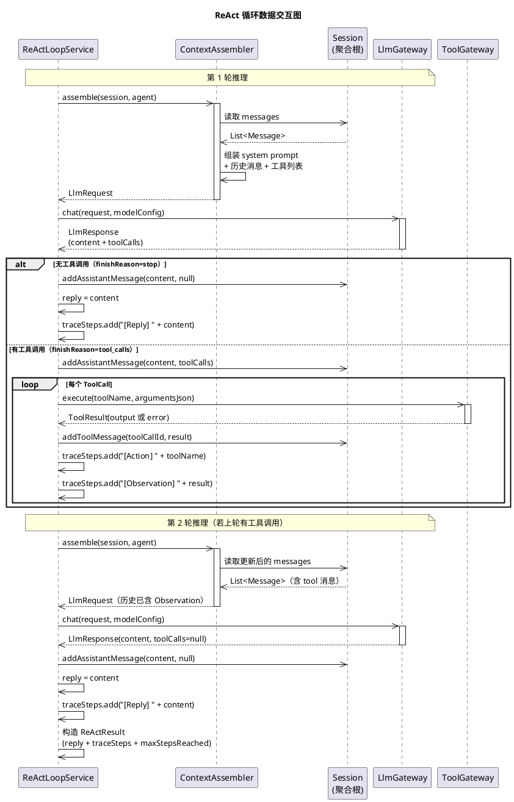
```plantuml
@startuml
title ReAct 循环数据交互图
participant RACT as "ReActLoopService"
participant CTX as "ContextAssembler"
participant SESS as "Session\n(聚合根)"
participant LLM as "LlmGateway"
participant TG as "ToolGateway"

Note over RACT, LLM : 第 1 轮推理
RACT->>CTX: assemble(session, agent)
activate CTX
CTX->>SESS: 读取 messages
SESS-->>CTX: List<Message>
CTX->>CTX: 组装 system prompt\n+ 历史消息 + 工具列表
CTX-->>RACT: LlmRequest
deactivate CTX

RACT->>LLM: chat(request, modelConfig)
activate LLM
LLM-->>RACT: LlmResponse\n(content + toolCalls)
deactivate LLM

alt 无工具调用（finishReason=stop）
    RACT->>SESS: addAssistantMessage(content, null)
    RACT->>RACT: reply = content
    RACT->>RACT: traceSteps.add("[Reply] " + content)
else 有工具调用（finishReason=tool_calls）
    RACT->>SESS: addAssistantMessage(content, toolCalls)
    loop 每个 ToolCall
        RACT->>TG: execute(toolName, argumentsJson)
        activate TG
        TG-->>RACT: ToolResult(output 或 error)
        deactivate TG
        RACT->>SESS: addToolMessage(toolCallId, result)
        RACT->>RACT: traceSteps.add("[Action] " + toolName)
        RACT->>RACT: traceSteps.add("[Observation] " + result)
    end
end

Note over RACT, LLM : 第 2 轮推理（若上轮有工具调用）
RACT->>CTX: assemble(session, agent)
activate CTX
CTX->>SESS: 读取更新后的 messages
SESS-->>CTX: List<Message>（含 tool 消息）
CTX-->>RACT: LlmRequest（历史已含 Observation）
deactivate CTX

RACT->>LLM: chat(request, modelConfig)
activate LLM
LLM-->>RACT: LlmResponse(content, toolCalls=null)
deactivate LLM

RACT->>SESS: addAssistantMessage(content, null)
RACT->>RACT: reply = content
RACT->>RACT: traceSteps.add("[Reply] " + content)

RACT->>RACT: 构造 ReActResult\n(reply + traceSteps + maxStepsReached)
@enduml
```

#### 6.1.3 文字说明

ReAct（Reasoning + Acting）循环由 [ReActLoopService](file:///Users/mawenbin/workspace/java/mwb_coding/mwb-ai-claw/mwb-ai-claw-domain/src/main/java/com/mwb/ai/claw/domain/core/ReActLoopService.java) 驱动，核心流程如下：

1. **上下文组装**：每轮推理开始，调用 `ContextAssembler.assemble()` 组装 LLM 请求。组装内容包括 system prompt（Agent 人设 + AGENT.md 指令 + 长期记忆 + **推理预算提示**：告知本次任务预算步数，引导并行调用相互独立的工具、获得足够信息后直接给出最终回复）、会话历史消息（或分层记忆的工作记忆视图）、工具规格列表。
2. **LLM 调用**：通过 `LlmGateway` 发送请求。支持同步（`chat`）与流式（`streamChat`）两种模式。流式模式下通过 `LlmStreamCallback` 逐 token 推送增量内容。
3. **响应判定**：检查 `LlmResponse.finishReason`——若为 `stop` 且无 `toolCalls`，则 LLM 已产出最终回复，循环终止；若为 `tool_calls`，则进入工具执行阶段。
4. **工具执行**：遍历 LLM 声明的 `ToolCall` 列表，逐个调用 `ToolGateway.execute()` 执行。每个工具结果作为 `tool` 角色消息（Observation）追加到会话。
5. **迭代或终止（软预算 + 自动扩展）**：工具执行完毕后步数 +1。初始预算为 `Agent.maxSteps`（默认 8），硬上限 = `maxSteps × maxStepsExtensionFactor`（默认 2.0）。预算用尽但本轮仍调用了工具（工具链未收敛）时，自动追加 `max(maxSteps/2, 1)` 步继续推理（每次扩展在 `traceSteps` 记录 `[Info] 步数预算已用尽…自动扩展`）；达到硬上限仍未产出最终回复，才以「达到最大推理步数」终止。
6. **结果返回**：构造 `ReActResult`，包含最终回复 `reply`、执行轨迹 `traceSteps`（Thought/Action/Observation 摘要）、以及 `maxStepsReached` 标志。

---

### 6.2 编排协作域

#### 6.2.1 编排生命周期状态图

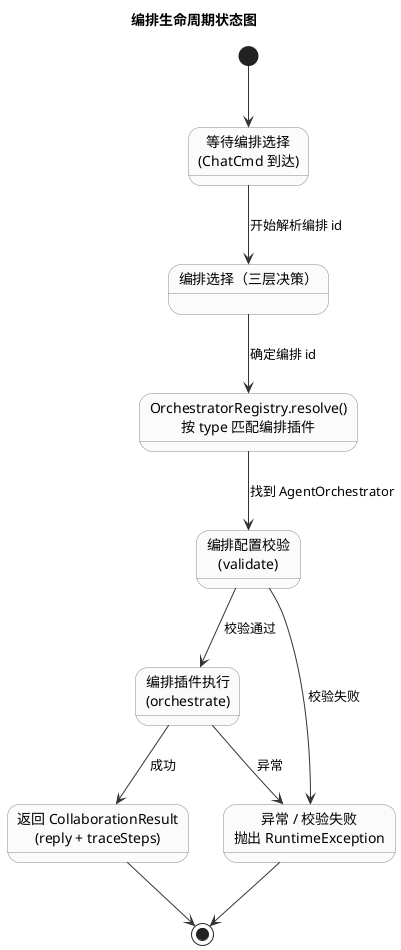
```plantuml
@startuml
title 编排生命周期状态图
skinparam state {
  BackgroundColor #FBFBFB
  BorderColor #888888
  ArrowColor #333333
}

[*] --> PENDING

state "等待编排选择\n(ChatCmd 到达)" as PENDING
PENDING --> SELECTING : 开始解析编排 id

state "编排选择（三层决策）" as SELECTING
SELECTING --> RESOLVING : 确定编排 id

state "OrchestratorRegistry.resolve()\n按 type 匹配编排插件" as RESOLVING
RESOLVING --> VALIDATING : 找到 AgentOrchestrator

state "编排配置校验\n(validate)" as VALIDATING
VALIDATING --> EXECUTING : 校验通过
VALIDATING --> FAILED : 校验失败

state "编排插件执行\n(orchestrate)" as EXECUTING
EXECUTING --> COMPLETED : 成功
EXECUTING --> FAILED : 异常

state "返回 CollaborationResult\n(reply + traceSteps)" as COMPLETED
COMPLETED --> [*]

state "异常 / 校验失败\n抛出 RuntimeException" as FAILED
FAILED --> [*]
@enduml
```

#### 6.2.2 编排选择（协作工具化）

对话请求默认走 `routing` 编排（单专家 ReAct 独立处理）；多 Agent 协作编排（对话式 / 委托）**不再做消息前置意图路由**，而是封装为全局协作工具（`invoke_discussion` / `invoke_delegate`，基于 `ExecutionUnit.runOrchestration`），由主 Agent 在 ReAct 推理中自主决定是否发起。编排选择简化为两层：显式指定（`orchestrationId`）> 默认编排（`agent.orchestration`，默认 `routing`）。

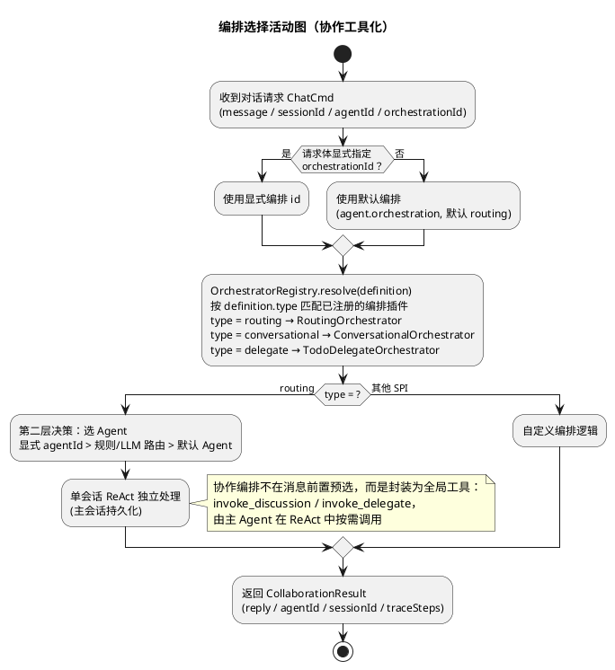
```plantuml
@startuml
title 编排选择活动图（协作工具化）
start
:收到对话请求 ChatCmd\n(message / sessionId / agentId / orchestrationId);
if (请求体显式指定\norchestrationId？) then (是)
  :使用显式编排 id;
else (否)
  :使用默认编排\n(agent.orchestration, 默认 routing);
endif
:OrchestratorRegistry.resolve(definition)\n按 definition.type 匹配已注册的编排插件\ntype = routing → RoutingOrchestrator\ntype = conversational → ConversationalOrchestrator\ntype = delegate → TodoDelegateOrchestrator;
if (type = ?) then (routing)
  :第二层决策：选 Agent\n显式 agentId > 规则/LLM 路由 > 默认 Agent;
  :单会话 ReAct 独立处理\n(主会话持久化);
  note right
    协作编排不在消息前置预选，而是封装为全局工具：
    invoke_discussion / invoke_delegate，
    由主 Agent 在 ReAct 中按需调用
  end note
else (其他 SPI)
  :自定义编排逻辑;
endif
:返回 CollaborationResult\n(reply / agentId / sessionId / traceSteps);
stop
@enduml
```

#### 6.2.3 对话式编排数据交互图

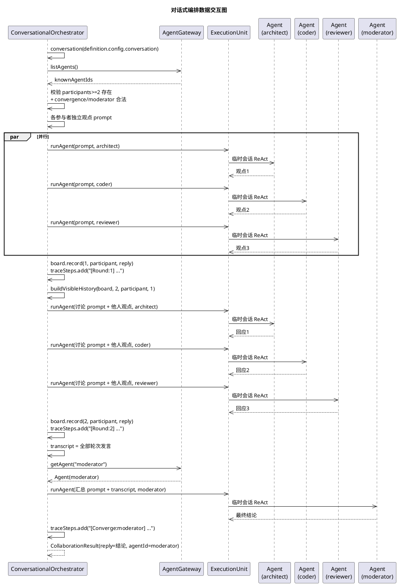
```plantuml
@startuml
title 对话式编排数据交互图
participant C as "ConversationalOrchestrator"
participant AG as "AgentGateway"
participant EU as "ExecutionUnit"
participant A1 as "Agent\n(architect)"
participant A2 as "Agent\n(coder)"
participant A3 as "Agent\n(reviewer)"
participant AM as "Agent\n(moderator)"

' 启动校验
C->>C: conversation(definition.config.conversation)
C->>AG: listAgents()
AG-->>C: knownAgentIds
C->>C: 校验 participants>=2 存在\n+ convergence/moderator 合法

' Round 1（并行，CompletableFuture + 线程池）
C->>C: 各参与者独立观点 prompt
par 并行
    C->>EU: runAgent(prompt, architect)
    EU->>A1: 临时会话 ReAct
    A1-->>EU: 观点1
    C->>EU: runAgent(prompt, coder)
    EU->>A2: 临时会话 ReAct
    A2-->>EU: 观点2
    C->>EU: runAgent(prompt, reviewer)
    EU->>A3: 临时会话 ReAct
    A3-->>EU: 观点3
end
C->>C: board.record(1, participant, reply)\ntraceSteps.add("[Round:1] ...")

' Round 2（串行，可见历史 visibleHistory=1）
C->>C: buildVisibleHistory(board, 2, participant, 1)
C->>EU: runAgent(讨论 prompt + 他人观点, architect)
EU->>A1: 临时会话 ReAct
A1-->>EU: 回应1
C->>EU: runAgent(讨论 prompt + 他人观点, coder)
EU->>A2: 临时会话 ReAct
A2-->>EU: 回应2
C->>EU: runAgent(讨论 prompt + 他人观点, reviewer)
EU->>A3: 临时会话 ReAct
A3-->>EU: 回应3
C->>C: board.record(2, participant, reply)\ntraceSteps.add("[Round:2] ...")

' 收敛（convergence=moderator）
C->>C: transcript = 全部轮次发言
C->>AG: getAgent("moderator")
AG-->>C: Agent(moderator)
C->>EU: runAgent(汇总 prompt + transcript, moderator)
EU->>AM: 临时会话 ReAct
AM-->>EU: 最终结论
C->>C: traceSteps.add("[Converge:moderator] ...")
C-->>C: CollaborationResult(reply=结论, agentId=moderator)
@enduml
```

#### 6.2.4 文字说明

编排协作域实现多 Agent 协作，核心设计是 **SPI 插件化 + 主 Agent 主导协作**：

**编排选择（简化两层）**：
1. **第一层（选编排）**：`ChatCmdExe` 根据 `orchestrationId` 决定使用哪个编排。优先级：显式指定 > 默认编排（`agent.orchestration`，默认 `routing`）。多 Agent 协作编排不再消息前置预选，而是封装为全局工具（`invoke_discussion` / `invoke_delegate`），由主 Agent 在 ReAct 中按需调用（经 `ExecutionUnit.runOrchestration` 嵌套调起）。
2. **第二层（选 Agent）**：编排插件内部决定使用哪个 Agent。Routing 编排通过显式 agentId / 规则关键词 / LLM 路由选择；协作编排（对话式 / 委托式）由各自定义中的 `agentId` 字段指定。
3. **第三层（选工具）**：Agent 的 `toolNames` 配置 + 全局工具（协作工具 / MCP 动态注册）决定可用工具集。

**编排 SPI（`AgentOrchestrator`）**：
- 实现类通过 `type()` 声明编排类型标识，注册中心在启动期自动收集。
- 新增编排方式仅需：(1) 实现接口并注册为 Spring Bean；(2) 在 `orchestrations.json` 增加一条定义。
- 内置实现：`RoutingOrchestrator`（路由，单 Agent 独立处理）、`ConversationalOrchestrator`（对话式，多方多轮讨论 + 收敛）、`TodoDelegateOrchestrator`（委托式，规划 Todo → 委派子 Agent，可递归 + 并行）。

**对话式编排（`ConversationalOrchestrator`）**：
- 定义（`ConversationDefinition`）从编排定义的 `config.conversation` Map 解析：`rounds` / `participants` / `moderator` / `convergence` / `minConsensus` / `visibleHistory` / `thinking`。
- 执行流程：首轮（并行，`CompletableFuture` + 线程池）各参与者独立产出观点 → 讨论轮（串行）按 `visibleHistory` 截断注入其他参与者发言并互相回应 → 收敛产出最终结论。
- 收敛策略：`moderator`（默认，仲裁 Agent 汇总全部发言）、`consensus`（发言含共识信号词数 ≥ `minConsensus` 提前终止，取支持最多的发言）、`best`（解析「置信度: 0.x」标注取最高）。
- 参与者与收敛 Agent 均通过临时会话执行（上下文隔离，不入库）；`thinking` 覆盖与空回复重试同委托编排。

**委托编排（`TodoDelegateOrchestrator`）**：
- 定义（`DelegateDefinition`）从编排定义的 `config.delegate` Map 解析：`plannerAgentId` / `maxTodos` / `maxDepth` / `parallel` / `concurrency` / `onFailure` / `retries` / `thinking` / `resultPass` / `workdir`。
- 执行流程：**规划（Plan）** → 主 Agent 思考并输出 Todo 列表（结构化 JSON：`todoId` / `title` / `description` / `agentId` / `dependsOn`）→ **委派（Execute）** → 对 Todo 做 Kahn 拓扑分层，无依赖组为 Wave 并行执行（`CompletableFuture` + 线程池），依赖 Todo 分层推进、结果注入下游 prompt → **汇总（Summarize）** → 各 Todo 结果（截断或落盘）交给规划 Agent 输出整体结论。
- 递归委托：子 Agent 执行 Todo 时若 `depth + 1 < maxDepth` 可再规划子 Todo 并委托下一级（任务树），到达深度上限的节点直接执行。
- 容错：规划输出非 JSON 重试一次后降级「直执行」；依赖环检测回退声明顺序串行；todo 失败按 `onFailure: abort / skip` 处理；空回复复用「请直接输出完整回答」重试；未知 agentId 回退默认 Agent。
- 约束：`maxDepth` / `maxTodos` 硬限制；`concurrency` 控制并行度（默认 4）；线程池每次编排实例级创建与释放。
- 数据底座：规划 / 汇总产物按 `{workdir}/{sessionId}/{时间戳}` 隔离落盘（`plan-{layerPath}.json` / `result-{layerPath}.txt`），叶子 todo 结论经 `LayeredMemoryGateway.saveFact` 沉淀 FACT（topic 含层级路径幂等去重），落盘与沉淀全程追加轨迹。
- 交互与上下文（P1）：Todo 生命周期状态机（`TodoStatus`：paused → approved → running → done / failed）；人工审批门禁 `approvalGate`（`none` / `root` / `all`，命中层规划完成后经 `ApprovalRegistry` 注册并暂停等待，REST / WebSocket 审批 API 或 Shell 命令（`/pending [sessionId]` 查询、`/approve <layerKey> [sessionId]` 批准、`/reject <layerKey> [sessionId]` 拒绝；shell 普通对话改后台线程执行，等待审批期间 REPL 仍可接收决策命令）按 `{sessionId}/{layerKey}` approve / reject，拒绝或超时降级直执行）；汇总阶段子结果按与父任务相关性 bigram 打分取 top-k（默认 3）注入，控制上下文成本。
- 智能与组合（P2）：动态规划 `replanRounds`（默认 0 不启用；每个 Wave 执行完成后规划者结合已得结果对剩余 Todo 做 re-plan，支持完整 `todos` 替换或 `adjust` keep/drop/modify 增量协议，仅作用于未执行 Wave，调整后写 `plan-*.json` 并输出 `[Replan]` 轨迹）；Todo 级编排嵌套组合（`TodoDefinition.orchestrationId` 可引用 conversational / delegate 自身，经 `ExecutionUnit.runOrchestration` 按 id 调起，嵌套 `CollaborationResult.reply` 回传参与本层汇总；防环用线程级嵌套调用链 `ThreadLocal<Deque>` 检测，A→B→A 循环引用运行时抛业务异常终止）。

---

### 6.3 记忆域

#### 6.3.1 记忆页生命周期状态图

`MemoryPage` 在分层记忆系统中经历多种类型转换：

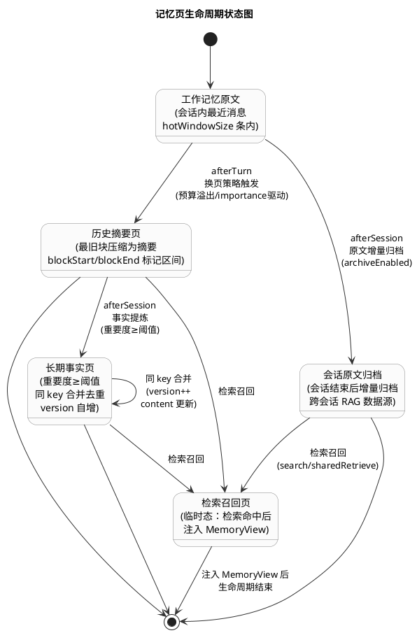
```plantuml
@startuml
title 记忆页生命周期状态图
skinparam state {
  BackgroundColor #FBFBFB
  BorderColor #888888
  ArrowColor #333333
}

[*] --> HOT

state "工作记忆原文\n(会话内最近消息\nhotWindowSize 条内)" as HOT

state "历史摘要页\n(最旧块压缩为摘要\nblockStart/blockEnd 标记区间)" as SUMMARY

state "会话原文归档\n(会话结束后增量归档\n跨会话 RAG 数据源)" as ARCHIVE

state "长期事实页\n(重要度≥阈值\n同 key 合并去重\nversion 自增)" as FACT

state "检索召回页\n(临时态：检索命中后\n注入 MemoryView)" as RETRIEVED

HOT --> SUMMARY : afterTurn\n换页策略触发\n(预算溢出/importance驱动)
SUMMARY --> FACT : afterSession\n事实提炼\n(重要度≥阈值)
HOT --> ARCHIVE : afterSession\n原文增量归档\n(archiveEnabled)
ARCHIVE --> RETRIEVED : 检索召回\n(search/sharedRetrieve)
SUMMARY --> RETRIEVED : 检索召回
FACT --> RETRIEVED : 检索召回

RETRIEVED --> [*] : 注入 MemoryView 后\n生命周期结束

FACT --> FACT : 同 key 合并\n(version++\ncontent 更新)
SUMMARY --> [*]
ARCHIVE --> [*]
FACT --> [*]
@enduml
```

#### 6.3.2 会话记忆流转状态图

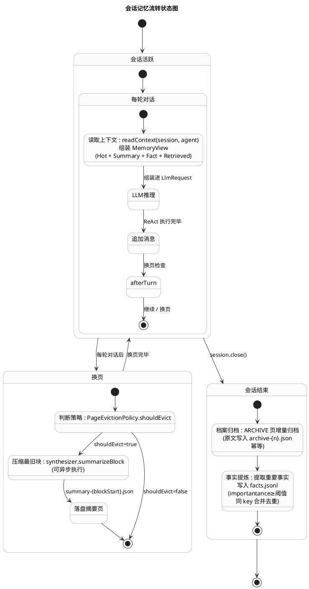
```plantuml
@startuml
title 会话记忆流转状态图
skinparam state {
  BackgroundColor #FBFBFB
  BorderColor #888888
  ArrowColor #333333
}

[*] --> ACTIVE

state "会话活跃" as ACTIVE {
  [*] --> TURN
  state "每轮对话" as TURN {
    [*] --> READ_CTX
    state "读取上下文 : readContext(session, agent)\n组装 MemoryView\n(Hot + Summary + Fact + Retrieved)" as READ_CTX
    READ_CTX --> LLM_REASON : 组装进 LlmRequest
    state "LLM推理" as LLM_REASON
    LLM_REASON --> APPEND_MSG : ReAct 执行完毕
    state "追加消息" as APPEND_MSG
    APPEND_MSG --> AFTER_TURN : 换页检查
    state "afterTurn" as AFTER_TURN
    AFTER_TURN --> [*] : 继续 / 换页
  }
}

state "换页" as EVICT {
  [*] --> CHECK_POLICY
  state "判断策略 : PageEvictionPolicy.shouldEvict" as CHECK_POLICY
  CHECK_POLICY --> COMPRESS : shouldEvict=true
  CHECK_POLICY --> [*] : shouldEvict=false
  state "压缩最旧块 : synthesizer.summarizeBlock\n(可异步执行)" as COMPRESS
  COMPRESS --> SAVE_SUMMARY : summary-{blockStart}.json
  state "落盘摘要页" as SAVE_SUMMARY
  SAVE_SUMMARY --> [*]
}

state "会话结束" as CLOSE {
  [*] --> ARCHIVE_DONE
  state "档案归档 : ARCHIVE 页增量归档\n(原文写入 archive-{n}.json\n幂等)" as ARCHIVE_DONE
  ARCHIVE_DONE --> FACT_EXTRACT
  state "事实提炼 : 提取重要事实\n写入 facts.jsonl\n(importantance≥阈值\n同 key 合并去重)" as FACT_EXTRACT
  FACT_EXTRACT --> [*]
}

ACTIVE --> EVICT : 每轮对话后
EVICT --> ACTIVE : 换页完毕
ACTIVE --> CLOSE : session.close()
CLOSE --> [*]
@enduml
```

#### 6.3.3 分层记忆上下文组装活动图

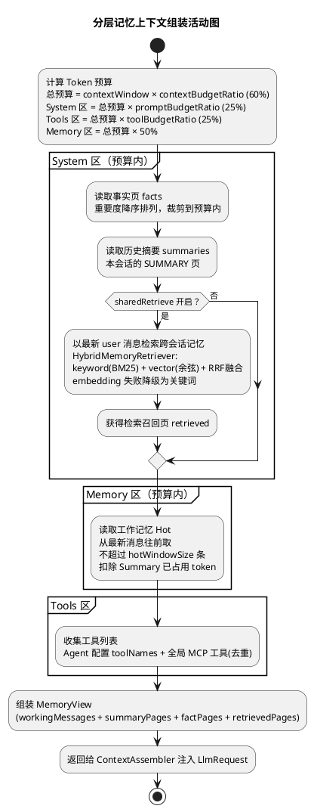
```plantuml
@startuml
title 分层记忆上下文组装活动图
start
:计算 Token 预算\n总预算 = contextWindow × contextBudgetRatio (60%)\nSystem 区 = 总预算 × promptBudgetRatio (25%)\nTools 区 = 总预算 × toolBudgetRatio (25%)\nMemory 区 = 总预算 × 50%;
partition "System 区（预算内）" {
  :读取事实页 facts\n重要度降序排列，裁剪到预算内;
  :读取历史摘要 summaries\n本会话的 SUMMARY 页;
  if (sharedRetrieve 开启？) then (是)
    :以最新 user 消息检索跨会话记忆\nHybridMemoryRetriever:\nkeyword(BM25) + vector(余弦) + RRF融合\nembedding 失败降级为关键词;
    :获得检索召回页 retrieved;
  else (否)
  endif
}
partition "Memory 区（预算内）" {
  :读取工作记忆 Hot\n从最新消息往前取\n不超过 hotWindowSize 条\n扣除 Summary 已占用 token;
}
partition "Tools 区" {
  :收集工具列表\nAgent 配置 toolNames + 全局 MCP 工具(去重);
}
:组装 MemoryView\n(workingMessages + summaryPages + factPages + retrievedPages);
:返回给 ContextAssembler 注入 LlmRequest;
stop
@enduml
```

#### 6.3.4 文字说明

记忆域实现五层分层记忆模型，核心目标是 **在有限的 LLM 上下文窗口内，最大化保留有价值的上下文信息**：

**五层记忆模型**：

| 层 | 类型 | 内容 | 存储 |
| -- | ---- | ---- | ---- |
| 指令层 | — | AGENT.md 扩展指令 | `.agent/AGENT.md` |
| 工作记忆 | `HOT` | 预算内最近原文消息 | 会话内存 |
| 短期 | — | 会话全量原文 | `.agent/sessions/*.json` |
| 中期 | `SUMMARY` | 块摘要页 | `.agent/memory/pages/{sessionId}/summary-*.json` |
| 长期 | `FACT` | 结构化事实（重要度过滤 + 合并去重） | `.agent/memory/facts.jsonl` |
| 档案 | `ARCHIVE` | 会话原文归档（跨会话 RAG 数据源） | `.agent/memory/pages/{sessionId}/archive-*.json` |

**核心机制**：
- **Token 预算驱动**：总预算 = `contextWindow × contextBudgetRatio(0.6)`，按 System(25%)/Tools(25%)/Memory(50%) 分配，各区域独立裁剪。
- **换页策略（SPI）**：`PageEvictionPolicy` 接口，内置 `TokenBudgetEvictionPolicy`（默认，预算溢出触发）和 `ImportanceEvictionPolicy`（重要度驱动，低价值提前压缩）。
- **异步提炼**：摘要/事实提炼经 `MemorySynthesisExecutor` 独立线程池串行执行，不阻塞主对话链路。结果按内容哈希经 `SynthesisCache` 去重缓存。
- **成本优化**：`synthesizerModel` 独立小模型提炼，降低成本。
- **检索召回（SPI）**：`MemoryRetriever` 接口，内置 `KeywordMemoryRetriever`（BM25 关键词）、`VectorMemoryRetriever`（向量余弦）、`HybridMemoryRetriever`（RRF 融合）。embedding 失败自动降级为关键词检索。
- **跨会话共享**：`sharedRetrieve` 开启时，以最新 user 消息跨会话检索事实/摘要/档案，实现多 Agent 共享记忆。
- **消息清洗**：`sanitizeMessages` 双向兜底，避免「孤立 tool 消息」或「有 tool_calls 无结果的 assistant」导致的 OpenAI 协议错误。

---

### 6.4 上下文工程域

#### 6.4.1 上下文组装活动图

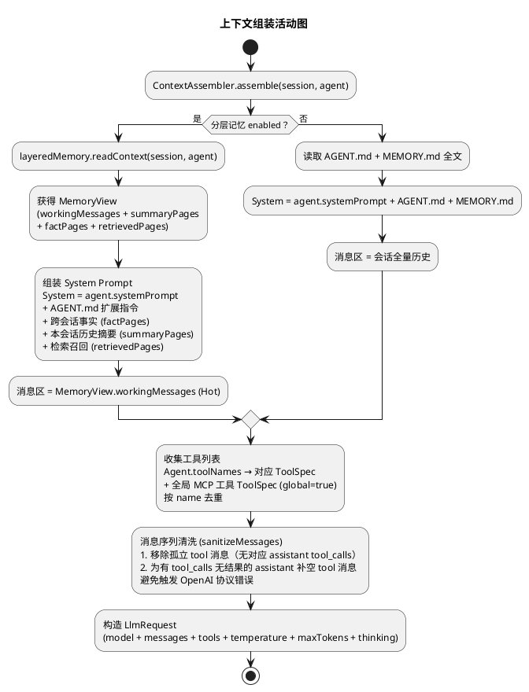
```plantuml
@startuml
title 上下文组装活动图
start
:ContextAssembler.assemble(session, agent);
if (分层记忆 enabled？) then (是)
  :layeredMemory.readContext(session, agent);
  :获得 MemoryView\n(workingMessages + summaryPages\n+ factPages + retrievedPages);
  :组装 System Prompt\nSystem = agent.systemPrompt\n+ AGENT.md 扩展指令\n+ 跨会话事实 (factPages)\n+ 本会话历史摘要 (summaryPages)\n+ 检索召回 (retrievedPages);
  :消息区 = MemoryView.workingMessages (Hot);
else (否)
  :读取 AGENT.md + MEMORY.md 全文;
  :System = agent.systemPrompt + AGENT.md + MEMORY.md;
  :消息区 = 会话全量历史;
endif
:收集工具列表\nAgent.toolNames → 对应 ToolSpec\n+ 全局 MCP 工具 ToolSpec (global=true)\n按 name 去重;
:消息序列清洗 (sanitizeMessages)\n1. 移除孤立 tool 消息（无对应 assistant tool_calls）\n2. 为有 tool_calls 无结果的 assistant 补空 tool 消息\n避免触发 OpenAI 协议错误;
:构造 LlmRequest\n(model + messages + tools + temperature + maxTokens + thinking);
stop
@enduml
```

#### 6.4.2 文字说明

上下文工程域由 [ContextAssembler](file:///Users/mawenbin/workspace/java/mwb_coding/mwb-ai-claw/mwb-ai-claw-domain/src/main/java/com/mwb/ai/claw/domain/context/DefaultContextAssembler.java) 实现，是 ReAct 循环与 LLM/记忆/工具之间的桥梁：

1. **System Prompt 组装**：Agent 人设（`systemPrompt`）→ AGENT.md 扩展指令 → 长期记忆事实 → 历史摘要 → 检索召回，按序拼接。
2. **消息区组装**：分层记忆开启时使用 `MemoryView.workingMessages`（预算内最近 Hot 消息）；未开启时使用会话全量历史。
3. **工具列表组装**：Agent 显式配置的 `toolNames` 对应的 `ToolSpec` + 全局 MCP 工具（`global=true`），按 name 去重。
4. **消息序列清洗**：`sanitizeMessages` 双向兜底——移除孤立的 tool 消息（无对应 assistant tool_calls），为有 tool_calls 但缺结果的 assistant 补充空 tool 消息，确保消息序列符合 OpenAI Chat Completions 协议要求。
5. **模型参数注入**：将 `ModelConfig` 中的 `temperature`、`maxTokens`、`thinking` 注入 `LlmRequest`。

---

### 6.5 工具域

#### 6.5.1 工具执行状态图

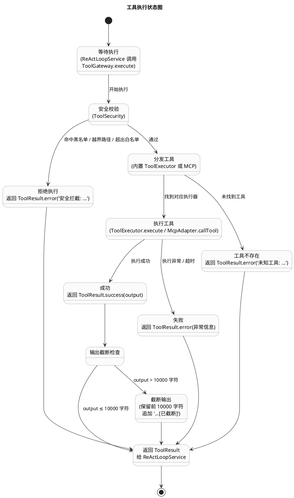
```plantuml
@startuml
title 工具执行状态图
skinparam state {
  BackgroundColor #FBFBFB
  BorderColor #888888
  ArrowColor #333333
}

[*] --> PENDING

state "等待执行\n(ReActLoopService 调用\nToolGateway.execute)" as PENDING

PENDING --> SECURITY_CHECK : 开始执行

state "安全校验\n(ToolSecurity)" as SECURITY_CHECK
SECURITY_CHECK --> REJECTED : 命中黑名单 / 越界路径 / 超出白名单
SECURITY_CHECK --> DISPATCHING : 通过

state "拒绝执行\n返回 ToolResult.error('安全拦截: ...')" as REJECTED
REJECTED --> DONE

state "分发工具\n(内置 ToolExecutor 或 MCP)" as DISPATCHING
DISPATCHING --> EXECUTING : 找到对应执行器
DISPATCHING --> NOT_FOUND : 未找到工具

state "工具不存在\n返回 ToolResult.error('未知工具: ...')" as NOT_FOUND
NOT_FOUND --> DONE

state "执行工具\n(ToolExecutor.execute / McpAdapter.callTool)" as EXECUTING
EXECUTING --> SUCCESS : 执行成功
EXECUTING --> FAILED : 执行异常 / 超时

state "成功\n返回 ToolResult.success(output)" as SUCCESS
SUCCESS --> TRUNCATE_CHECK

state "输出截断检查" as TRUNCATE_CHECK
TRUNCATE_CHECK --> DONE : output ≤ 10000 字符
TRUNCATE_CHECK --> TRUNCATED : output > 10000 字符

state "截断输出\n(保留前 10000 字符\n追加 '...[已截断]')" as TRUNCATED
TRUNCATED --> DONE

state "失败\n返回 ToolResult.error(异常信息)" as FAILED
FAILED --> DONE

state "返回 ToolResult\n给 ReActLoopService" as DONE
DONE --> [*]
@enduml
```

#### 6.5.2 工具调用数据交互图

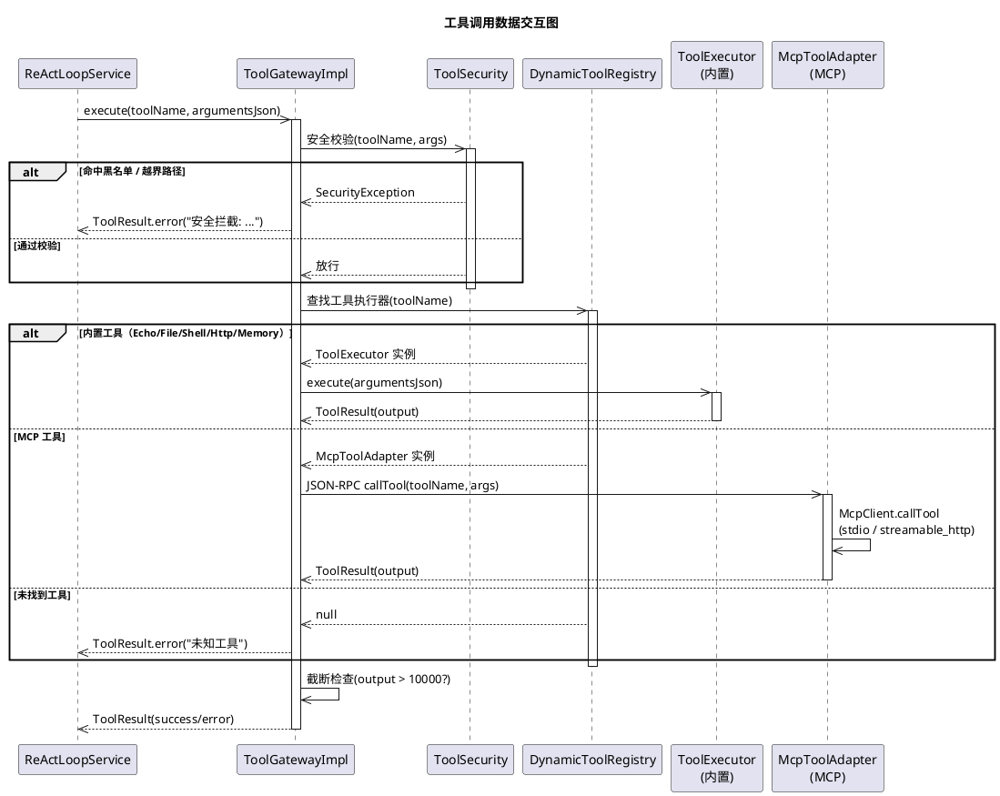
```plantuml
@startuml
title 工具调用数据交互图
participant RACT as "ReActLoopService"
participant TG as "ToolGatewayImpl"
participant SEC as "ToolSecurity"
participant REG as "DynamicToolRegistry"
participant BUILTIN as "ToolExecutor\n(内置)"
participant MCP as "McpToolAdapter\n(MCP)"

RACT->>TG: execute(toolName, argumentsJson)
activate TG

TG->>SEC: 安全校验(toolName, args)
activate SEC
alt 命中黑名单 / 越界路径
    SEC-->>TG: SecurityException
    TG-->>RACT: ToolResult.error("安全拦截: ...")
else 通过校验
    SEC-->>TG: 放行
end
deactivate SEC

TG->>REG: 查找工具执行器(toolName)
activate REG

alt 内置工具（Echo/File/Shell/Http/Memory）
    REG-->>TG: ToolExecutor 实例
    TG->>BUILTIN: execute(argumentsJson)
    activate BUILTIN
    BUILTIN-->>TG: ToolResult(output)
    deactivate BUILTIN
else MCP 工具
    REG-->>TG: McpToolAdapter 实例
    TG->>MCP: JSON-RPC callTool(toolName, args)
    activate MCP
    MCP->>MCP: McpClient.callTool\n(stdio / streamable_http)
    MCP-->>TG: ToolResult(output)
    deactivate MCP
else 未找到工具
    REG-->>TG: null
    TG-->>RACT: ToolResult.error("未知工具")
end
deactivate REG

TG->>TG: 截断检查(output > 10000?)
TG-->>RACT: ToolResult(success/error)
deactivate TG
@enduml
```

#### 6.5.3 文字说明

工具域提供 Agent 执行外部操作的能力，核心是 **SPI 扩展 + 安全沙箱 + MCP 协议**：

**工具 SPI（`ToolExecutor`）**：
- 新增工具只需实现 `ToolExecutor` 接口并注册为 Spring Bean，`ToolGatewayImpl` 通过 `DynamicToolRegistry` 自动收集。
- 内置工具：`echo`（测试）、`file`（文件读写）、`shell`（命令执行）、`shell_status`（后台任务查询/终止）、`http`（网络请求）、`read_memory`/`write_memory`（长期记忆读写）。
- 流式执行：`ToolExecutor` / `ToolGateway` 提供回调版 `execute(argumentsJson, ProgressCallback)`，Shell 命令输出逐行推送（`[Stream]`），供终端实时回显。
- MCP 工具：通过 `McpToolRegistrar` 将 MCP Server 暴露的工具动态注册为全局工具（`global=true`），对所有 Agent 可见。

**安全沙箱（`ToolSecurity`）**：
- Shell 语义：经 `bash -lc`（Windows 为 `cmd /c`）执行，完整支持管道 / 重定向 / 通配符 / `&&` / 环境变量。
- 命令白名单：允许的 Shell 命令，**按命令段逐段校验**（`splitShellSegments` 引号感知切分，防 `ls; rm -rf` / `&&` 拼接绕过）。
- 命令黑名单：21 个危险模式（`rm -rf /`、`sudo`、`mkfs`、fork bomb 等），优先级高于白名单。
- 审批模式：`shell-approval-mode` 三档（`auto` 自动执行 / `ask` 命中规则弹 Y/N 确认（默认）/ `read-only` 拒绝），`shell-approval-patterns` 配置 50+ 高风险规则（`git push`、`rm`、`npm install`、`npm cache`、`find -delete`、`curl -X` 等）；`ToolApproval` 领域接口由 Shell REPL 实现，headless / 无审批器场景安全默认拒绝。
- 长时任务：前台超时**不再强杀**，转为后台任务（`ShellProcessManager`）返回 taskId，`shell_status` 工具（status/output/kill）查询 / 终止；`shell` 支持 `background=true` 参数。
- 路径限制：File/Shell 工具仅允许在配置的 `workspace-dir` 内操作。
- 输出截断：工具输出限制 10000 字符（截断前先脱敏）。
- 敏感信息脱敏：shell 输出与工具入参中的密钥（`sk-` / `api_key=` / `token:` / `password=` / `Bearer` / `AKIA`）经 `maskSecrets` 打码后再进上下文。
- HTTP 限制：可配置 `http-allowed-hosts` 防 SSRF。
- 所有安全违规捕获为 `SecurityException`，返回 `ToolResult.error`，不中断 ReAct 循环。

**MCP 协议栈**：
- `McpClientManager` 管理多个 MCP Server 连接（stdio / streamable_http 传输），启动期自动初始化。
- 运行时管理：`McpClientManager` 支持 `disconnectServer`（关闭连接 + 注销其注册的工具）与 `reconnectServer`，Shell REPL 的 `/mcp` 命令（list / connect / disconnect）可直接查看与启停。
- `McpToolRegistrar` 在启动期从 MCP Server 获取工具列表，注册为全局工具；工具调用时通过 JSON-RPC `callTool` 方法远程执行。

---

### 6.6 会话域

#### 6.6.1 会话生命周期状态图

```plantuml
@startuml
title 会话生命周期状态图
skinparam state {
  BackgroundColor #FBFBFB
  BorderColor #888888
  ArrowColor #333333
}

[*] --> CREATED

state "创建\n(Session 构造\nstatus=ACTIVE\n自动设置标题)" as CREATED

CREATED --> ACTIVE : 构造完成

state "活跃" as ACTIVE {
  [*] --> ADD_USER_MSG
  state "addUserMessage(content)\n自动设置标题(前30字符)" as ADD_USER_MSG
  ADD_USER_MSG --> REACT_EXEC : ReAct 循环执行
  state "ReActLoopService.run" as REACT_EXEC
  REACT_EXEC --> ADD_ASSISTANT : 记录 assistant 消息
  state "addAssistantMessage(content)" as ADD_ASSISTANT
  ADD_ASSISTANT --> ADD_TOOL : 记录 tool 消息(若有)
  state "addToolMessage(toolCallId, result)" as ADD_TOOL
  ADD_TOOL --> REACT_EXEC : 继续推理(若有工具调用)
  ADD_ASSISTANT --> [*] : 无工具调用，本轮完成
  ADD_TOOL --> AFTER_TURN : 记忆换页检查
  state "afterTurn 换页检查" as AFTER_TURN
  AFTER_TURN --> [*] : 继续 / 换页
}

ACTIVE --> CLOSED : session.close()\n(status=CLOSED)

state "关闭\n(不再接收新消息\n触发记忆 afterSession\n归档+事实提炼)" as CLOSED

CLOSED --> DELETED : 显式删除\n(FileBasedSessionGateway.delete)

state "已删除\n(sessions/{id}.json 物理删除)" as DELETED
DELETED --> [*]

ACTIVE --> ACTIVE : 多轮对话\n活跃状态可经历多轮对话\n每轮：addUserMessage → ReAct → afterTurn\n会话文件自动持久化\n跨重启恢复
@enduml
```

#### 6.6.2 文字说明

会话域以 [Session](file:///Users/mawenbin/workspace/java/mwb_coding/mwb-ai-claw/mwb-ai-claw-domain/src/main/java/com/mwb/ai/claw/domain/core/Session.java) 聚合根为核心，管理对话上下文的生命周期：

**状态流转**：
- `CREATED` → `ACTIVE`：Session 构造时 `status=ACTIVE`，标题取第一条用户消息前 30 字符（若标题为空或以 `session-` 开头）。
- `ACTIVE`（多轮对话循环）：`addUserMessage` → ReAct 执行 → `addAssistantMessage`（+ `addToolMessage` 若有工具调用） → `afterTurn`（记忆换页检查）。会话文件自动持久化，跨重启可恢复。
- `ACTIVE` → `CLOSED`：调用 `session.close()` 后 `status=CLOSED`，触发记忆域 `afterSession`（档案归档 + 事实提炼）。
- `CLOSED` → `DELETED`：通过 `FileBasedSessionGateway.delete()` 物理删除会话文件。

**聚合根行为约束**：
- 所有消息操作经 Session 的 `addUserMessage`/`addAssistantMessage`/`addToolMessage`/`close` 方法，每次操作刷新 `updateTime`。
- Session 持有 `messages` 列表，维护完整的对话历史（作为记忆系统的数据源）。

**持久化**：
- 会话 JSON 序列化到 `.agent/sessions/{sessionId}.json`。
- `FileBasedSessionGateway` 负责会话的增删改查，支持跨重启恢复。

---

### 6.7 配置加载域

#### 6.7.1 配置加载流程图

```plantuml
@startuml
title 配置加载流程图
participant JVM as "JVM 启动"
participant ENV as "DotenvPostProcessor"
participant SE as "Spring Environment"
participant YML as "application.yml"
participant ARL as "AgentRegistryLoader"
participant OCL as "OrchestrationConfigLoader"
participant MCL as "McpServerConfigLoader"
participant OR as "OrchestratorRegistry"

JVM->>ENV: environmentPostProcessor
activate ENV
ENV->>ENV: 解析 .env 文件\n(KEY=value, 忽略 # 注释)
ENV->>SE: 注入环境变量\n优先级: 命令行 > 项目.env > 系统环境 > 默认
deactivate ENV

JVM->>YML: 加载配置\n${VAR:default} 占位符解析

JVM->>ARL: 加载 agents.json
activate ARL
ARL->>ARL: 查找: 运行目录同名文件\n> jar classpath 默认模板
ARL->>ARL: ${VAR:default} 占位符解析
ARL-->>JVM: Agent 注册表\n(跨编排共享)
deactivate ARL

JVM->>OCL: 加载 orchestrations.json
activate OCL
OCL->>OCL: 启动校验:\nid 唯一 / type 已注册\n/ agentId 存在
OCL-->>JVM: 编排注册表
deactivate OCL

JVM->>MCL: 加载 mcp-server.json
activate MCL
MCL-->>JVM: MCP Server 列表\n(stdio / streamable_http)
deactivate MCL

JVM->>OR: Spring 容器收集 SPI
activate OR
OR->>OR: 收集 AgentOrchestrator 实现\n收集 ToolExecutor 实现\n收集 PageEvictionPolicy 实现\n收集 MemoryRetriever 实现
OR-->>JVM: SPI 注册完成
deactivate OR

JVM->>JVM: Spring 容器启动完成\n系统就绪
@enduml
```

#### 6.7.2 文字说明

配置加载在 Spring Boot 启动期完成，分为环境变量注入、配置文件加载、注册表构建三个阶段：

**环境变量注入**：
- `DotenvEnvironmentPostProcessor` 在 Spring Environment 后处理阶段解析 `.env` 文件，注入为环境变量。
- 优先级（由高到低）：命令行参数 > 项目 `.env` 文件 > 系统环境变量 > 配置文件默认值。

**配置文件加载**：
- `application.yml`：Spring Boot 标准配置，`${VAR:default}` 占位符解析。
- `agents.json`：Agent 注册表，`AgentRegistryLoader` 加载。查找顺序：运行目录（user.dir）同名文件（命中即用，不再读取内置）> jar classpath 默认模板。支持 `${VAR:default}` 占位符。
- `orchestrations.json`：编排注册表，`OrchestrationConfigLoader` 加载。启动期校验：id 唯一、type 已注册、引用的 agentId 存在。
- `mcp-server.json`：MCP Server 配置，`McpServerConfigLoader` 加载。

**SPI 自动收集**：
- Spring 容器启动完成后，`OrchestratorRegistry` 自动收集所有 `AgentOrchestrator` 实现并按 `type()` 注册。
- `DynamicToolRegistry` 自动收集所有 `ToolExecutor` 实现并注册为工具。
- `PageEvictionPolicy`、`MemoryRetriever` 同理自动收集。

**配置覆盖优先级**（由高到低）：命令行参数 > 项目 `.env` 文件 > 系统环境变量 > 配置文件默认值 > 代码默认值。

### 6.8 技能域（Skill）

#### 6.8.1 技能渐进式披露流程图

```plantuml
@startuml
title 技能渐进式披露流程图
start
:用户消息;
:ReActLoopService;
:ContextAssembler 组装上下文;
note right
  工具规格: 含 use_skill 全局工具
end note
:L1 发现层: system prompt 携带技能清单\nname + description, 约 100 token/技能;
if (LLM 判定技能相关?) then (是)
  :ToolCall: use_skill 技能名;
  :SkillGateway 按名加载;
  :L2: SKILL.md 全文注入 tool 消息\n$SKILL_DIR 替换为绝对路径;
  :继续 ReAct: shell / file 等工具执行指令;
  :L3: 经 $SKILL_DIR 按需读取 resources/;
else (否)
  :常规推理, 技能正文零消耗;
endif
:最终回复;
stop
@enduml
```

#### 6.8.2 文字说明

技能域（Skill）遵循 **Agent Skills 开放标准**（Anthropic 于 2025-10 发布、2025-12 开放为 AgentSkills.io 标准）：将可复用的工作流 / 领域知识打包为 `skills/<name>/SKILL.md`（YAML frontmatter：`name` / `description` + Markdown 指令正文），采用**渐进式披露（Progressive Disclosure）** 三层按需加载：

1. **L1 发现层**：启动时 `SkillLoader` 扫描技能根目录（运行目录 `skills/` > classpath `skills/` 兜底），解析 frontmatter 并启动校验（name / description 缺失、name 与目录不一致、name 重复 → 启动报错）。`SkillRegistryImpl` 维护 `name → Skill` 索引，`DefaultContextAssembler` 将技能清单（name + description，约 100 token/技能）注入 system prompt——LLM 据此判断「何时该用哪个技能」。
2. **L2 指令层**：LLM 判定任务匹配某技能描述时，调用 `use_skill(name)` 工具（全局工具，对齐 MCP，对所有 Agent 可见）按需加载 `SKILL.md` 全文，作为 tool 消息注入上下文继续 ReAct 推理。
3. **L3 资源层**：`SKILL.md` 正文中的 `$SKILL_DIR` 占位符由 `use_skill` 替换为技能目录绝对路径，脚本 / 参考文档 / 模板经既有 file / shell 工具按路径读取执行。

**与现有能力的关系**：工具（ToolExecutor / MCP）解决「能做什么」（always-on），技能解决「该怎么做」（on-demand）；技能只是指令注入，执行仍走工具沙箱（shell 白名单 / 路径限制 / 超时 / 截断），无特权提升；与编排（routing / conversational / delegate）正交——任意编排内 Agent 均可用技能，与记忆可叠加（技能可引导读写记忆）。

**配置**：`agent.skills-enabled`（总开关，默认 true，关闭后不加载技能、不注册 use_skill）、`agent.skills-dir`（技能根目录，默认 `${user.dir}/skills`）。内置 12 个技能位于 `start/src/main/resources/skills/` 作为 classpath 模板兜底：`code-review`（代码审查）、`project-structure-analysis`（项目结构分析）、`unit-test-writing`（单元测试编写）、`git-workflow`（Git 提交流程）、`ddd-modeling`（DDD 领域建模）、`tech-design-doc`（技术方案编写）、`web-research`（联网调研，配合 tavily MCP）、`database-design`（数据库设计）、`doc-writing-guide`（文档写作规范）、`markdown-diagramming`（mermaid 图表规范）、`doc-review`（文档审查与一致性）、`example-skill`（周报生成示例）。

**新增技能（零代码）**：在技能根目录放 `skills/<name>/SKILL.md`（frontmatter + 指令正文），重启应用即加载生效；技能目录内可含 `resources/` 子目录存放脚本 / 参考文档。
