# mwb-ai-claw 技术方案

> 本文档为 mwb-ai-claw 项目的完整技术方案，涵盖项目背景、目标、概要设计、整体架构设计（整洁架构 + DDD + 六边形架构融合）、数据模型设计（UML 类图）以及各核心领域的详细流程设计（状态图、数据交互图、文字说明）。所有图形均采用 Mermaid 描述，可在支持 Mermaid 的编辑器（GitHub / Typora / VS Code 等）中直接渲染。

---

## 1. 项目背景

随着大语言模型（LLM）的成熟，AI Agent（智能体）从「聊天问答」进化为「能真正动手干活」的自主助手已成为趋势。然而，市面上多数 Agent 框架存在以下痛点：

- **过度依赖云端**：用户数据、会话历史、长期记忆全部上传到远端服务器，隐私无法保障。
- **工具扩展困难**：每接入一个新工具都要侵入式修改核心代码，缺乏标准协议。
- **上下文窗口受限**：长对话很快超出 LLM 上下文窗口，导致「失忆」。
- **单 Agent 独木难支**：复杂任务需要多个专家 Agent 协作，但编排能力弱或耦合死。
- **技术栈偏 Python**：Java 生态缺乏一个结构清晰、可扩展、本地优先的 Agent 框架。

mwb-ai-claw 正是在此背景下诞生的 **Java 版智能体 Agent 框架**，灵感来自 OpenClaw，旨在提供一个本地优先、多 Agent 协作、开箱即用的个人 AI 助手框架，并以 DDD + 整洁架构 + 六边形架构为骨架，确保高度可扩展性。

---

## 2. 项目目标

| 维度 | 目标 | 关键能力 |
| ---- | ---- | -------- |
| **本地优先** | 数据本地化，隐私可控 | 会话/记忆落盘 `.agent/` 目录，密钥经 `.env` 注入 |
| **多渠道接入** | 同一 Agent 多入口 | REST API、SSE 流式、WebSocket、Shell REPL、前端控制台 |
| **ReAct 推理** | 思考→行动→观察迭代 | `ReActLoopService` 驱动 LLM 自主决策工具调用 |
| **工具生态** | 标准化工具接入 | 内置工具（file/shell/http/memory）+ MCP 协议（stdio/HTTP）+ SPI 扩展 |
| **分层记忆** | 突破上下文窗口 | 五层记忆（指令→Hot→Summary→Fact→Archive）+ Token 预算 + 检索召回 |
| **多 Agent 编排** | 专家协作 | 编排 SPI（routing/pipeline/conversational）+ 配置与编排分离 + 意图驱动选择 |
| **多模型适配** | 兼容主流 LLM | OpenAI 兼容 API（DeepSeek/通义千问等）+ 流式 SSE 解析 + 独立模型配置 |
| **架构质量** | 高可扩展、可测试 | 整洁架构 + DDD 分层 + 六边形端口适配器 + 依赖倒置 |

---

## 3. 概要设计

### 3.1 技术选型

| 维度 | 选型 | 说明 |
| ---- | ---- | ---- |
| 语言 / 框架 | Java 8 + Spring Boot 2.7.2 | COLA 5.0 架构骨架 |
| 构建 | Maven 多模块 | parent + 6 子模块 |
| LLM 调用 | OkHttp + OpenAI 兼容 API | 统一 Chat Completions，流式 SSE |
| 流式输出 | SseEmitter + TextWebSocketHandler | Token 级实时推送 |
| 工具协议 | MCP（Model Context Protocol） | stdio / streamable_http |
| Shell 终端 | JLine 3.20 | ANSI 着色、命令历史 |
| 持久化 | 本地文件（`.agent/` 目录） | 会话 JSON + 记忆文件 |
| 前端 | 原生 HTML/CSS/JS | 零依赖测试控制台 |

### 3.2 模块全景

```
mwb-ai-claw-parent (pom)
├── mwb-ai-claw-client          # 客户端 SDK：AgentServiceI 接口、ChatCmd、DTO
├── mwb-ai-claw-adapter         # 适配层：REST/SSE Controller、WebSocket、Shell REPL
├── mwb-ai-claw-app             # 应用层：AgentServiceImpl + 命令执行器
├── mwb-ai-claw-domain          # 领域层：聚合根、领域服务、Gateway 端口接口
├── mwb-ai-claw-infrastructure  # 基础设施层：Gateway 适配器实现、工具、MCP、记忆
└── start                       # 启动模块：Application、配置文件模板
```

### 3.3 领域子域划分

| 子域 | 职责 | 核心类型 |
| ---- | ---- | -------- |
| **core 核心域** | Agent/Session/Message 聚合、ReAct 引擎、路由 | `Session`、`Agent`、`Message`、`ReActLoopService`、`ModelConfig`、`ReActResult` |
| **collaboration 编排域** | 多 Agent 协作编排（SPI 插件化） | `OrchestrationDefinition`、`AgentOrchestrator`、`OrchestrationSelector`、`ExecutionUnit`、`CollaborationResult` |
| **context 上下文工程域** | 上下文统一组装与消息清洗 | `ContextAssembler` |
| **llm LLM 域** | 大模型调用抽象（端口） | `LlmGateway`、`EmbeddingGateway`、`LlmRequest/Response`、`LlmStreamCallback` |
| **tool 工具域** | 工具执行抽象与安全 | `ToolGateway`、`ToolExecutor`、`ToolSpec`、`ToolResult` |
| **skill 技能域** | 技能（SKILL.md）发现与按需加载（渐进式披露） | `Skill`、`SkillGateway`、`UseSkillTool` |
| **memory 记忆域** | 分层记忆与检索 | `LayeredMemoryGateway`、`MemoryPage`、`PageEvictionPolicy`、`MemoryRetriever` |

---

## 4. 整体架构设计

本项目的架构融合了 **整洁架构（Clean Architecture）**、**领域驱动设计（DDD）** 和 **六边形架构（Hexagonal Architecture）** 三者的核心理念：

- **整洁架构**的「依赖规则」：外层依赖内层，内层不感知外层——domain 是最内层核心，不依赖任何技术框架。
- **DDD** 的「领域分层 + 聚合根」：将业务拆分为多个限界上下文（子域），核心域持有聚合根（Session），编排域、记忆域等各自自治。
- **六边形架构**的「端口与适配器」：domain 层定义 Gateway 接口（端口），infrastructure 层提供实现（适配器），adapter 层作为输入适配器（REST/WS/Shell），三者通过端口解耦。

### 4.1 架构同心圆（整洁架构 + 六边形端口适配器）

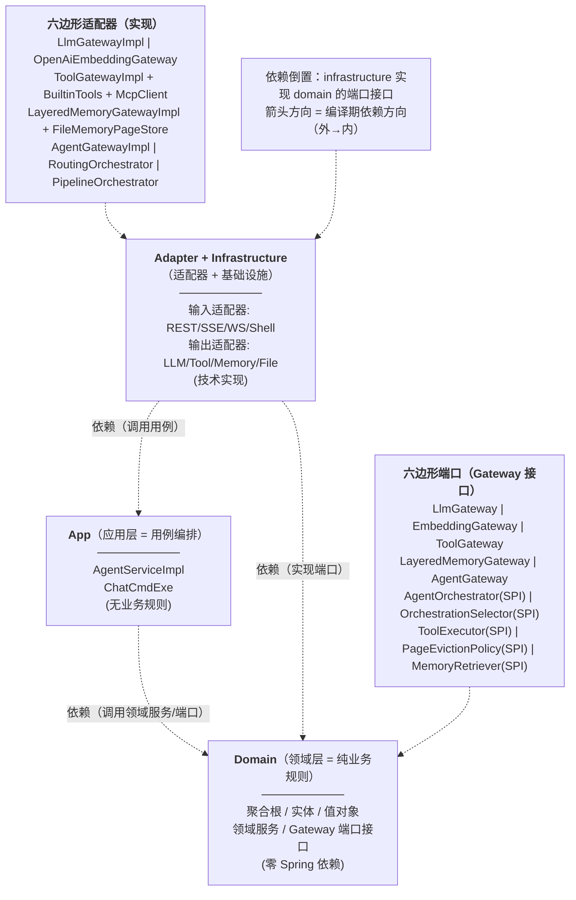
```mermaid
flowchart TD
    %% 整洁架构同心圆：外层依赖内层
    DOMAIN["<b>Domain</b>（领域层 = 纯业务规则）<br/>──────────<br/>聚合根 / 实体 / 值对象<br/>领域服务 / Gateway 端口接口<br/>(零 Spring 依赖)"]
    APP["<b>App</b>（应用层 = 用例编排）<br/>──────────<br/>AgentServiceImpl<br/>ChatCmdExe<br/>(无业务规则)"]
    OUTER["<b>Adapter + Infrastructure</b>（适配器 + 基础设施）<br/>──────────<br/>输入适配器: REST/SSE/WS/Shell<br/>输出适配器: LLM/Tool/Memory/File<br/>(技术实现)"]

    %% 六边形端口：Gateway 接口
    PORTNOTE["<b>六边形端口（Gateway 接口）</b><br/>LlmGateway | EmbeddingGateway | ToolGateway<br/>LayeredMemoryGateway | AgentGateway<br/>AgentOrchestrator(SPI) | OrchestrationSelector(SPI)<br/>ToolExecutor(SPI) | PageEvictionPolicy(SPI) | MemoryRetriever(SPI)"]
    %% 六边形适配器（实现）
    ADAPTERNOTE["<b>六边形适配器（实现）</b><br/>LlmGatewayImpl | OpenAiEmbeddingGateway<br/>ToolGatewayImpl + BuiltinTools + McpClient<br/>LayeredMemoryGatewayImpl + FileMemoryPageStore<br/>AgentGatewayImpl | RoutingOrchestrator | PipelineOrchestrator"]
    %% 依赖倒置箭头
    DIPNOTE["依赖倒置：infrastructure 实现 domain 的端口接口<br/>箭头方向 = 编译期依赖方向（外→内）"]

    %% 依赖方向：外→内
    OUTER -.->|依赖（调用用例）| APP
    APP -.->|依赖（调用领域服务/端口）| DOMAIN
    OUTER -.->|依赖（实现端口）| DOMAIN

    PORTNOTE -.-> DOMAIN
    ADAPTERNOTE -.-> OUTER
    DIPNOTE -.-> OUTER
```

### 4.2 分层架构与模块依赖

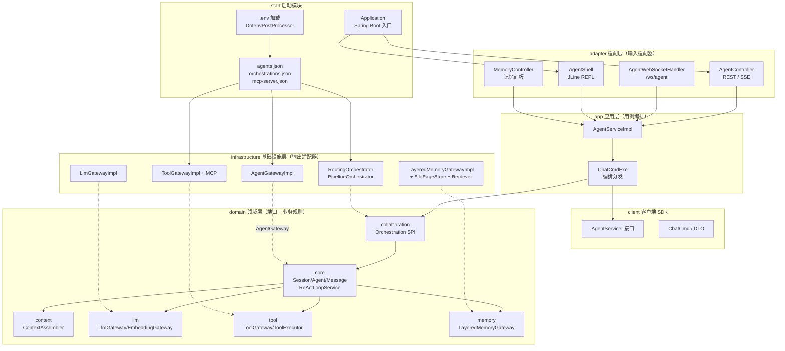
```mermaid
flowchart TD
    subgraph START_MOD["start 启动模块"]
        START["Application<br/>Spring Boot 入口"]
        ENV[".env 加载<br/>DotenvPostProcessor"]
        CONFIG["agents.json<br/>orchestrations.json<br/>mcp-server.json"]
    end
    subgraph ADAPTER_MOD["adapter 适配层（输入适配器）"]
        CTRL["AgentController<br/>REST / SSE"]
        WS["AgentWebSocketHandler<br/>/ws/agent"]
        SHELL["AgentShell<br/>JLine REPL"]
        MEMCTRL["MemoryController<br/>记忆面板"]
    end
    subgraph APP_MOD["app 应用层（用例编排）"]
        SVC["AgentServiceImpl"]
        EXE["ChatCmdExe<br/>编排分发"]
    end
    subgraph CLIENT_MOD["client 客户端 SDK"]
        API["AgentServiceI 接口"]
        DTO["ChatCmd / DTO"]
    end
    subgraph DOMAIN_MOD["domain 领域层（端口 + 业务规则）"]
        CORE["core<br/>Session/Agent/Message<br/>ReActLoopService"]
        COLLAB["collaboration<br/>Orchestration SPI"]
        CTX["context<br/>ContextAssembler"]
        LLM_PORT["llm<br/>LlmGateway/EmbeddingGateway"]
        TOOL_PORT["tool<br/>ToolGateway/ToolExecutor"]
        MEM_PORT["memory<br/>LayeredMemoryGateway"]
    end
    subgraph INFRA_MOD["infrastructure 基础设施层（输出适配器）"]
        ILLM["LlmGatewayImpl"]
        ITOOL["ToolGatewayImpl + MCP"]
        IMEM["LayeredMemoryGatewayImpl<br/>+ FilePageStore + Retriever"]
        ICORE["AgentGatewayImpl"]
        ICOLLAB["RoutingOrchestrator<br/>PipelineOrchestrator"]
    end

    %% 输入适配器 → 应用层
    CTRL --> SVC
    WS --> SVC
    SHELL --> SVC
    MEMCTRL --> SVC

    %% 应用层 → 领域端口
    SVC --> EXE
    EXE --> COLLAB
    EXE --> API

    %% 领域内部
    COLLAB --> CORE
    CORE --> CTX
    CORE --> LLM_PORT
    CORE --> TOOL_PORT
    CORE --> MEM_PORT

    %% 输出适配器实现端口（依赖倒置：infrastructure → domain）
    ILLM -.-> LLM_PORT
    ITOOL -.-> TOOL_PORT
    IMEM -.-> MEM_PORT
    ICORE -.->|AgentGateway| CORE
    ICOLLAB -.-> COLLAB

    %% 启动配置
    START --> CTRL
    START --> SHELL
    ENV --> CONFIG
    CONFIG --> ICORE
    CONFIG --> ICOLLAB
    CONFIG --> ITOOL
```

### 4.3 六边形端口-适配器映射

六边形架构的核心是：**领域层定义端口（接口），基础设施层提供适配器（实现），适配器层作为外部世界与领域交互的入口**。

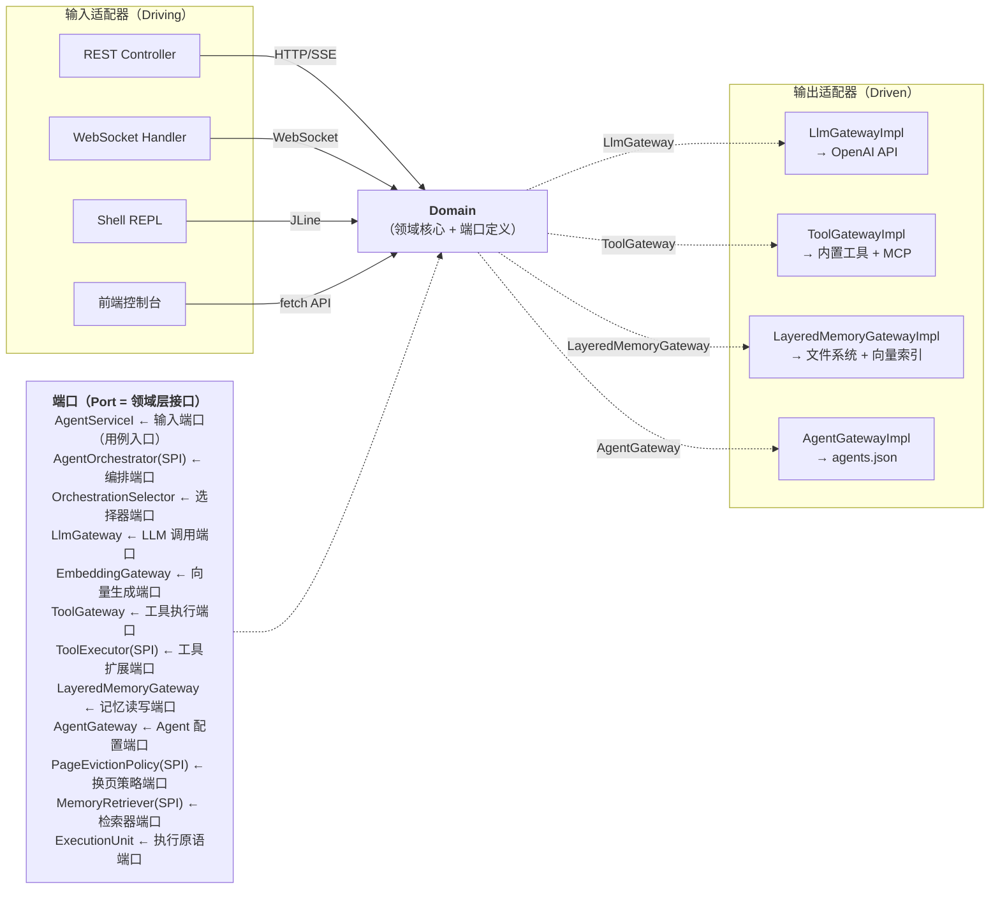
```mermaid
flowchart LR
    %% 六边形主体：领域层
    DOMAIN["<b>Domain</b><br/>（领域核心 + 端口定义）"]

    %% 左侧：输入适配器（Driving Adapters）
    subgraph IN_MOD["输入适配器（Driving）"]
        REST["REST Controller"]
        WSH["WebSocket Handler"]
        REPL["Shell REPL"]
        FE["前端控制台"]
    end

    %% 右侧：输出适配器（Driven Adapters）
    subgraph OUT_MOD["输出适配器（Driven）"]
        LLM_IMPL["LlmGatewayImpl<br/>→ OpenAI API"]
        TOOL_IMPL["ToolGatewayImpl<br/>→ 内置工具 + MCP"]
        MEM_IMPL["LayeredMemoryGatewayImpl<br/>→ 文件系统 + 向量索引"]
        AGENT_IMPL["AgentGatewayImpl<br/>→ agents.json"]
    end

    %% 端口接口（在领域层定义，适配器实现）
    PORTS["<b>端口（Port = 领域层接口）</b><br/>AgentServiceI ← 输入端口（用例入口）<br/>AgentOrchestrator(SPI) ← 编排端口<br/>OrchestrationSelector ← 选择器端口<br/>LlmGateway ← LLM 调用端口<br/>EmbeddingGateway ← 向量生成端口<br/>ToolGateway ← 工具执行端口<br/>ToolExecutor(SPI) ← 工具扩展端口<br/>LayeredMemoryGateway ← 记忆读写端口<br/>AgentGateway ← Agent 配置端口<br/>PageEvictionPolicy(SPI) ← 换页策略端口<br/>MemoryRetriever(SPI) ← 检索器端口<br/>ExecutionUnit ← 执行原语端口"]

    %% 输入适配器 → 领域
    REST -->|HTTP/SSE| DOMAIN
    WSH -->|WebSocket| DOMAIN
    REPL -->|JLine| DOMAIN
    FE -->|fetch API| DOMAIN

    %% 领域 → 输出适配器（通过端口，依赖倒置）
    DOMAIN -.->|LlmGateway| LLM_IMPL
    DOMAIN -.->|ToolGateway| TOOL_IMPL
    DOMAIN -.->|LayeredMemoryGateway| MEM_IMPL
    DOMAIN -.->|AgentGateway| AGENT_IMPL

    PORTS -.-> DOMAIN
```

### 4.4 架构设计原则

| 原则 | 体现 |
| ---- | ---- |
| **依赖规则（整洁架构）** | 依赖方向严格外→内：adapter/infrastructure → app → client + domain；domain 零 Spring 依赖，可独立测试 |
| **依赖倒置（DIP）** | domain 定义 Gateway 接口（端口），infrastructure 实现（适配器），编译期 domain 不依赖 infrastructure |
| **聚合根（DDD）** | `Session` 是核心域聚合根，所有消息操作经 Session 的 `addUserMessage`/`addAssistantMessage`/`addToolMessage` 方法 |
| **限界上下文（DDD）** | 6 个子域各自自治：core（会话+推理）、collaboration（编排）、memory（记忆）、llm（模型）、tool（工具）、context（上下文） |
| **端口适配器（六边形）** | 输入适配器（REST/WS/Shell）→ 用例端口（AgentServiceI）→ 领域 → 输出适配器（LLM/Tool/Memory Gateway 实现） |
| **SPI 可插拔** | `AgentOrchestrator`、`ToolExecutor`、`OrchestrationSelector`、`PageEvictionPolicy`、`MemoryRetriever` 均为 SPI 接口，Spring 自动收集注册 |
| **配置分离** | Agent 注册表（agents.json）与编排注册表（orchestrations.json）解耦，编排选择器与编排插件分离 |

---

## 5. 数据模型设计

### 5.1 领域模型全景图


```mermaid
classDiagram
    %% ===== 核心域 =====
    namespace core核心域 {
        %% Session <<AggregateRoot>>
        class Session {
            -String sessionId
            -String agentId
            -String title
            -SessionStatus status
            -long createTime
            -long updateTime
            -List~Message~ messages
            +addUserMessage(content)
            +addAssistantMessage(content, toolCalls)
            +addToolMessage(toolCallId, content)
            +close()
        }
        %% Agent <<Entity>>
        class Agent {
            -String agentId
            -String name
            -String systemPrompt
            -String agentInstructions
            -String description
            -List~String~ keywords
            -ModelConfig modelConfig
            -List~String~ toolNames
            -int maxSteps = 8
        }
        %% Message <<Entity>>
        class Message {
            -String role
            -String content
            -List~ToolCall~ toolCalls
            -String toolCallId
            -long timestamp
            +of(role, content)
            +assistant(content, toolCalls)
            +tool(toolCallId, content)
        }
        %% ModelConfig <<ValueObject>>
        class ModelConfig {
            -String model
            -String baseUrl
            -String apiKey
            -double temperature = 0.7
            -int maxTokens = 2048
            -Boolean thinking
        }
        %% ReActResult <<ValueObject>>
        class ReActResult {
            -String reply
            -List~String~ traceSteps
            -boolean maxStepsReached
        }
        %% SessionStatus <<enumeration>>
        class SessionStatus {
            ACTIVE
            CLOSED
        }
        %% MessageRole <<enumeration>>
        class MessageRole {
            SYSTEM
            USER
            ASSISTANT
            TOOL
        }
        %% ReActLoopService <<DomainService>>
        class ReActLoopService {
            +run(session, agent, callback) ReActResult
            +streamRun(session, agent, callback, streamCallback) ReActResult
        }
        %% AgentGateway <<Port>>
        class AgentGateway {
            +getAgent(agentId) Agent
            +listAgents() List~Agent~
        }
        %% ProgressCallback <<Port>>
        class ProgressCallback {
            +onProgress(step)
        }
    }
    %% ===== 编排协作域 =====
    namespace collaboration编排域 {
        %% OrchestrationDefinition <<ValueObject>>
        class OrchestrationDefinition {
            -String id
            -String type
            -String description
            -List~String~ keywords
            -Map~String, Object~ config
            -List~String~ agents
        }
        %% OrchestrationContext <<ValueObject>>
        class OrchestrationContext {
            -String message
            -String sessionId
            -String explicitAgentId
            -String explicitOrchestrationId
            -OrchestrationDefinition definition
            -AgentGateway agentGateway
            -ExecutionUnit executionUnit
            -ProgressCallback callback
            -LlmStreamCallback streamCallback
        }
        %% CollaborationResult <<ValueObject>>
        class CollaborationResult {
            -String reply
            -String agentId
            -String sessionId
            -String orchestrationId
            -List~String~ traceSteps
        }
        %% AgentOrchestrator <<interface>>
        class AgentOrchestrator {
            +type() String
            +validate(definition)
            +orchestrate(context) CollaborationResult
        }
        %% OrchestrationSelector <<interface>>
        class OrchestrationSelector {
            +select(message, definitions) String
        }
        %% ExecutionUnit <<Port>>
        class ExecutionUnit {
            +getOrCreateSession(sessionId, agent) Session
            +saveSession(session)
            +runSession(session, agent, callback, streamCallback) ReActResult
            +runAgent(prompt, agent, callback) String
            +writeArtifact(workdir, stageId, content) Path
        }
    }
    %% ===== LLM 域 =====
    namespace llmLLM域 {
        %% LlmGateway <<interface>>
        class LlmGateway {
            +chat(request, modelConfig) LlmResponse
            +streamChat(request, modelConfig, callback) LlmResponse
        }
        %% EmbeddingGateway <<interface>>
        class EmbeddingGateway {
            +embed(text) float[]
        }
        %% LlmRequest <<ValueObject>>
        class LlmRequest {
            -String model
            -List~LlmMessage~ messages
            -List~ToolSpec~ tools
            -double temperature
            -int maxTokens
            -Boolean thinking
        }
        %% LlmResponse <<ValueObject>>
        class LlmResponse {
            -String content
            -List~ToolCall~ toolCalls
            -String finishReason
        }
        %% LlmMessage <<ValueObject>>
        class LlmMessage {
            -String role
            -String content
            -List~ToolCall~ toolCalls
            -String toolCallId
        }
        %% ToolCall <<ValueObject>>
        class ToolCall {
            -String id
            -String name
            -String arguments
        }
        %% LlmStreamCallback <<interface>>
        class LlmStreamCallback {
            +onToken(token)
            +onToolName(toolName)
            +onToolArguments(argDelta)
            +onComplete(response)
            +onError(error)
        }
    }
    %% ===== 工具域 =====
    namespace tool工具域 {
        %% ToolGateway <<interface>>
        class ToolGateway {
            +execute(toolName, argumentsJson) ToolResult
            +listTools() List~ToolSpec~
            +getToolSpec(toolName) ToolSpec
        }
        %% ToolExecutor <<interface>>
        class ToolExecutor {
            +getName() String
            +getSpec() ToolSpec
            +execute(argumentsJson) ToolResult
        }
        %% ToolSpec <<ValueObject>>
        class ToolSpec {
            -String name
            -String description
            -String parametersJson
            -boolean global = false
        }
        %% ToolResult <<ValueObject>>
        class ToolResult {
            -boolean success
            -String output
            -String error
            +success(output)
            +error(error)
        }
    }
    %% ===== 记忆域 =====
    namespace memory记忆域 {
        %% LayeredMemoryGateway <<interface>>
        class LayeredMemoryGateway {
            +isEnabled() boolean
            +readContext(session, agent) MemoryView
            +afterTurn(session, agent)
            +afterSession(session, agent)
            +saveFact(topic, content, importance)
            +readFactsText() String
            +search(query, topK) List~MemoryPage~
        }
        %% MemoryPage <<ValueObject>>
        class MemoryPage {
            -String pageId
            -PageType type
            -String content
            -String key
            -double importance
            -int tokenCount
            -String sessionId
            -int blockStart
            -int blockEnd
            -long createTime
            -int version
            +summary(...)
            +fact(...)
            +archive(...)
        }
        %% MemoryView <<ValueObject>>
        class MemoryView {
            -List~Message~ workingMessages
            -List~MemoryPage~ summaryPages
            -List~MemoryPage~ factPages
            -List~MemoryPage~ retrievedPages
        }
        %% LayeredMemoryConfig <<Config>>
        class LayeredMemoryConfig {
            -boolean enabled
            -int contextWindowTokens
            -double contextBudgetRatio
            -double promptBudgetRatio
            -double toolBudgetRatio
            -int hotWindowSize
            -int summaryBlockSize
            -double importanceThreshold
            -int topK
            -String evictionPolicy
            -String retriever
            -boolean vectorEnabled
            -boolean archiveEnabled
            -boolean sharedRetrieve
            -String synthesizerModel
            -int synthesisCacheSize
        }
        %% PageEvictionPolicy <<interface>>
        class PageEvictionPolicy {
            +shouldEvict(context) boolean
        }
        %% MemoryRetriever <<interface>>
        class MemoryRetriever {
            +search(query, topK) List~MemoryPage~
        }
        %% PageType <<enumeration>>
        class PageType {
            HOT
            SUMMARY
            FACT
            RETRIEVED
            ARCHIVE
        }
    }
    %% ===== 关系 =====
    Session *-- "1..*" Message
    Session --> SessionStatus
    Agent *-- "1" ModelConfig
    Message --> "0..*" ToolCall
    ReActLoopService ..> Session
    ReActLoopService ..> Agent
    ReActLoopService ..> ReActResult
    AgentGateway ..> Agent
    OrchestrationContext --> OrchestrationDefinition
    OrchestrationContext --> ExecutionUnit
    AgentOrchestrator ..> OrchestrationContext
    AgentOrchestrator --> CollaborationResult
    LlmRequest *-- "1..*" LlmMessage
    LlmRequest --> "0..*" ToolSpec
    LlmResponse --> "0..*" ToolCall
    LlmMessage --> "0..*" ToolCall
    LlmGateway ..> LlmRequest
    LlmGateway ..> LlmResponse
    ToolGateway ..> ToolResult
    ToolGateway ..> ToolSpec
    ToolExecutor ..> ToolResult
    ToolExecutor ..> ToolSpec
    LayeredMemoryGateway *-- MemoryView
    MemoryView --> "0..*" MemoryPage
    MemoryPage --> PageType
    LayeredMemoryGateway ..> MemoryPage
    PageEvictionPolicy ..> MemoryPage
    MemoryRetriever ..> MemoryPage
    LayeredMemoryGateway ..> LayeredMemoryConfig
    LlmRequest ..> ToolSpec
    LlmResponse ..> ToolCall
    Message ..> ToolCall
```

### 5.2 核心域数据模型

核心域是整个系统的业务核心，包含 Session 聚合根、Agent 实体、Message 实体及 ReAct 推理引擎。

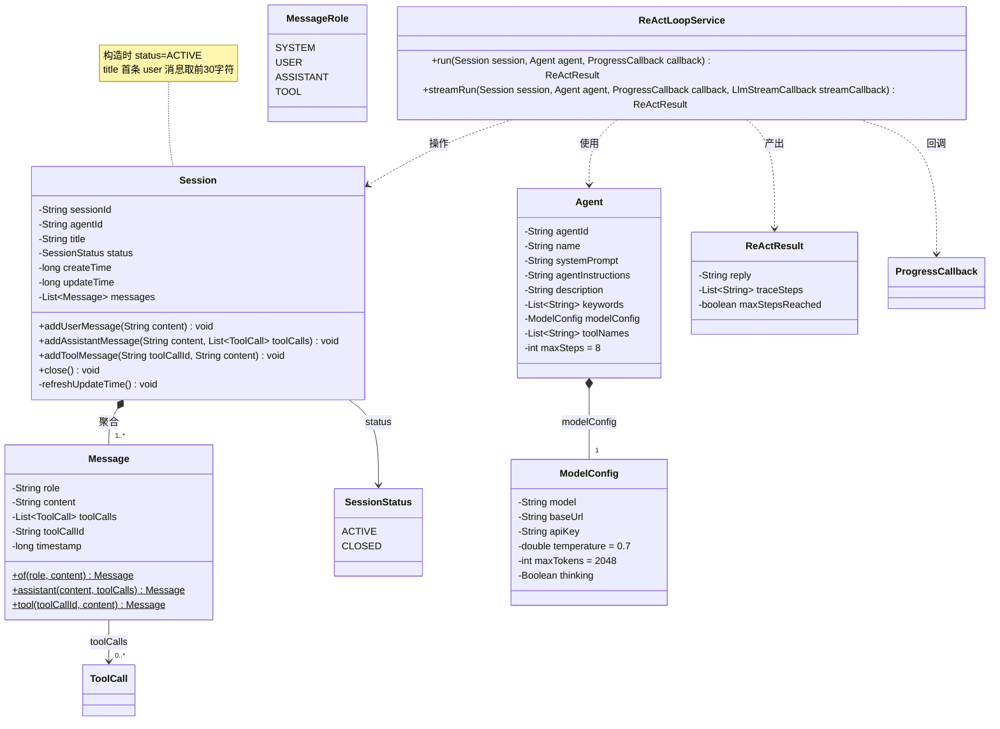
```mermaid
classDiagram
    %% Session <<AggregateRoot>>
    class Session {
        -String sessionId
        -String agentId
        -String title
        -SessionStatus status
        -long createTime
        -long updateTime
        -List~Message~ messages
        +addUserMessage(String content) void
        +addAssistantMessage(String content, List~ToolCall~ toolCalls) void
        +addToolMessage(String toolCallId, String content) void
        +close() void
        -refreshUpdateTime() void
    }
    note for Session "构造时 status=ACTIVE<br/>title 首条 user 消息取前30字符"
    %% Message <<Entity>>
    class Message {
        -String role
        -String content
        -List~ToolCall~ toolCalls
        -String toolCallId
        -long timestamp
        +of(role, content)$ Message
        +assistant(content, toolCalls)$ Message
        +tool(toolCallId, content)$ Message
    }
    %% Agent <<Entity>>
    class Agent {
        -String agentId
        -String name
        -String systemPrompt
        -String agentInstructions
        -String description
        -List~String~ keywords
        -ModelConfig modelConfig
        -List~String~ toolNames
        -int maxSteps = 8
    }
    %% ModelConfig <<ValueObject>>
    class ModelConfig {
        -String model
        -String baseUrl
        -String apiKey
        -double temperature = 0.7
        -int maxTokens = 2048
        -Boolean thinking
    }
    %% ReActResult <<ValueObject>>
    class ReActResult {
        -String reply
        -List~String~ traceSteps
        -boolean maxStepsReached
    }
    %% ReActLoopService <<DomainService>>
    class ReActLoopService {
        +run(Session session, Agent agent, ProgressCallback callback) ReActResult
        +streamRun(Session session, Agent agent, ProgressCallback callback, LlmStreamCallback streamCallback) ReActResult
    }
    %% SessionStatus <<enumeration>>
    class SessionStatus {
        ACTIVE
        CLOSED
    }
    %% MessageRole <<enumeration>>
    class MessageRole {
        SYSTEM
        USER
        ASSISTANT
        TOOL
    }
    Session *-- "1..*" Message : 聚合
    Session --> SessionStatus : status
    Message --> "0..*" ToolCall : toolCalls
    Agent *-- "1" ModelConfig : modelConfig
    ReActLoopService ..> Session : 操作
    ReActLoopService ..> Agent : 使用
    ReActLoopService ..> ReActResult : 产出
    ReActLoopService ..> ProgressCallback : 回调
```

### 5.3 编排协作域数据模型

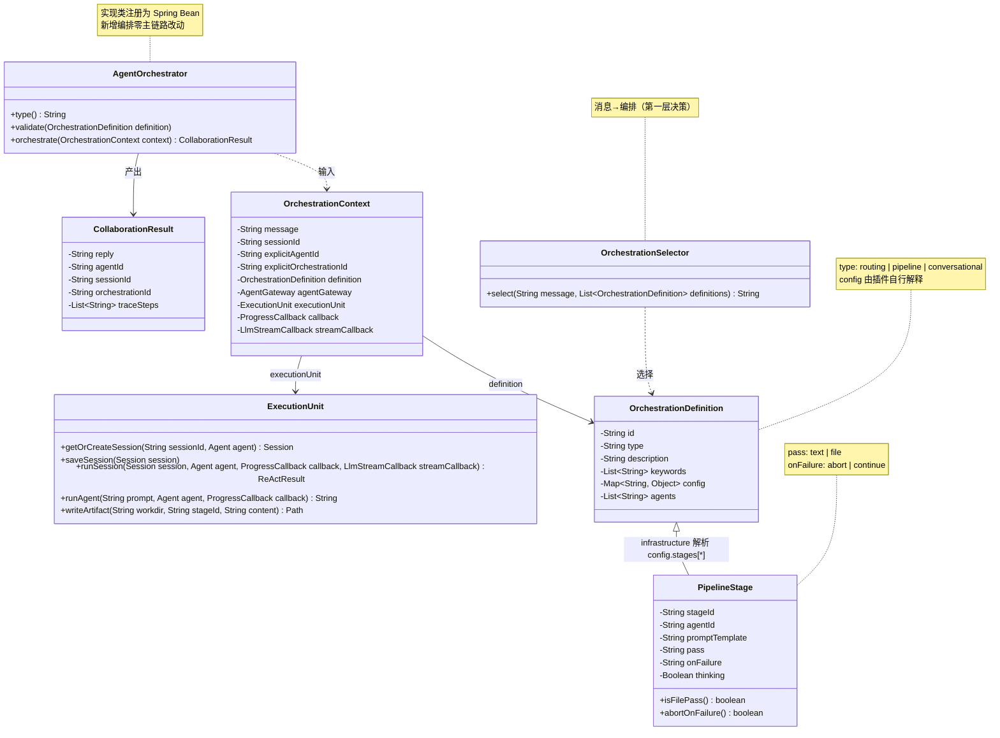
```mermaid
classDiagram
    %% OrchestrationDefinition <<ValueObject>>
    class OrchestrationDefinition {
        -String id
        -String type
        -String description
        -List~String~ keywords
        -Map~String, Object~ config
        -List~String~ agents
    }
    note for OrchestrationDefinition "type: routing | pipeline | conversational<br/>config 由插件自行解释"
    %% OrchestrationContext <<ValueObject>>
    class OrchestrationContext {
        -String message
        -String sessionId
        -String explicitAgentId
        -String explicitOrchestrationId
        -OrchestrationDefinition definition
        -AgentGateway agentGateway
        -ExecutionUnit executionUnit
        -ProgressCallback callback
        -LlmStreamCallback streamCallback
    }
    %% CollaborationResult <<ValueObject>>
    class CollaborationResult {
        -String reply
        -String agentId
        -String sessionId
        -String orchestrationId
        -List~String~ traceSteps
    }
    %% AgentOrchestrator <<interface>>
    class AgentOrchestrator {
        +type() String
        +validate(OrchestrationDefinition definition)
        +orchestrate(OrchestrationContext context) CollaborationResult
    }
    note for AgentOrchestrator "实现类注册为 Spring Bean<br/>新增编排零主链路改动"
    %% OrchestrationSelector <<interface>>
    class OrchestrationSelector {
        +select(String message, List~OrchestrationDefinition~ definitions) String
    }
    note for OrchestrationSelector "消息→编排（第一层决策）"
    %% ExecutionUnit <<Port>>
    class ExecutionUnit {
        +getOrCreateSession(String sessionId, Agent agent) Session
        +saveSession(Session session)
        +runSession(Session session, Agent agent, ProgressCallback callback, LlmStreamCallback streamCallback) ReActResult
        +runAgent(String prompt, Agent agent, ProgressCallback callback) String
        +writeArtifact(String workdir, String stageId, String content) Path
    }
    %% PipelineStage <<Infrastructure>>
    class PipelineStage {
        -String stageId
        -String agentId
        -String promptTemplate
        -String pass
        -String onFailure
        -Boolean thinking
        +isFilePass() boolean
        +abortOnFailure() boolean
    }
    note for PipelineStage "pass: text | file<br/>onFailure: abort | continue"
    OrchestrationContext --> OrchestrationDefinition : definition
    OrchestrationContext --> ExecutionUnit : executionUnit
    AgentOrchestrator ..> OrchestrationContext : 输入
    AgentOrchestrator --> CollaborationResult : 产出
    OrchestrationSelector ..> OrchestrationDefinition : 选择
    OrchestrationDefinition <|-- PipelineStage : infrastructure 解析 config.stages[*]
```

### 5.4 记忆域数据模型

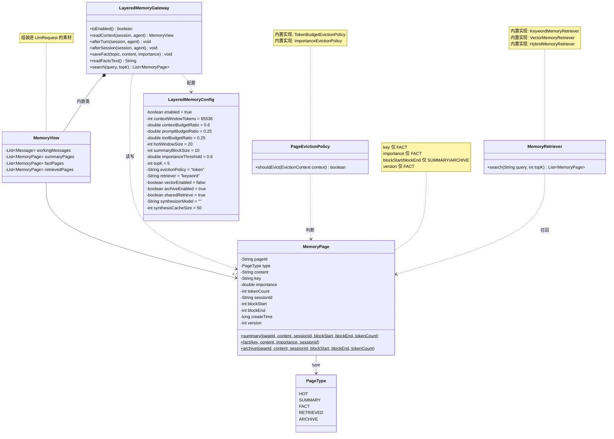
```mermaid
classDiagram
    %% LayeredMemoryGateway <<interface>>
    class LayeredMemoryGateway {
        +isEnabled() boolean
        +readContext(session, agent) MemoryView
        +afterTurn(session, agent) void
        +afterSession(session, agent) void
        +saveFact(topic, content, importance) void
        +readFactsText() String
        +search(query, topK) List~MemoryPage~
    }
    %% MemoryView <<ValueObject>>
    class MemoryView {
        -List~Message~ workingMessages
        -List~MemoryPage~ summaryPages
        -List~MemoryPage~ factPages
        -List~MemoryPage~ retrievedPages
    }
    note for MemoryView "组装进 LlmRequest 的素材"
    %% MemoryPage <<ValueObject>>
    class MemoryPage {
        -String pageId
        -PageType type
        -String content
        -String key
        -double importance
        -int tokenCount
        -String sessionId
        -int blockStart
        -int blockEnd
        -long createTime
        -int version
        +summary(pageId, content, sessionId, blockStart, blockEnd, tokenCount)$
        +fact(key, content, importance, sessionId)$
        +archive(pageId, content, sessionId, blockStart, blockEnd, tokenCount)$
    }
    note for MemoryPage "key 仅 FACT<br/>importance 仅 FACT<br/>blockStart/blockEnd 仅 SUMMARY/ARCHIVE<br/>version 仅 FACT"
    %% LayeredMemoryConfig <<Config>>
    class LayeredMemoryConfig {
        -boolean enabled = true
        -int contextWindowTokens = 65536
        -double contextBudgetRatio = 0.6
        -double promptBudgetRatio = 0.25
        -double toolBudgetRatio = 0.25
        -int hotWindowSize = 20
        -int summaryBlockSize = 10
        -double importanceThreshold = 0.6
        -int topK = 5
        -String evictionPolicy = "token"
        -String retriever = "keyword"
        -boolean vectorEnabled = false
        -boolean archiveEnabled = true
        -boolean sharedRetrieve = true
        -String synthesizerModel = ""
        -int synthesisCacheSize = 50
    }
    %% PageEvictionPolicy <<interface>>
    class PageEvictionPolicy {
        +shouldEvict(EvictionContext context) boolean
    }
    note for PageEvictionPolicy "内置实现: TokenBudgetEvictionPolicy<br/>内置实现: ImportanceEvictionPolicy"
    %% MemoryRetriever <<interface>>
    class MemoryRetriever {
        +search(String query, int topK) List~MemoryPage~
    }
    note for MemoryRetriever "内置实现: KeywordMemoryRetriever<br/>内置实现: VectorMemoryRetriever<br/>内置实现: HybridMemoryRetriever"
    %% PageType <<enumeration>>
    class PageType {
        HOT
        SUMMARY
        FACT
        RETRIEVED
        ARCHIVE
    }
    LayeredMemoryGateway *-- MemoryView : 内嵌类
    MemoryView --> "0..*" MemoryPage
    MemoryPage --> PageType : type
    LayeredMemoryGateway ..> MemoryPage : 读写
    PageEvictionPolicy ..> MemoryPage : 判断
    MemoryRetriever ..> MemoryPage : 召回
    LayeredMemoryGateway ..> LayeredMemoryConfig : 配置
```

### 5.5 LLM 域数据模型

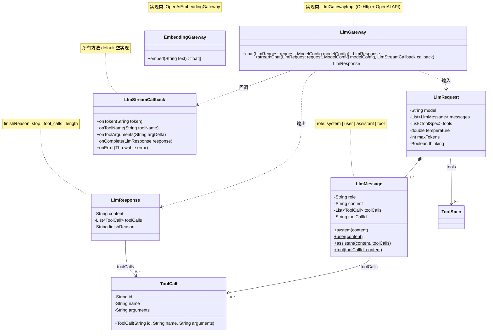
```mermaid
classDiagram
    %% LlmGateway <<interface>>
    class LlmGateway {
        +chat(LlmRequest request, ModelConfig modelConfig) LlmResponse
        +streamChat(LlmRequest request, ModelConfig modelConfig, LlmStreamCallback callback) LlmResponse
    }
    note for LlmGateway "实现类: LlmGatewayImpl (OkHttp + OpenAI API)"
    %% EmbeddingGateway <<interface>>
    class EmbeddingGateway {
        +embed(String text) float[]
    }
    note for EmbeddingGateway "实现类: OpenAiEmbeddingGateway"
    %% LlmRequest <<ValueObject>>
    class LlmRequest {
        -String model
        -List~LlmMessage~ messages
        -List~ToolSpec~ tools
        -double temperature
        -int maxTokens
        -Boolean thinking
    }
    %% LlmResponse <<ValueObject>>
    class LlmResponse {
        -String content
        -List~ToolCall~ toolCalls
        -String finishReason
    }
    note for LlmResponse "finishReason: stop | tool_calls | length"
    %% LlmMessage <<ValueObject>>
    class LlmMessage {
        -String role
        -String content
        -List~ToolCall~ toolCalls
        -String toolCallId
        +system(content)$
        +user(content)$
        +assistant(content, toolCalls)$
        +tool(toolCallId, content)$
    }
    note for LlmMessage "role: system | user | assistant | tool"
    %% ToolCall <<ValueObject>>
    class ToolCall {
        -String id
        -String name
        -String arguments
        +ToolCall(String id, String name, String arguments)
    }
    %% LlmStreamCallback <<interface>>
    class LlmStreamCallback {
        +onToken(String token)
        +onToolName(String toolName)
        +onToolArguments(String argDelta)
        +onComplete(LlmResponse response)
        +onError(Throwable error)
    }
    note for LlmStreamCallback "所有方法 default 空实现"
    LlmGateway ..> LlmRequest : 输入
    LlmGateway ..> LlmResponse : 输出
    LlmRequest *-- "1..*" LlmMessage
    LlmRequest --> "0..*" ToolSpec : tools
    LlmResponse --> "0..*" ToolCall : toolCalls
    LlmMessage --> "0..*" ToolCall : toolCalls
    LlmGateway ..> LlmStreamCallback : 回调
```

### 5.6 工具域数据模型

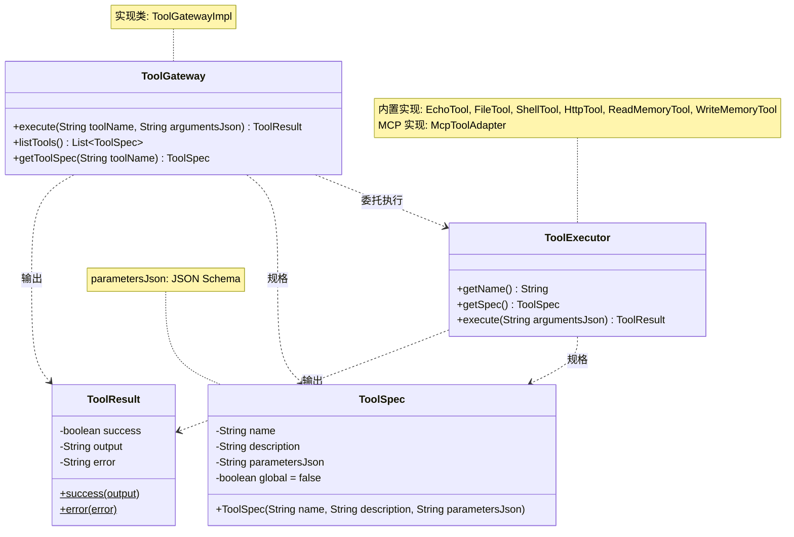
```mermaid
classDiagram
    %% ToolGateway <<interface>>
    class ToolGateway {
        +execute(String toolName, String argumentsJson) ToolResult
        +listTools() List~ToolSpec~
        +getToolSpec(String toolName) ToolSpec
    }
    note for ToolGateway "实现类: ToolGatewayImpl"
    %% ToolExecutor <<interface>>
    class ToolExecutor {
        +getName() String
        +getSpec() ToolSpec
        +execute(String argumentsJson) ToolResult
    }
    note for ToolExecutor "内置实现: EchoTool, FileTool, ShellTool, HttpTool, ReadMemoryTool, WriteMemoryTool<br/>MCP 实现: McpToolAdapter"
    %% ToolSpec <<ValueObject>>
    class ToolSpec {
        -String name
        -String description
        -String parametersJson
        -boolean global = false
        +ToolSpec(String name, String description, String parametersJson)
    }
    note for ToolSpec "parametersJson: JSON Schema"
    %% ToolResult <<ValueObject>>
    class ToolResult {
        -boolean success
        -String output
        -String error
        +success(output)$
        +error(error)$
    }
    ToolGateway ..> ToolResult : 输出
    ToolGateway ..> ToolSpec : 规格
    ToolExecutor ..> ToolResult : 输出
    ToolExecutor ..> ToolSpec : 规格
    ToolGateway ..> ToolExecutor : 委托执行
```

### 5.7 枚举定义汇总

| 枚举 | 所属域 | 值 | 用途 |
| ---- | ------ | --- | ---- |
| `SessionStatus` | core | `ACTIVE`, `CLOSED` | 会话生命周期状态 |
| `MessageRole` | core | `SYSTEM`, `USER`, `ASSISTANT`, `TOOL` | 消息角色（已废弃：`Message.role` 改用 String，枚举无引用） |
| `PageType` | memory | `HOT`, `SUMMARY`, `FACT`, `RETREVED`, `ARCHIVE` | 记忆页类型 |

---

## 6. 重要领域的详细流程设计

### 6.1 核心域：ReAct 推理引擎

#### 6.1.1 ReAct 循环状态图

ReAct 推理引擎是整个系统的核心，驱动「思考→行动→观察」迭代循环。每轮循环中，LLM 要么直接产出最终回复（终止），要么声明工具调用（进入工具执行后继续循环）。

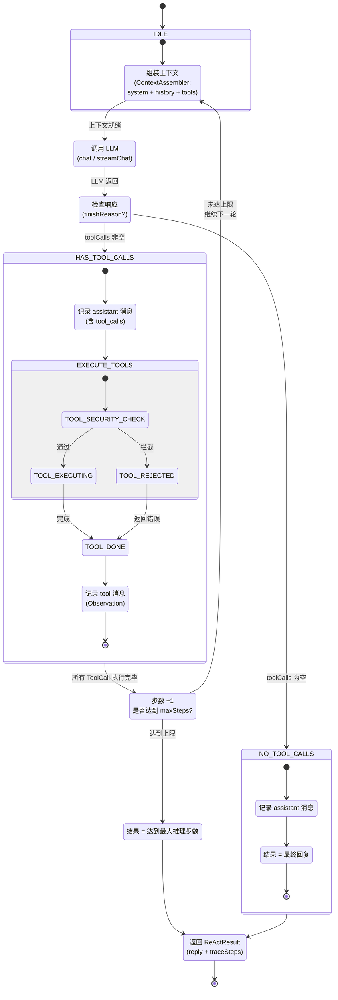
```mermaid
stateDiagram-v2
    [*] --> IDLE

    state IDLE {
        [*] --> CONTEXT_ASSEMBLE
    }

    state "组装上下文<br/>(ContextAssembler:<br/>system + history + tools)" as CONTEXT_ASSEMBLE
    CONTEXT_ASSEMBLE --> LLM_CALLING : 上下文就绪

    state "调用 LLM<br/>(chat / streamChat)" as LLM_CALLING
    LLM_CALLING --> CHECK_RESPONSE : LLM 返回

    state "检查响应<br/>(finishReason?)" as CHECK_RESPONSE

    state HAS_TOOL_CALLS {
        [*] --> RECORD_ASSISTANT
        state "记录 assistant 消息<br/>(含 tool_calls)" as RECORD_ASSISTANT
        RECORD_ASSISTANT --> EXECUTE_TOOLS
        state EXECUTE_TOOLS {
            [*] --> TOOL_SECURITY_CHECK
            TOOL_SECURITY_CHECK --> TOOL_EXECUTING : 通过
            TOOL_SECURITY_CHECK --> TOOL_REJECTED : 拦截
            TOOL_EXECUTING --> TOOL_DONE : 完成
            TOOL_REJECTED --> TOOL_DONE : 返回错误
        }
        TOOL_DONE --> RECORD_OBSERVATION
        state "记录 tool 消息<br/>(Observation)" as RECORD_OBSERVATION
        RECORD_OBSERVATION --> [*]
    }

    state NO_TOOL_CALLS {
        [*] --> RECORD_REPLY
        state "记录 assistant 消息" as RECORD_REPLY
        RECORD_REPLY --> SET_REPLY
        state "结果 = 最终回复" as SET_REPLY
        SET_REPLY --> [*]
    }

    CHECK_RESPONSE --> HAS_TOOL_CALLS : toolCalls 非空
    CHECK_RESPONSE --> NO_TOOL_CALLS : toolCalls 为空

    HAS_TOOL_CALLS --> STEP_CHECK : 所有 ToolCall 执行完毕

    state "步数 +1<br/>是否达到 maxSteps?" as STEP_CHECK
    STEP_CHECK --> CONTEXT_ASSEMBLE : 未达上限<br/>继续下一轮
    STEP_CHECK --> MAX_STEPS : 达到上限

    state "结果 = 达到最大推理步数" as MAX_STEPS
    MAX_STEPS --> DONE

    NO_TOOL_CALLS --> DONE

    state "返回 ReActResult<br/>(reply + traceSteps)" as DONE
    DONE --> [*]
```

#### 6.1.2 ReAct 循环数据交互图

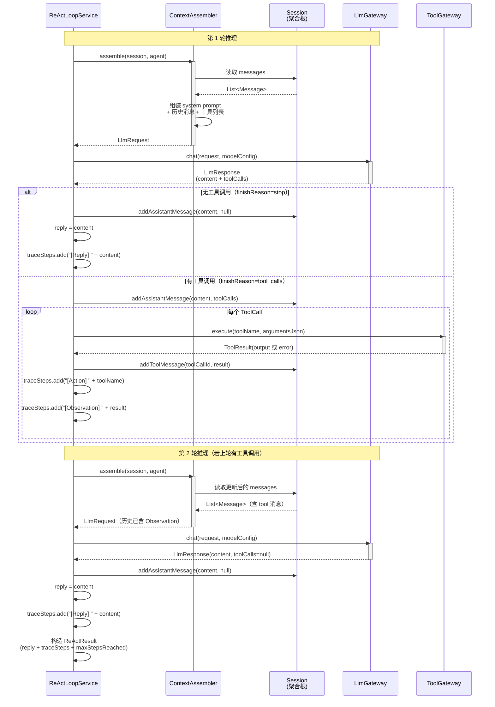
```mermaid
sequenceDiagram
    participant RACT as ReActLoopService
    participant CTX as ContextAssembler
    participant SESS as Session<br/>(聚合根)
    participant LLM as LlmGateway
    participant TG as ToolGateway

    Note over RACT, LLM: 第 1 轮推理
    RACT->>CTX: assemble(session, agent)
    activate CTX
    CTX->>SESS: 读取 messages
    SESS-->>CTX: List<Message>
    CTX->>CTX: 组装 system prompt<br/>+ 历史消息 + 工具列表
    CTX-->>RACT: LlmRequest
    deactivate CTX

    RACT->>LLM: chat(request, modelConfig)
    activate LLM
    LLM-->>RACT: LlmResponse<br/>(content + toolCalls)
    deactivate LLM

    alt 无工具调用（finishReason=stop）
        RACT->>SESS: addAssistantMessage(content, null)
        RACT->>RACT: reply = content
        RACT->>RACT: traceSteps.add("[Reply] " + content)
    else 有工具调用（finishReason=tool_calls）
        RACT->>SESS: addAssistantMessage(content, toolCalls)
        loop 每个 ToolCall
            RACT->>TG: execute(toolName, argumentsJson)
            activate TG
            TG-->>RACT: ToolResult(output 或 error)
            deactivate TG
            RACT->>SESS: addToolMessage(toolCallId, result)
            RACT->>RACT: traceSteps.add("[Action] " + toolName)
            RACT->>RACT: traceSteps.add("[Observation] " + result)
        end
    end

    Note over RACT, LLM: 第 2 轮推理（若上轮有工具调用）
    RACT->>CTX: assemble(session, agent)
    activate CTX
    CTX->>SESS: 读取更新后的 messages
    SESS-->>CTX: List<Message>（含 tool 消息）
    CTX-->>RACT: LlmRequest（历史已含 Observation）
    deactivate CTX

    RACT->>LLM: chat(request, modelConfig)
    activate LLM
    LLM-->>RACT: LlmResponse(content, toolCalls=null)
    deactivate LLM

    RACT->>SESS: addAssistantMessage(content, null)
    RACT->>RACT: reply = content
    RACT->>RACT: traceSteps.add("[Reply] " + content)

    RACT->>RACT: 构造 ReActResult<br/>(reply + traceSteps + maxStepsReached)
```

#### 6.1.3 文字说明

ReAct（Reasoning + Acting）循环由 [ReActLoopService](file:///Users/mawenbin/workspace/java/mwb_coding/mwb-ai-claw/mwb-ai-claw-domain/src/main/java/com/mwb/ai/claw/domain/core/ReActLoopService.java) 驱动，核心流程如下：

1. **上下文组装**：每轮推理开始，调用 `ContextAssembler.assemble()` 组装 LLM 请求。组装内容包括 system prompt（Agent 人设 + AGENT.md 指令 + 长期记忆）、会话历史消息（或分层记忆的工作记忆视图）、工具规格列表。
2. **LLM 调用**：通过 `LlmGateway` 发送请求。支持同步（`chat`）与流式（`streamChat`）两种模式。流式模式下通过 `LlmStreamCallback` 逐 token 推送增量内容。
3. **响应判定**：检查 `LlmResponse.finishReason`——若为 `stop` 且无 `toolCalls`，则 LLM 已产出最终回复，循环终止；若为 `tool_calls`，则进入工具执行阶段。
4. **工具执行**：遍历 LLM 声明的 `ToolCall` 列表，逐个调用 `ToolGateway.execute()` 执行。每个工具结果作为 `tool` 角色消息（Observation）追加到会话。
5. **迭代或终止**：工具执行完毕后步数 +1，若未达到 `Agent.maxSteps`（默认 8），则回到步骤 1 继续下一轮推理；若达到上限，则产出「达到最大推理步数」提示并终止。
6. **结果返回**：构造 `ReActResult`，包含最终回复 `reply`、执行轨迹 `traceSteps`（Thought/Action/Observation 摘要）、以及 `maxStepsReached` 标志。

---

### 6.2 编排协作域

#### 6.2.1 编排生命周期状态图

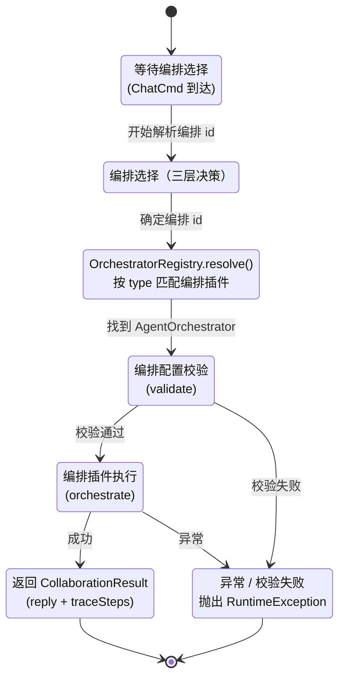
```mermaid
stateDiagram-v2
    [*] --> PENDING

    state "等待编排选择<br/>(ChatCmd 到达)" as PENDING
    PENDING --> SELECTING : 开始解析编排 id

    state "编排选择（三层决策）" as SELECTING
    SELECTING --> RESOLVING : 确定编排 id

    state "OrchestratorRegistry.resolve()<br/>按 type 匹配编排插件" as RESOLVING
    RESOLVING --> VALIDATING : 找到 AgentOrchestrator

    state "编排配置校验<br/>(validate)" as VALIDATING
    VALIDATING --> EXECUTING : 校验通过
    VALIDATING --> FAILED : 校验失败

    state "编排插件执行<br/>(orchestrate)" as EXECUTING
    EXECUTING --> COMPLETED : 成功
    EXECUTING --> FAILED : 异常

    state "返回 CollaborationResult<br/>(reply + traceSteps)" as COMPLETED
    COMPLETED --> [*]

    state "异常 / 校验失败<br/>抛出 RuntimeException" as FAILED
    FAILED --> [*]
```

#### 6.2.2 编排选择活动图（三层决策分离）

对话请求先「选编排」，再由编排内部「选 Agent」，两层决策解耦：
- 意图选择器由 `agent.orchestration-selector` 配置驱动：`rule`（默认）仅关键词匹配；`llm` 模式由 `LlmOrchestrationSelector` 基于各编排 description 做语义匹配（温度 0 + 关闭思考保证确定性，返回 id 并校验存在于候选），未命中 / 调用失败回退规则关键词（兜底），两者均未命中回退默认编排。

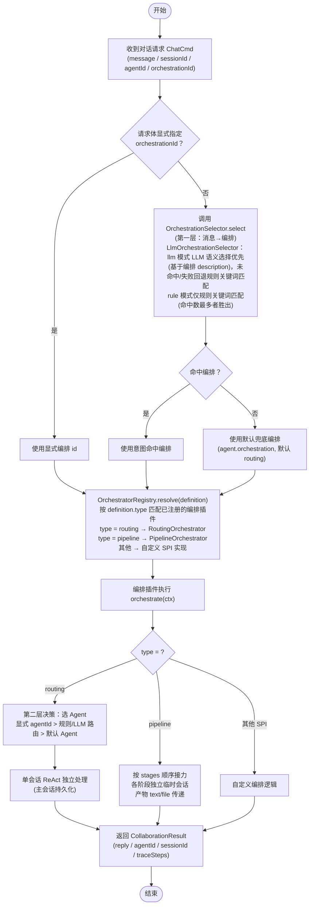
```mermaid
flowchart TD
    %% 编排选择活动图（三层决策分离）
    START([开始]) --> REQ["收到对话请求 ChatCmd<br/>(message / sessionId / agentId / orchestrationId)"]
    REQ --> D1{请求体显式指定<br/>orchestrationId？}
    D1 --是--> EXPLICIT["使用显式编排 id"]
    D1 --否--> SELECT["调用 OrchestrationSelector.select<br/>(第一层：消息→编排)<br/>LlmOrchestrationSelector：llm 模式 LLM 语义选择优先<br/>(基于编排 description)，未命中/失败回退规则关键词匹配<br/>rule 模式仅规则关键词匹配(命中数最多者胜出)"]
    SELECT --> D2{命中编排？}
    D2 --是--> HIT["使用意图命中编排"]
    D2 --否--> FALLBACK["使用默认兜底编排<br/>(agent.orchestration, 默认 routing)"]
    EXPLICIT --> RESOLVE["OrchestratorRegistry.resolve(definition)<br/>按 definition.type 匹配已注册的编排插件<br/>type = routing → RoutingOrchestrator<br/>type = pipeline → PipelineOrchestrator<br/>其他 → 自定义 SPI 实现"]
    HIT --> RESOLVE
    FALLBACK --> RESOLVE
    RESOLVE --> EXEC["编排插件执行 orchestrate(ctx)"]
    EXEC --> D3{type = ?}
    D3 --routing--> DECIDE["第二层决策：选 Agent<br/>显式 agentId > 规则/LLM 路由 > 默认 Agent"]
    DECIDE --> REACT["单会话 ReAct 独立处理<br/>(主会话持久化)"]
    D3 --pipeline--> STAGES["按 stages 顺序接力<br/>各阶段独立临时会话<br/>产物 text/file 传递"]
    D3 --其他 SPI--> CUSTOM["自定义编排逻辑"]
    REACT --> RESULT["返回 CollaborationResult<br/>(reply / agentId / sessionId / traceSteps)"]
    STAGES --> RESULT
    CUSTOM --> RESULT
    RESULT --> END_([结束])
```

#### 6.2.3 流水线编排数据交互图

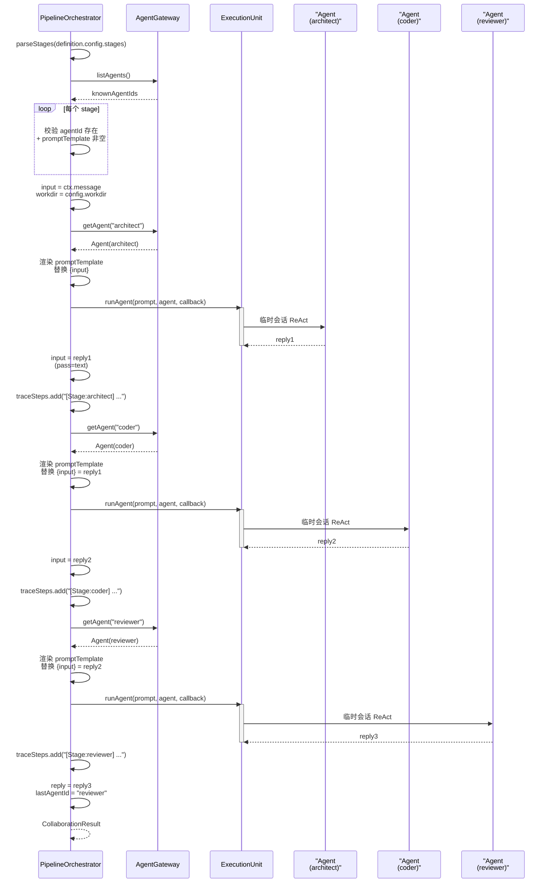
```mermaid
sequenceDiagram
    participant P as PipelineOrchestrator
    participant AG as AgentGateway
    participant EU as ExecutionUnit
    participant A1 as "Agent<br/>(architect)"
    participant A2 as "Agent<br/>(coder)"
    participant A3 as "Agent<br/>(reviewer)"

    %% 启动校验
    P->>P: parseStages(definition.config.stages)
    P->>AG: listAgents()
    AG-->>P: knownAgentIds
    loop 每个 stage
        P->>P: 校验 agentId 存在<br/>+ promptTemplate 非空
    end

    %% 执行流水线
    P->>P: input = ctx.message<br/>workdir = config.workdir

    %% Stage 1: architect
    P->>AG: getAgent("architect")
    AG-->>P: Agent(architect)
    P->>P: 渲染 promptTemplate<br/>替换 {input}
    P->>EU: runAgent(prompt, agent, callback)
    activate EU
    EU->>A1: 临时会话 ReAct
    A1-->>EU: reply1
    deactivate EU
    P->>P: input = reply1<br/>(pass=text)
    P->>P: traceSteps.add("[Stage:architect] ...")

    %% Stage 2: coder
    P->>AG: getAgent("coder")
    AG-->>P: Agent(coder)
    P->>P: 渲染 promptTemplate<br/>替换 {input} = reply1
    P->>EU: runAgent(prompt, agent, callback)
    activate EU
    EU->>A2: 临时会话 ReAct
    A2-->>EU: reply2
    deactivate EU
    P->>P: input = reply2
    P->>P: traceSteps.add("[Stage:coder] ...")

    %% Stage 3: reviewer
    P->>AG: getAgent("reviewer")
    AG-->>P: Agent(reviewer)
    P->>P: 渲染 promptTemplate<br/>替换 {input} = reply2
    P->>EU: runAgent(prompt, agent, callback)
    activate EU
    EU->>A3: 临时会话 ReAct
    A3-->>EU: reply3
    deactivate EU
    P->>P: traceSteps.add("[Stage:reviewer] ...")

    %% 汇总
    P->>P: reply = reply3<br/>lastAgentId = "reviewer"
    P-->>P: CollaborationResult
```

#### 6.2.4 对话式编排数据交互图

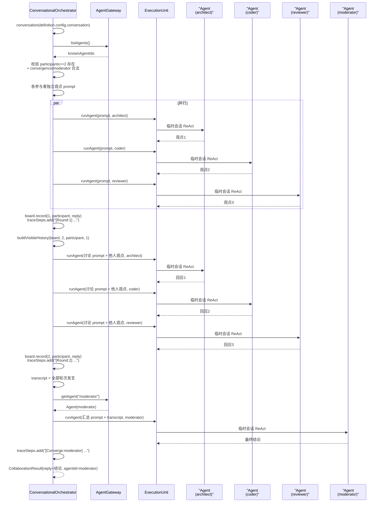
```mermaid
sequenceDiagram
    participant C as ConversationalOrchestrator
    participant AG as AgentGateway
    participant EU as ExecutionUnit
    participant A1 as "Agent<br/>(architect)"
    participant A2 as "Agent<br/>(coder)"
    participant A3 as "Agent<br/>(reviewer)"
    participant AM as "Agent<br/>(moderator)"

    %% 启动校验
    C->>C: conversation(definition.config.conversation)
    C->>AG: listAgents()
    AG-->>C: knownAgentIds
    C->>C: 校验 participants>=2 存在<br/>+ convergence/moderator 合法

    %% Round 1（并行，CompletableFuture + 线程池）
    C->>C: 各参与者独立观点 prompt
    par 并行
        C->>EU: runAgent(prompt, architect)
        EU->>A1: 临时会话 ReAct
        A1-->>EU: 观点1
        C->>EU: runAgent(prompt, coder)
        EU->>A2: 临时会话 ReAct
        A2-->>EU: 观点2
        C->>EU: runAgent(prompt, reviewer)
        EU->>A3: 临时会话 ReAct
        A3-->>EU: 观点3
    end
    C->>C: board.record(1, participant, reply)<br/>traceSteps.add("[Round:1] ...")

    %% Round 2（串行，可见历史 visibleHistory=1）
    C->>C: buildVisibleHistory(board, 2, participant, 1)
    C->>EU: runAgent(讨论 prompt + 他人观点, architect)
    EU->>A1: 临时会话 ReAct
    A1-->>EU: 回应1
    C->>EU: runAgent(讨论 prompt + 他人观点, coder)
    EU->>A2: 临时会话 ReAct
    A2-->>EU: 回应2
    C->>EU: runAgent(讨论 prompt + 他人观点, reviewer)
    EU->>A3: 临时会话 ReAct
    A3-->>EU: 回应3
    C->>C: board.record(2, participant, reply)<br/>traceSteps.add("[Round:2] ...")

    %% 收敛（convergence=moderator）
    C->>C: transcript = 全部轮次发言
    C->>AG: getAgent("moderator")
    AG-->>C: Agent(moderator)
    C->>EU: runAgent(汇总 prompt + transcript, moderator)
    EU->>AM: 临时会话 ReAct
    AM-->>EU: 最终结论
    C->>C: traceSteps.add("[Converge:moderator] ...")
    C-->>C: CollaborationResult(reply=结论, agentId=moderator)
```

#### 6.2.5 文字说明

编排协作域实现多 Agent 协作，核心设计是 **SPI 插件化 + 三层决策分离**：

**三层决策分离**：
1. **第一层（选编排）**：`ChatCmdExe` 根据 `orchestrationId` 决定使用哪个编排。优先级：显式指定 > 意图选择器（`OrchestrationSelector`）匹配 > 默认兜底。
2. **第二层（选 Agent）**：编排插件内部决定使用哪个 Agent。Routing 编排通过显式 agentId / 规则关键词 / LLM 路由选择；Pipeline 编排由每个 stage 的 `agentId` 字段指定。
3. **第三层（选工具）**：Agent 的 `toolNames` 配置 + 全局 MCP 工具决定可用工具集。

**编排 SPI（`AgentOrchestrator`）**：
- 实现类通过 `type()` 声明编排类型标识，注册中心在启动期自动收集。
- 新增编排方式仅需：(1) 实现接口并注册为 Spring Bean；(2) 在 `orchestrations.json` 增加一条定义。
- 内置实现：`RoutingOrchestrator`（路由，单 Agent 独立处理）、`PipelineOrchestrator`（流水线，多阶段接力）、`ConversationalOrchestrator`（对话式，多方多轮讨论 + 收敛）。

**流水线编排（`PipelineOrchestrator`）**：
- 阶段定义（`PipelineStage`）从编排定义的宽松 `config` Map 解析，注册中心不感知具体编排结构。
- 阶段级 `thinking` 覆盖：控制推理模式，避免 DeepSeek 思考模式吃满输出预算。
- 空回复重试：阶段回复为空时带提示重试一次。
- 失败策略：`onFailure: abort`（终止）或 `continue`（跳过）。
- 产物传递：`pass: text`（直接作为下阶段输入）或 `file`（经 `ExecutionUnit.writeArtifact` 落盘传路径）。

**对话式编排（`ConversationalOrchestrator`）**：
- 定义（`ConversationDefinition`）从编排定义的 `config.conversation` Map 解析：`rounds` / `participants` / `moderator` / `convergence` / `minConsensus` / `visibleHistory` / `thinking`。
- 执行流程：首轮（并行，`CompletableFuture` + 线程池）各参与者独立产出观点 → 讨论轮（串行）按 `visibleHistory` 截断注入其他参与者发言并互相回应 → 收敛产出最终结论。
- 收敛策略：`moderator`（默认，仲裁 Agent 汇总全部发言）、`consensus`（发言含共识信号词数 ≥ `minConsensus` 提前终止，取支持最多的发言）、`best`（解析「置信度: 0.x」标注取最高）。
- 参与者与收敛 Agent 均通过临时会话执行（上下文隔离，不入库）；`thinking` 覆盖与空回复重试同流水线。

---

### 6.3 记忆域

#### 6.3.1 记忆页生命周期状态图

`MemoryPage` 在分层记忆系统中经历多种类型转换：

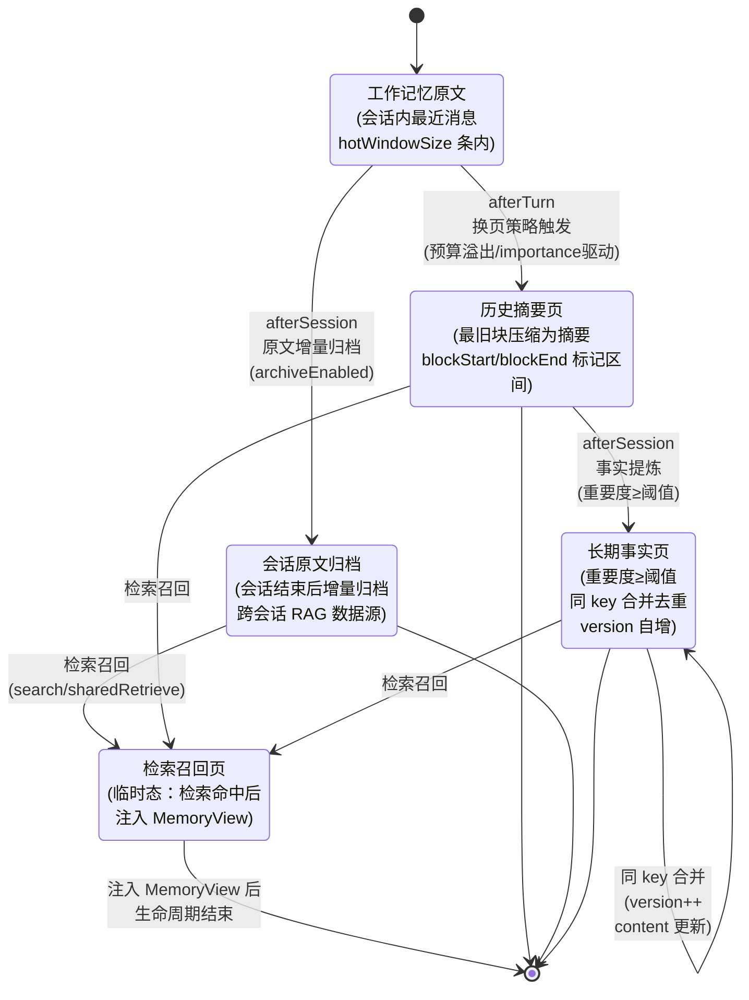
```mermaid
stateDiagram-v2
    [*] --> HOT

    state "工作记忆原文<br/>(会话内最近消息<br/>hotWindowSize 条内)" as HOT

    state "历史摘要页<br/>(最旧块压缩为摘要<br/>blockStart/blockEnd 标记区间)" as SUMMARY

    state "会话原文归档<br/>(会话结束后增量归档<br/>跨会话 RAG 数据源)" as ARCHIVE

    state "长期事实页<br/>(重要度≥阈值<br/>同 key 合并去重<br/>version 自增)" as FACT

    state "检索召回页<br/>(临时态：检索命中后<br/>注入 MemoryView)" as RETRIEVED

    HOT --> SUMMARY : afterTurn<br/>换页策略触发<br/>(预算溢出/importance驱动)
    SUMMARY --> FACT : afterSession<br/>事实提炼<br/>(重要度≥阈值)
    HOT --> ARCHIVE : afterSession<br/>原文增量归档<br/>(archiveEnabled)
    ARCHIVE --> RETRIEVED : 检索召回<br/>(search/sharedRetrieve)
    SUMMARY --> RETRIEVED : 检索召回
    FACT --> RETRIEVED : 检索召回

    RETRIEVED --> [*] : 注入 MemoryView 后<br/>生命周期结束

    FACT --> FACT : 同 key 合并<br/>(version++<br/>content 更新)
    SUMMARY --> [*]
    ARCHIVE --> [*]
    FACT --> [*]
```

#### 6.3.2 会话记忆流转状态图

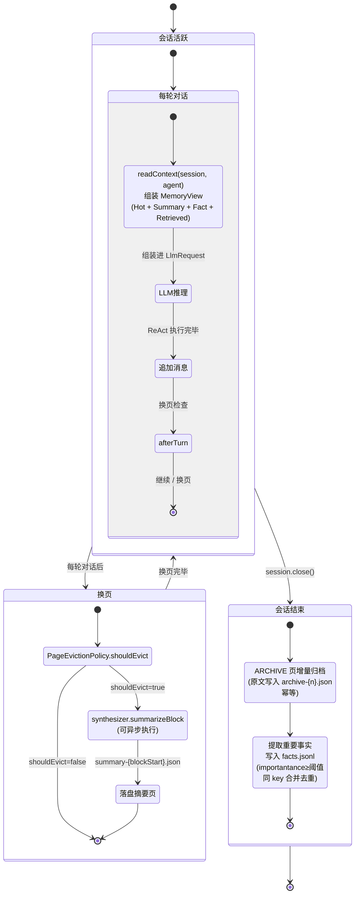
```mermaid
stateDiagram-v2
    [*] --> ACTIVE

    state "会话活跃" as ACTIVE {
        [*] --> TURN
        state "每轮对话" as TURN {
            [*] --> 读取上下文
            读取上下文 : readContext(session, agent)<br/>组装 MemoryView<br/>(Hot + Summary + Fact + Retrieved)
            读取上下文 --> LLM推理 : 组装进 LlmRequest
            LLM推理 --> 追加消息 : ReAct 执行完毕
            追加消息 --> afterTurn : 换页检查
            afterTurn --> [*] : 继续 / 换页
        }
    }

    state "换页" as EVICT {
        [*] --> 判断策略
        判断策略 : PageEvictionPolicy.shouldEvict
        判断策略 --> 压缩最旧块 : shouldEvict=true
        判断策略 --> [*] : shouldEvict=false
        压缩最旧块 : synthesizer.summarizeBlock<br/>(可异步执行)
        压缩最旧块 --> 落盘摘要页 : summary-{blockStart}.json
        落盘摘要页 --> [*]
    }

    state "会话结束" as CLOSE {
        [*] --> 档案归档
        档案归档 : ARCHIVE 页增量归档<br/>(原文写入 archive-{n}.json<br/>幂等)
        档案归档 --> 事实提炼
        事实提炼 : 提取重要事实<br/>写入 facts.jsonl<br/>(importantance≥阈值<br/>同 key 合并去重)
        事实提炼 --> [*]
    }

    ACTIVE --> EVICT : 每轮对话后
    EVICT --> ACTIVE : 换页完毕
    ACTIVE --> CLOSE : session.close()
    CLOSE --> [*]
```

#### 6.3.3 分层记忆上下文组装活动图

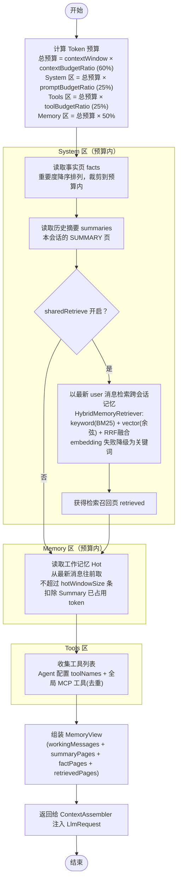
```mermaid
flowchart TD
    %% 分层记忆上下文组装活动图
    START([开始]) --> BUDGET["计算 Token 预算<br/>总预算 = contextWindow × contextBudgetRatio (60%)<br/>System 区 = 总预算 × promptBudgetRatio (25%)<br/>Tools 区 = 总预算 × toolBudgetRatio (25%)<br/>Memory 区 = 总预算 × 50%"]

    subgraph SYS["System 区（预算内）"]
        FACTS["读取事实页 facts<br/>重要度降序排列，裁剪到预算内"] --> SUMS["读取历史摘要 summaries<br/>本会话的 SUMMARY 页"]
        SUMS --> SHARED{sharedRetrieve 开启？}
        SHARED --是--> RETRIEVE["以最新 user 消息检索跨会话记忆<br/>HybridMemoryRetriever:<br/>keyword(BM25) + vector(余弦) + RRF融合<br/>embedding 失败降级为关键词"]
        RETRIEVE --> RETRIEVED["获得检索召回页 retrieved"]
    end

    subgraph MEM["Memory 区（预算内）"]
        HOT["读取工作记忆 Hot<br/>从最新消息往前取<br/>不超过 hotWindowSize 条<br/>扣除 Summary 已占用 token"]
    end

    subgraph TOOLS["Tools 区"]
        COLLECT["收集工具列表<br/>Agent 配置 toolNames + 全局 MCP 工具(去重)"]
    end

    BUDGET --> FACTS
    SHARED --否--> HOT
    RETRIEVED --> HOT
    HOT --> COLLECT
    COLLECT --> ASSEMBLE["组装 MemoryView<br/>(workingMessages + summaryPages + factPages + retrievedPages)"]
    ASSEMBLE --> INJECT["返回给 ContextAssembler 注入 LlmRequest"]
    INJECT --> END_([结束])
```

#### 6.3.4 文字说明

记忆域实现五层分层记忆模型，核心目标是 **在有限的 LLM 上下文窗口内，最大化保留有价值的上下文信息**：

**五层记忆模型**：

| 层 | 类型 | 内容 | 存储 |
| -- | ---- | ---- | ---- |
| 指令层 | — | AGENT.md 扩展指令 | `.agent/AGENT.md` |
| 工作记忆 | `HOT` | 预算内最近原文消息 | 会话内存 |
| 短期 | — | 会话全量原文 | `.agent/sessions/*.json` |
| 中期 | `SUMMARY` | 块摘要页 | `.agent/memory/pages/{sessionId}/summary-*.json` |
| 长期 | `FACT` | 结构化事实（重要度过滤 + 合并去重） | `.agent/memory/facts.jsonl` |
| 档案 | `ARCHIVE` | 会话原文归档（跨会话 RAG 数据源） | `.agent/memory/pages/{sessionId}/archive-*.json` |

**核心机制**：
- **Token 预算驱动**：总预算 = `contextWindow × contextBudgetRatio(0.6)`，按 System(25%)/Tools(25%)/Memory(50%) 分配，各区域独立裁剪。
- **换页策略（SPI）**：`PageEvictionPolicy` 接口，内置 `TokenBudgetEvictionPolicy`（默认，预算溢出触发）和 `ImportanceEvictionPolicy`（重要度驱动，低价值提前压缩）。
- **异步提炼**：摘要/事实提炼经 `MemorySynthesisExecutor` 独立线程池串行执行，不阻塞主对话链路。结果按内容哈希经 `SynthesisCache` 去重缓存。
- **成本优化**：`synthesizerModel` 独立小模型提炼，降低成本。
- **检索召回（SPI）**：`MemoryRetriever` 接口，内置 `KeywordMemoryRetriever`（BM25 关键词）、`VectorMemoryRetriever`（向量余弦）、`HybridMemoryRetriever`（RRF 融合）。embedding 失败自动降级为关键词检索。
- **跨会话共享**：`sharedRetrieve` 开启时，以最新 user 消息跨会话检索事实/摘要/档案，实现多 Agent 共享记忆。
- **消息清洗**：`sanitizeMessages` 双向兜底，避免「孤立 tool 消息」或「有 tool_calls 无结果的 assistant」导致的 OpenAI 协议错误。

---

### 6.4 上下文工程域

#### 6.4.1 上下文组装活动图

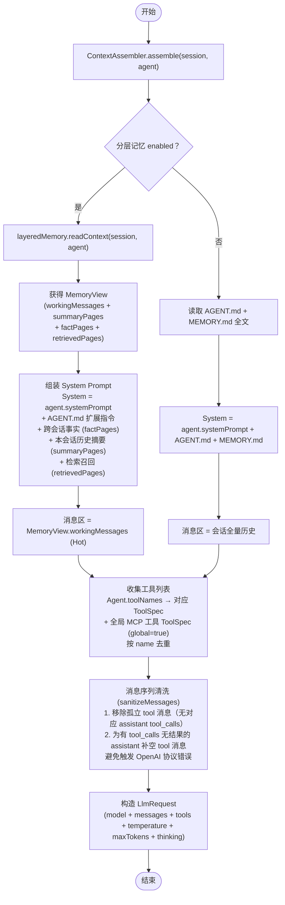
```mermaid
flowchart TD
    %% 上下文组装活动图
    START([开始]) --> ASSEMBLE["ContextAssembler.assemble(session, agent)"]
    ASSEMBLE --> D1{分层记忆 enabled？}
    D1 --是--> READ_CTX["layeredMemory.readContext(session, agent)"]
    READ_CTX --> MEMVIEW["获得 MemoryView<br/>(workingMessages + summaryPages<br/>+ factPages + retrievedPages)"]
    MEMVIEW --> SYS_PROMPT["组装 System Prompt<br/>System = agent.systemPrompt<br/>+ AGENT.md 扩展指令<br/>+ 跨会话事实 (factPages)<br/>+ 本会话历史摘要 (summaryPages)<br/>+ 检索召回 (retrievedPages)"]
    SYS_PROMPT --> MSG_AREA["消息区 = MemoryView.workingMessages (Hot)"]
    D1 --否--> READ_FULL["读取 AGENT.md + MEMORY.md 全文"]
    READ_FULL --> SYS_LEGACY["System = agent.systemPrompt + AGENT.md + MEMORY.md"]
    SYS_LEGACY --> MSG_LEGACY["消息区 = 会话全量历史"]
    MSG_AREA --> COLLECT["收集工具列表<br/>Agent.toolNames → 对应 ToolSpec<br/>+ 全局 MCP 工具 ToolSpec (global=true)<br/>按 name 去重"]
    MSG_LEGACY --> COLLECT
    COLLECT --> SANITIZE["消息序列清洗 (sanitizeMessages)<br/>1. 移除孤立 tool 消息（无对应 assistant tool_calls）<br/>2. 为有 tool_calls 无结果的 assistant 补空 tool 消息<br/>避免触发 OpenAI 协议错误"]
    SANITIZE --> LLM_REQ["构造 LlmRequest<br/>(model + messages + tools + temperature + maxTokens + thinking)"]
    LLM_REQ --> END_([结束])
```

#### 6.4.2 文字说明

上下文工程域由 [ContextAssembler](file:///Users/mawenbin/workspace/java/mwb_coding/mwb-ai-claw/mwb-ai-claw-domain/src/main/java/com/mwb/ai/claw/domain/context/DefaultContextAssembler.java) 实现，是 ReAct 循环与 LLM/记忆/工具之间的桥梁：

1. **System Prompt 组装**：Agent 人设（`systemPrompt`）→ AGENT.md 扩展指令 → 长期记忆事实 → 历史摘要 → 检索召回，按序拼接。
2. **消息区组装**：分层记忆开启时使用 `MemoryView.workingMessages`（预算内最近 Hot 消息）；未开启时使用会话全量历史。
3. **工具列表组装**：Agent 显式配置的 `toolNames` 对应的 `ToolSpec` + 全局 MCP 工具（`global=true`），按 name 去重。
4. **消息序列清洗**：`sanitizeMessages` 双向兜底——移除孤立的 tool 消息（无对应 assistant tool_calls），为有 tool_calls 但缺结果的 assistant 补充空 tool 消息，确保消息序列符合 OpenAI Chat Completions 协议要求。
5. **模型参数注入**：将 `ModelConfig` 中的 `temperature`、`maxTokens`、`thinking` 注入 `LlmRequest`。

---

### 6.5 工具域

#### 6.5.1 工具执行状态图

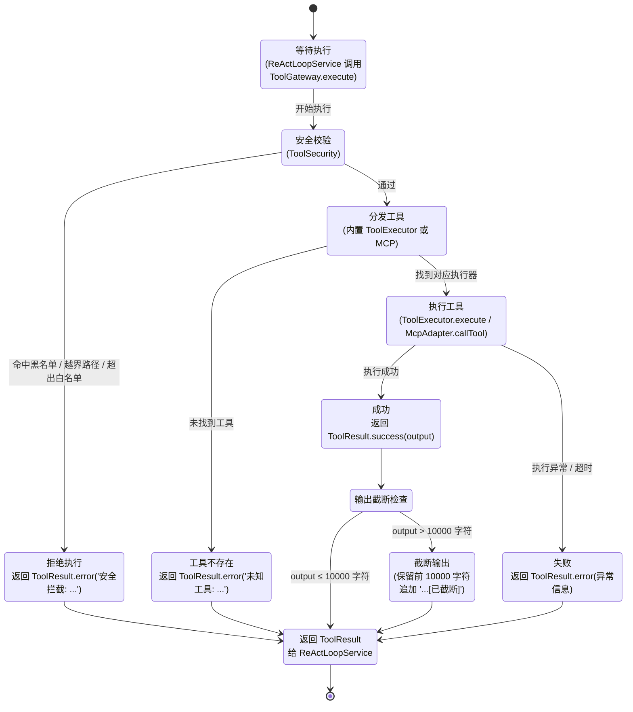
```mermaid
stateDiagram-v2
    [*] --> PENDING

    state "等待执行<br/>(ReActLoopService 调用<br/>ToolGateway.execute)" as PENDING

    PENDING --> SECURITY_CHECK : 开始执行

    state "安全校验<br/>(ToolSecurity)" as SECURITY_CHECK
    SECURITY_CHECK --> REJECTED : 命中黑名单 / 越界路径 / 超出白名单
    SECURITY_CHECK --> DISPATCHING : 通过

    state "拒绝执行<br/>返回 ToolResult.error('安全拦截: ...')" as REJECTED
    REJECTED --> DONE

    state "分发工具<br/>(内置 ToolExecutor 或 MCP)" as DISPATCHING
    DISPATCHING --> EXECUTING : 找到对应执行器
    DISPATCHING --> NOT_FOUND : 未找到工具

    state "工具不存在<br/>返回 ToolResult.error('未知工具: ...')" as NOT_FOUND
    NOT_FOUND --> DONE

    state "执行工具<br/>(ToolExecutor.execute / McpAdapter.callTool)" as EXECUTING
    EXECUTING --> SUCCESS : 执行成功
    EXECUTING --> FAILED : 执行异常 / 超时

    state "成功<br/>返回 ToolResult.success(output)" as SUCCESS
    SUCCESS --> TRUNCATE_CHECK

    state "输出截断检查" as TRUNCATE_CHECK
    TRUNCATE_CHECK --> DONE : output ≤ 10000 字符
    TRUNCATE_CHECK --> TRUNCATED : output > 10000 字符

    state "截断输出<br/>(保留前 10000 字符<br/>追加 '...[已截断]')" as TRUNCATED
    TRUNCATED --> DONE

    state "失败<br/>返回 ToolResult.error(异常信息)" as FAILED
    FAILED --> DONE

    state "返回 ToolResult<br/>给 ReActLoopService" as DONE
    DONE --> [*]
```

#### 6.5.2 工具调用数据交互图

```mermaid
sequenceDiagram
    participant RACT as ReActLoopService
    participant TG as ToolGatewayImpl
    participant SEC as ToolSecurity
    participant REG as DynamicToolRegistry
    participant BUILTIN as "ToolExecutor<br/>(内置)"
    participant MCP as "McpToolAdapter<br/>(MCP)"

    RACT->>TG: execute(toolName, argumentsJson)
    activate TG

    TG->>SEC: 安全校验(toolName, args)
    activate SEC
    alt 命中黑名单 / 越界路径
        SEC-->>TG: SecurityException
        TG-->>RACT: ToolResult.error("安全拦截: ...")
    else 通过校验
        SEC-->>TG: 放行
    end
    deactivate SEC

    TG->>REG: 查找工具执行器(toolName)
    activate REG

    alt 内置工具（Echo/File/Shell/Http/Memory）
        REG-->>TG: ToolExecutor 实例
        TG->>BUILTIN: execute(argumentsJson)
        activate BUILTIN
        BUILTIN-->>TG: ToolResult(output)
        deactivate BUILTIN
    else MCP 工具
        REG-->>TG: McpToolAdapter 实例
        TG->>MCP: JSON-RPC callTool(toolName, args)
        activate MCP
        MCP->>MCP: McpClient.callTool<br/>(stdio / streamable_http)
        MCP-->>TG: ToolResult(output)
        deactivate MCP
    else 未找到工具
        REG-->>TG: null
        TG-->>RACT: ToolResult.error("未知工具")
    end
    deactivate REG

    TG->>TG: 截断检查(output > 10000?)
    TG-->>RACT: ToolResult(success/error)
    deactivate TG
```

#### 6.5.3 文字说明

工具域提供 Agent 执行外部操作的能力，核心是 **SPI 扩展 + 安全沙箱 + MCP 协议**：

**工具 SPI（`ToolExecutor`）**：
- 新增工具只需实现 `ToolExecutor` 接口并注册为 Spring Bean，`ToolGatewayImpl` 通过 `DynamicToolRegistry` 自动收集。
- 内置工具：`echo`（测试）、`file`（文件读写）、`shell`（命令执行）、`http`（网络请求）、`read_memory`/`write_memory`（长期记忆读写）。
- MCP 工具：通过 `McpToolRegistrar` 将 MCP Server 暴露的工具动态注册为全局工具（`global=true`），对所有 Agent 可见。

**安全沙箱（`ToolSecurity`）**：
- 命令白名单：65 个允许的 Shell 命令。
- 命令黑名单：21 个危险模式（`rm -rf /`、`sudo`、`mkfs`、fork bomb 等），优先级高于白名单。
- 路径限制：File/Shell 工具仅允许在配置的 `workspace-dir` 内操作。
- 超时控制：30 秒超时强制终止。
- 输出截断：工具输出限制 10000 字符。
- HTTP 限制：可配置 `http-allowed-hosts` 防 SSRF。
- 所有安全违规捕获为 `SecurityException`，返回 `ToolResult.error`，不中断 ReAct 循环。

**MCP 协议栈**：
- `McpClientManager` 管理多个 MCP Server 连接（stdio / streamable_http 传输）。
- `McpToolRegistrar` 在启动期从 MCP Server 获取工具列表，注册为全局工具。
- 工具调用时通过 JSON-RPC `callTool` 方法远程执行。

---

### 6.6 会话域

#### 6.6.1 会话生命周期状态图

```mermaid
stateDiagram-v2
    [*] --> CREATED

    state "创建<br/>(Session 构造<br/>status=ACTIVE<br/>自动设置标题)" as CREATED

    CREATED --> ACTIVE : 构造完成

    state "活跃" as ACTIVE {
        [*] --> ADD_USER_MSG
        ADD_USER_MSG : addUserMessage(content)<br/>自动设置标题(前30字符)
        ADD_USER_MSG --> REACT_EXEC : ReAct 循环执行
        REACT_EXEC : ReActLoopService.run
        REACT_EXEC --> ADD_ASSISTANT : 记录 assistant 消息
        ADD_ASSISTANT --> ADD_TOOL : 记录 tool 消息(若有)
        ADD_TOOL --> REACT_EXEC : 继续推理(若有工具调用)
        ADD_ASSISTANT --> [*] : 无工具调用，本轮完成
        ADD_TOOL --> AFTER_TURN : 记忆换页检查
        AFTER_TURN --> [*] : 继续 / 换页
    }

    ACTIVE --> CLOSED : session.close()<br/>(status=CLOSED)

    state "关闭<br/>(不再接收新消息<br/>触发记忆 afterSession<br/>归档+事实提炼)" as CLOSED

    CLOSED --> DELETED : 显式删除<br/>(FileBasedSessionGateway.delete)

    state "已删除<br/>(sessions/{id}.json 物理删除)" as DELETED
    DELETED --> [*]

    ACTIVE --> ACTIVE : 多轮对话<br/>活跃状态可经历多轮对话<br/>每轮：addUserMessage → ReAct → afterTurn<br/>会话文件自动持久化<br/>跨重启恢复
```

#### 6.6.2 文字说明

会话域以 [Session](file:///Users/mawenbin/workspace/java/mwb_coding/mwb-ai-claw/mwb-ai-claw-domain/src/main/java/com/mwb/ai/claw/domain/core/Session.java) 聚合根为核心，管理对话上下文的生命周期：

**状态流转**：
- `CREATED` → `ACTIVE`：Session 构造时 `status=ACTIVE`，标题取第一条用户消息前 30 字符（若标题为空或以 `session-` 开头）。
- `ACTIVE`（多轮对话循环）：`addUserMessage` → ReAct 执行 → `addAssistantMessage`（+ `addToolMessage` 若有工具调用） → `afterTurn`（记忆换页检查）。会话文件自动持久化，跨重启可恢复。
- `ACTIVE` → `CLOSED`：调用 `session.close()` 后 `status=CLOSED`，触发记忆域 `afterSession`（档案归档 + 事实提炼）。
- `CLOSED` → `DELETED`：通过 `FileBasedSessionGateway.delete()` 物理删除会话文件。

**聚合根行为约束**：
- 所有消息操作经 Session 的 `addUserMessage`/`addAssistantMessage`/`addToolMessage`/`close` 方法，每次操作刷新 `updateTime`。
- Session 持有 `messages` 列表，维护完整的对话历史（作为记忆系统的数据源）。

**持久化**：
- 会话 JSON 序列化到 `.agent/sessions/{sessionId}.json`。
- `FileBasedSessionGateway` 负责会话的增删改查，支持跨重启恢复。

---

### 6.7 配置加载域

#### 6.7.1 配置加载流程图

```mermaid
sequenceDiagram
    participant JVM as "JVM 启动"
    participant ENV as DotenvPostProcessor
    participant SE as "Spring Environment"
    participant YML as "application.yml"
    participant ARL as AgentRegistryLoader
    participant OCL as OrchestrationConfigLoader
    participant MCL as McpServerConfigLoader
    participant OR as OrchestratorRegistry

    JVM->>ENV: environmentPostProcessor
    activate ENV
    ENV->>ENV: 解析 .env 文件<br/>(KEY=value, 忽略 # 注释)
    ENV->>SE: 注入环境变量<br/>优先级: 命令行 > 系统环境 > .env > 默认
    deactivate ENV

    JVM->>YML: 加载配置<br/>${VAR:default} 占位符解析

    JVM->>ARL: 加载 agents.json
    activate ARL
    ARL->>ARL: 查找: 运行目录同名文件<br/>> jar classpath 默认模板
    ARL->>ARL: ${VAR:default} 占位符解析
    ARL-->>JVM: Agent 注册表<br/>(跨编排共享)
    deactivate ARL

    JVM->>OCL: 加载 orchestrations.json
    activate OCL
    OCL->>OCL: 启动校验:<br/>id 唯一 / type 已注册<br/>/ agentId 存在
    OCL-->>JVM: 编排注册表
    deactivate OCL

    JVM->>MCL: 加载 mcp-server.json
    activate MCL
    MCL-->>JVM: MCP Server 列表<br/>(stdio / streamable_http)
    deactivate MCL

    JVM->>OR: Spring 容器收集 SPI
    activate OR
    OR->>OR: 收集 AgentOrchestrator 实现<br/>收集 ToolExecutor 实现<br/>收集 OrchestrationSelector 实现<br/>收集 PageEvictionPolicy 实现<br/>收集 MemoryRetriever 实现
    OR-->>JVM: SPI 注册完成
    deactivate OR

    JVM->>JVM: Spring 容器启动完成<br/>系统就绪
```

#### 6.7.2 文字说明

配置加载在 Spring Boot 启动期完成，分为环境变量注入、配置文件加载、注册表构建三个阶段：

**环境变量注入**：
- `DotenvEnvironmentPostProcessor` 在 Spring Environment 后处理阶段解析 `.env` 文件，注入为环境变量。
- 优先级（由高到低）：命令行参数 > 系统环境变量 > `.env` 文件 > 配置文件默认值。

**配置文件加载**：
- `application.yml`：Spring Boot 标准配置，`${VAR:default}` 占位符解析。
- `agents.json`：Agent 注册表，`AgentRegistryLoader` 加载。查找顺序：运行目录同名文件 > jar classpath 默认模板。支持 `${VAR:default}` 占位符。
- `orchestrations.json`：编排注册表，`OrchestrationConfigLoader` 加载。启动期校验：id 唯一、type 已注册、引用的 agentId 存在。
- `mcp-server.json`：MCP Server 配置，`McpServerConfigLoader` 加载。

**SPI 自动收集**：
- Spring 容器启动完成后，`OrchestratorRegistry` 自动收集所有 `AgentOrchestrator` 实现并按 `type()` 注册。
- `DynamicToolRegistry` 自动收集所有 `ToolExecutor` 实现并注册为工具。
- `OrchestrationSelector`、`PageEvictionPolicy`、`MemoryRetriever` 同理自动收集。

**配置覆盖优先级**（由高到低）：命令行参数 > 系统环境变量 > `.env` 文件 > 配置文件默认值 > 代码默认值。

### 6.8 技能域（Skill）

#### 6.8.1 技能渐进式披露流程图

```mermaid
flowchart TD
    U[用户消息] --> R[ReActLoopService]
    R --> A[ContextAssembler 组装上下文]
    A --> L1[L1 发现层: system prompt 携带技能清单<br/>name + description, 约 100 token/技能]
    A --> T[工具规格: 含 use_skill 全局工具]
    L1 --> LLM{LLM 判定技能相关?}
    LLM -- 否 --> N[常规推理, 技能正文零消耗]
    LLM -- 是 --> C[ToolCall: use_skill 技能名]
    C --> S[SkillGateway 按名加载]
    S --> L2[L2: SKILL.md 全文注入 tool 消息<br/>$SKILL_DIR 替换为绝对路径]
    L2 --> E[继续 ReAct: shell / file 等工具执行指令]
    E --> L3[L3: 经 $SKILL_DIR 按需读取 resources/]
    L3 --> O[最终回复]
```

#### 6.8.2 文字说明

技能域（Skill）遵循 **Agent Skills 开放标准**（Anthropic 于 2025-10 发布、2025-12 开放为 AgentSkills.io 标准）：将可复用的工作流 / 领域知识打包为 `skills/<name>/SKILL.md`（YAML frontmatter：`name` / `description` + Markdown 指令正文），采用**渐进式披露（Progressive Disclosure）** 三层按需加载：

1. **L1 发现层**：启动时 `SkillLoader` 扫描技能根目录（运行目录 `skills/` > classpath `skills/` 兜底），解析 frontmatter 并启动校验（name / description 缺失、name 与目录不一致、name 重复 → 启动报错）。`SkillRegistryImpl` 维护 `name → Skill` 索引，`DefaultContextAssembler` 将技能清单（name + description，约 100 token/技能）注入 system prompt——LLM 据此判断「何时该用哪个技能」。
2. **L2 指令层**：LLM 判定任务匹配某技能描述时，调用 `use_skill(name)` 工具（全局工具，对齐 MCP，对所有 Agent 可见）按需加载 `SKILL.md` 全文，作为 tool 消息注入上下文继续 ReAct 推理。
3. **L3 资源层**：`SKILL.md` 正文中的 `$SKILL_DIR` 占位符由 `use_skill` 替换为技能目录绝对路径，脚本 / 参考文档 / 模板经既有 file / shell 工具按路径读取执行。

**与现有能力的关系**：工具（ToolExecutor / MCP）解决「能做什么」（always-on），技能解决「该怎么做」（on-demand）；技能只是指令注入，执行仍走工具沙箱（shell 白名单 / 路径限制 / 超时 / 截断），无特权提升；与编排（routing / pipeline / conversational）正交——任意编排内 Agent 均可用技能，与记忆可叠加（技能可引导读写记忆）。

**配置**：`agent.skills-enabled`（总开关，默认 true，关闭后不加载技能、不注册 use_skill）、`agent.skills-dir`（技能根目录，默认 `${user.dir}/skills`）。内置 12 个技能位于 `start/src/main/resources/skills/` 作为 classpath 模板兜底：`code-review`（代码审查）、`project-structure-analysis`（项目结构分析）、`unit-test-writing`（单元测试编写）、`git-workflow`（Git 提交流程）、`ddd-modeling`（DDD 领域建模）、`tech-design-doc`（技术方案编写）、`web-research`（联网调研，配合 tavily MCP）、`database-design`（数据库设计）、`doc-writing-guide`（文档写作规范）、`markdown-diagramming`（mermaid 图表规范）、`doc-review`（文档审查与一致性）、`example-skill`（周报生成示例）。

**新增技能（零代码）**：在技能根目录放 `skills/<name>/SKILL.md`（frontmatter + 指令正文），重启应用即加载生效；技能目录内可含 `resources/` 子目录存放脚本 / 参考文档。
